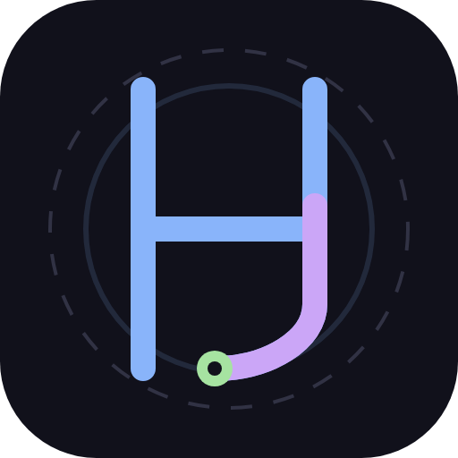

<!-- Synced from CLAUDE.md by sync-config -->
<!-- 手動修改可能在下次同步時被覆蓋 -->

# Workshop

Modular Monolith + Event-Driven workspace.

## Stack
- **Backend**: Python 3.12 / FastAPI / uv (Modular Monolith, port 10000)
- **Frontend**: React 19 / TypeScript / Rsbuild / pnpm (Single App, port 3000)
- **Database**: PostgreSQL (per-module schema isolation)
- **Cache/Events**: Redis (cache + event bus)
- **Storage**: RustFS (MinIO fork, S3-compatible)
- **Realtime**: LiveKit (WebRTC), SSE (streaming)
- **Observability**: OpenTelemetry + LGTM (dev) / SigNoz (prod)

## Key Directories
- `core/src/modules/` — 17 domain modules (auth, admin, briefing, capture, dailyos, finance, ideagraph, intelflow, invest, matchcore, memvault, nodeflow, notification, paper, skillpath, taskflow, workpool)
- `core/services/` — Hot-path: realtime (8830), media (8831)
- `workbench/` — Single React app
- `mcp/` — 23 MCP servers (SDK-based protocol access)
- `stations/` — 19 standalone local tools (each with `cli/`)
- `bridges/` — External connectors (LINE, Telegram, Discord)
- `libs/` — Shared libraries: `sdk-client/` (38 API clients + utils), `audio-ops/` (6 ops), `image-ops/` (8 ops), `video-ops/` (7 ops), `tmux-lib/`, `ai-assistant/` (TS), `live2d-core/` (TS)
- `core/cli/` — Core module CLI wrappers
- `docs/` — Architecture + Vision (Traditional Chinese, source of truth)
- `vendor/` — Third-party tools; `plugins/` — Plugin packages
- `lab/` — POC experiments; `infra/` — Docker, Nginx, observability; `scripts/` — Build/deploy

## Multi-Machine Rules
- **Alembic migration 只在 Mac 主機跑** — 遠端 Claude Code 不可執行 `alembic revision` 或 `alembic upgrade`
- **Fleet dispatch** 時 Claude Code 使用 `--allowedTools` 白名單，非 `--dangerously-skip-permissions`
- **Git branch 隔離** — 遠端工作一律在 `fleet/task-*` branch，不碰 main
- **Mac 不依賴 Windows** — Tailscale 斷線不影響 Mac 服務

## Session Naming
On receiving the FIRST user message of a session, rename the session using the built-in `/rename <title>` CLI command (NOT the Skill tool — `/rename` is a built-in command).
Rules: verb-first, kebab-case, max 30 chars, 2-4 words.
Examples: `fix-auth-middleware`, `add-paper-search`, `refactor-memvault-scoring`, `explore-testing-types`


---

# Architecture

# Architecture Constraints

## Modular Monolith
- Single deployable unit: all 13 domain modules in one FastAPI process (port 10000)
- Two hot-path services run separately: realtime/LiveKit (8830), media/STT-TTS (8831)
- Frontend: single React app (workbench/, port 3000) — NO micro-frontend, NO Module Federation

## Module Boundaries (HARD RULES)
- Modules MUST NOT import another module's models.py or DB tables
- Modules MUST NOT write to another module's PostgreSQL schema
- Cross-module reads → call the target module's `services.py` (public API)
- Cross-module writes → publish events via EventBus, never direct DB writes
- Each module owns one PostgreSQL schema: module name = schema name

## 13 Core Modules

| Module | Domain | Phase |
|--------|--------|-------|
| auth | Authentication, sessions, spaces, permissions | 1 |
| finance | Transactions, budgets, subscriptions | 1 |
| taskflow | Quests, tasks, dispatch, rewards | 1 |
| ideagraph | Sparks, links, knowledge graph | 1 |
| admin | Platform management, audit logs | 1 |
| intelflow | RSS feeds, daily briefings | 2 |
| memvault | LLM memories, semantic search | 2 |
| skillpath | Skill trees, learning paths | 2 |
| nodeflow | Workflow orchestration, DAG execution | 2 |
| notification | Multi-channel notifications | 2 |
| invest | Investment tracking, portfolio analysis | 2 |
| workpool | Resources, scheduling, capacity | 3 |
| matchcore | Talent-job matching, scoring | 3 |

## Event-Driven Rules
- Naming: `{module}.{entity}.{past_tense}` (e.g., `finance.transaction.created`)
- Events are immutable — once published, data never changes
- Handlers MUST be idempotent — processing same event twice = no side effects
- Fire-and-forget — if you need a response, use service imports instead
- Keep payloads lean: IDs + essential data only; fetch full records via service imports

## Service Taxonomy
- **Foundation** (infra modules): auth, admin, capture (shared schema, cross-module)
- **Core Modules** (DB-backed): finance, taskflow, ideagraph, intelflow, memvault, skillpath, workpool, matchcore, nodeflow, notification, invest
- **Stations** (`stations/`): standalone local tools, no Core DB dependency
- **Bridges** (`bridges/`): external platform connectors (LINE, Telegram, Discord)
- **MCP servers** (`mcp/`): SDK-based protocol access to core services and stations (16 servers)
- **Vendor** (`vendor/`): third-party tools, used as-is, no modification

## Key Design Principles
- KISS: modular monolith > microservices (solo team)
- YAGNI: don't build for hypothetical future needs
- Prefer Existing: mature OSS > custom build (RustFS, LiveKit, react-grid-layout)
- MVP: each phase is a complete, usable product
- Composition > Inheritance: Service = BaseCRUD + EventBus + Permission


---

# Automation Boundaries

# Automation Boundaries

## Philosophy
Knowing what NOT to automate is as important as knowing what to automate.
When in doubt, default to human review over silent automation.

## Never Automate (Hard Boundaries)

| Category | Examples | Reason |
|----------|----------|--------|
| Security credentials | API key rotation, credential management, secret storage | Irreversible; requires human judgment |
| Financial transactions | Money transfers, payment processing, billing mutations | Legal liability; no auto-rollback |
| Data deletion | Purging user data, dropping schemas, bulk hard-deletes | Irreversible by definition |
| External communications | Sending emails to real recipients, social media posts | Visible to others; reputation risk |
| Production deployments | Pushing to prod, DNS changes, infra teardown | Blast radius too high |
| Access control changes | Granting/revoking permissions, role assignments | Security implications; audit trail required |

## Automate with Confidence Gate (Soft Boundaries)

| Category | Gate | Action if Low Confidence |
|----------|------|--------------------------|
| Capture enrichment | LLM confidence < 0.5 | Flag for human review, do not persist |
| Content classification | Ambiguous or multi-label input | Queue for review; never guess silently |
| Cross-module data sync | Schema mismatch or missing FK | Log warning, skip record, alert |
| Scheduled batch jobs | Error rate > 10% in a single run | Halt job, send alert, do not retry blindly |
| Automated tagging / linking | Similarity score < threshold | Store candidate, require confirmation |

## Always Automate (Green Zone)

- Formatting, linting, type checking (ruff, biome)
- Test execution and CI pipelines
- Log aggregation and monitoring
- Backup and snapshot creation (read-only side effects)
- Schema and Pydantic validation
- Health checks and status reporting
- Cache invalidation on known write paths

## Decision Framework

When unsure whether to automate, ask in order:

1. **Reversible?** No → do not automate (or add explicit confirmation gate)
2. **Affects others?** Yes → do not automate (or add approval step)
3. **Cost of error > cost of manual work?** Yes → do not automate
4. **Can failure be detected automatically?** No → do not automate

All four questions must pass before full automation is acceptable.


---

# Conventions

# Code Conventions

## Backend Module Layout (`core/src/modules/<name>/`)
```
__init__.py    # Module registration, router export
routes.py      # FastAPI routes (HTTP layer only)
models.py      # SQLAlchemy models (module-scoped)
schemas.py     # Pydantic request/response schemas
services.py    # Business logic — THIS IS THE PUBLIC API
events.py      # Event subscribers
hooks.py       # Plugin hook points
deps.py        # FastAPI dependencies
```
Other modules import from `services.py` only. Never from models.py or routes.py.

## Frontend Module Layout (`workbench/src/modules/<name>/`)
```
components/    # Domain-specific components
pages/         # Route-level components
hooks/         # Domain-specific hooks
stores/        # Zustand stores (domain-scoped)
api/           # API client functions
types/         # Domain-specific types
index.tsx      # Module entry (export routes)
```
Frontend modules MUST NOT import from other modules. Cross-module via Router, custom events, or `src/shared/stores/`.

## Naming
- Backend modules: snake_case → `auth`, `finance`
- Frontend modules: match backend names
- Module name = DB schema = API prefix (`/api/<module>/`)
- Events: `{module}.{entity}.{past_tense}` — always past tense
- Errors: `{module}.{error_name}` — structured codes
- IDs: UUID v7 everywhere (uuid-utils)

## Shared Code Threshold
Code goes in `shared/` or `libs/` ONLY if used by 2+ modules. One user → keep it local.

## OOP Patterns
- `BaseCRUDService<M,C,U,R>` — Template Method with hooks: `before_create()`, `after_create()`, `to_response()`
- `SpaceScopedModel` — TimestampMixin + space_id + created_by (8/10 modules)
- `GlobalModel` — TimestampMixin only (auth, admin)
- `PaginatedResponse<T>` — all list endpoints return this format
- `WorkshopError` hierarchy — NotFoundError(404), ForbiddenError(403), ConflictError(409), BadRequestError(400)
- `createCrudApi<T,C,U>(basePath)` — frontend CRUD factory, one line per module
- `BridgeAdapter` ABC — polymorphic external platform connectors

## Configuration
- `pydantic-settings` with prefixed env vars (CORE_*, etc.)
- .env for local dev, env vars for production


---

# Dev Patterns

# Development Patterns

## Five-Layer Coverage
Every feature must implement all applicable layers: Backend → SDK → CLI → MCP → Capture Adapter.

## Module Development
- **MCP registration**: After creating server.py, must sync `~/.mcpproxy/mcp_config.json`
- **Station restart**: `launchctl kickstart -k` — never manual kill
- **Middleware resilience**: Redis/DB calls must try/except — degrade gracefully on failure
- **Serialization sync**: New ORM field → verify `_serialize_value` can handle it
- **Partial unique index**: Soft-delete models must add `AND deleted_at IS NULL` to unique indexes
- **sync→async**: `after_create/update/delete` calling `event_bus.publish()` → must use `asyncio.ensure_future()`
- **Cache pattern**: Read-Through + Write-Invalidate at Core service layer
- **Test data purge**: Must hard-delete, not just soft-delete

## Frontend
- **Station URLs**: Always relative paths, never absolute
- **Fill UX**: ID fields must never show raw UUIDs — use name dropdowns
- **Playwright E2E required**: Must run real browser tests after frontend work
- **SW must not intercept API**: PWA service worker must never fetch-handle /api/
- **URL**: Use `workshop.joneshong.com`, never localhost

## Architecture
- Capture: fuzzy natural-language universal intake — criterion is "whether input is ambiguous"
- Four-tier data lifecycle: Hot → Warm → Cold → Frozen (`docs/plans/four-tier-data-lifecycle.md`)
- Alembic latest migration: `m5n6o7p8q9r2`

## Scheduling
- Cronicle = sole scheduler (port 4105), launchd = boot-start + offline fallback only
- Configuration template: `schedules/manifest.json` → 透過 `seed_jobs.py` 同步到 Cronicle
- Runtime source of truth: Cronicle (port 4105)

## Port Management
- Single source of truth: `libs/sdk-client/sdk_client/port_registry.py`
- Port range convention (10000+):
  - 10000-10099: Core services
  - 10100-10199: Stations — Infra & Ops
  - 10200-10299: Stations — AI & Media
  - 10300-10399: Stations — Business & Tools
  - 10500-10599: Frontend
- Third-party / Docker ports keep their standard values
- New service → add to `port_registry.py` first, then `workshop_services.py`
- Drift check: `python3 scripts/check_nginx_ports.py`

## MCP Proxy
- mcpproxy-go v0.20.2, config `~/.mcpproxy/mcp_config.json`
- Profile switching: `mcp-profile.sh <proxy|direct|status>`
- `top_k` deprecated → use `tools_limit`

## Tmux Status Bar
- `#(...)` calls MUST use shell script (`tmux_status.sh`), **NEVER** `#(python3 ...)`
- Reason: tmux forks a subprocess per `#(cmd)` every status-interval seconds; Python startup ~1s/call × 13 = CPU 100%
- Shell + jq reads same JSON file: 0.07s/call, no residual processes

## Skill Integration
- CLI-first, MCP only when no CLI alternative exists
- `See references/` is ineffective — inline critical instructions into SKILL.md
- MANDATORY markers to prevent skipping


---

# Frontend Build

# Frontend Build Rule

Nginx serves `workbench/dist/` as static files (NOT proxied to dev server).

## After ANY workbench source change

Rebuild:
```bash
cd /Users/joneshong/workshop/workbench && /opt/homebrew/opt/node@22/lib/node_modules/corepack/shims/pnpm run build
```

The build script automatically injects `git rev-parse --short HEAD` into `dist/sw.js` CACHE_NAME,
so every build produces a new SW version → browser detects byte-diff → installs new SW → purges old cache.

## Verify after build

```bash
grep -o 'src="[^"]*"' workbench/dist/index.html   # must show /static/...
head -1 workbench/dist/sw.js                        # must show workshop-<git-hash>
```

## Key facts

- V2 is at root `/` — no `BASE_PATH` needed (empty/unset)
- Nginx root `/` block has `Cache-Control: no-store` → sw.js always fetched fresh
- SW CACHE_NAME uses git hash (injected at build) — no manual version bump needed
- Incognito / browser cache clear does NOT clear SW CacheStorage — only SW version change clears it


---

# Module Onboarding

# New Module Onboarding Checklist

When adding a new frontend module or station, complete ALL applicable items before considering the task done.

## Core Module (runs inside core on port 10000)

Examples: briefing, finance, memvault, intelflow, notification

| # | Item | File |
|---|------|------|
| 1 | RBAC permissions | `core/src/modules/auth/permissions.py` → `ROLE_PERMISSIONS` (user + guest) |
| 2 | App Launcher entry | `workbench/src/shared/constants/apps.ts` |
| 2 | Sentinel light check (HTTP) | `stations/sentinel/checker.py` → `LIGHT_CHECKS` |
| 3 | Sentinel deep check (Playwright) | `stations/sentinel/checker.py` → `DEEP_CHECKS` + `_short_names` |
| 4 | Frontend build | `pnpm run build` in `workbench/` |

No separate service entry needed — core already managed by `scripts/workshop_services.py`.

## Standalone Station (own port, own process)

Examples: agent-metrics, hook-observatory, auto-survey, system-monitor

All of the above, plus:

| # | Item | File |
|---|------|------|
| 5 | Port registry | `libs/sdk-client/sdk_client/port_registry.py` → `PORTS` |
| 6 | Service registry | `scripts/workshop_services.py` → `SERVICES` |
| 7 | Sentinel remediation map | `stations/sentinel/remediation.py` → `SIMPLE_RESTART_MAP` |
| 8 | Nginx reverse proxy | `/opt/homebrew/etc/nginx/conf.d/workshop-apps.inc` |

## Reference: Existing Patterns

- **App Launcher entry**: Copy structure from `apps.ts`, set `status: 'available'` for internal routes, `status: 'external'` + `externalUrl` for station UIs
- **Sentinel light check**: Core modules use `group="internal"`, `expect_contains='<div id="root">'`; stations use `group="external"`
- **Sentinel deep check**: Core modules use `_PW_ROOT_CHECK`; stations use `_PW_BODY_CHECK`
- **Nginx proxy**: Include `auth_request /_v2_auth_check` + `error_page 401 = @auth_redirect` for authenticated access


---

# Operonlab Release

# Operonlab — Open Source Release

## Organization
- GitHub org: `operonlab`
- Owner: JonesHong

## Subtree Pattern (monorepo → standalone repo)
```bash
git subtree split --prefix=stations/<name> -b operonlab-temp
git push <remote> operonlab-temp:main
git branch -D operonlab-temp
```

## Remote Registry
| Repo | Subtree Prefix | Remote Name |
|------|---------------|-------------|
| hook-observatory | stations/hook-observatory | operonlab-hook |


---

# Security

# Security Rules

## Authentication
- Signed cookies via itsdangerous (NOT JWT)
- Sessions stored in Redis: `auth:session:{session_id}`
- Cookie flags: httponly=True, secure=True, samesite=lax, expiry=7d
- Password hashing: Argon2id preferred, bcrypt acceptable. NEVER plaintext.

## Authorization: RBAC + ABAC
- RBAC: admin=`*`, user=`{module}.read`+`{module}.write`, guest=`{module}.read`
- Permission format: `{module}.{action}` (e.g., `finance.write`)
- ABAC layer: owner-only, status-check, rate-limit, time-window
- Apply: `@require_permission("finance.read")` + `enforce_policy("owner-only", ...)`
- Plugin sandbox: effective_permissions = plugin.declared ∩ user.permissions

## Defense-in-Depth (Post-Audit 2026-03-13)
- ALL routes.py MUST have `require_permission()` — Nginx=Layer 1, FastAPI=Layer 2
- Only exceptions: `/status` health checks, public OAuth endpoints
- SQL: f-string with dynamic column/table → MUST whitelist validate; user input → parameterize
- SSRF: URL-accepting endpoints → MUST call `ssrf_guard.validate_url()` (blocks RFC1918/loopback)
- OAuth redirects: validated with `is_safe_url()` (Issue #12)
- Docker ports: ALL use `127.0.0.1:` prefix
- AI prompts: system prompt modification needs `briefing.write` permission

## User Lifecycle
- States: pending → active → suspended / banned
- Only `active` users can login. Suspend/ban clears all sessions.

## Network
- All services bind to 127.0.0.1 — external through Nginx only
- CSRF: SameSite cookies + optional CSRF token
- Inter-service calls are localhost HTTP


---

# Memory Feedbacks

# User Feedback Index

少爺給我的偏好／規則／反例索引。詳細 WHY 與 How-to-apply 在各檔案內。

## 思考與決策
- **先理解 WHY 再決定 HOW** → [feedback_deep_thinking_first.md](./feedback_deep_thinking_first.md)
- **大膽假設小心求證** → [feedback_bold_hypothesis_careful_verify.md](./feedback_bold_hypothesis_careful_verify.md)
- **No timeline estimates** → [feedback_no_timeline_estimates.md](./feedback_no_timeline_estimates.md)
- **Complete design** → [feedback_complete_design.md](./feedback_complete_design.md)
- **Lesson ≠ Fix** → [feedback_lesson_not_fix.md](./feedback_lesson_not_fix.md)
- **No retroactive fixes** → [feedback_no_rerun_old.md](./feedback_no_rerun_old.md)
- **Act autonomously**: Do small things directly, don't ask repeatedly
- **No backward compatibility**: Replace + delete directly
- **Enforce > Document** → [feedback_enforce_over_document.md](./feedback_enforce_over_document.md)
- **Token > 工時** → [feedback_token_over_hours.md](./feedback_token_over_hours.md)
- **Read Track 按問題類型路由** → [feedback_route_by_intent.md](./feedback_route_by_intent.md)

## 工程實作
- **Python/Node 先行 → Rust/Go 重構** → [feedback_python_first_rewrite_to_go_rust.md](./feedback_python_first_rewrite_to_go_rust.md)
- **少爺講話贅詞清單**（自動摘要剝除用） → [feedback_user_speech_patterns.md](./feedback_user_speech_patterns.md)
- **LLM > hard rules** → [feedback_llm_over_hardcoded_rules.md](./feedback_llm_over_hardcoded_rules.md)
- **動態閾值 + 指數退避** → [feedback_dynamic_threshold_retry.md](./feedback_dynamic_threshold_retry.md)
- **LLM 比對用結構化約束** → [feedback_llm_answer_verbatim.md](./feedback_llm_answer_verbatim.md)
- **不可覆寫 live config** → [feedback_never_overwrite_live_config.md](./feedback_never_overwrite_live_config.md)
- **Scheduling role confusion forbidden** → [feedback_scheduling_roles.md](./feedback_scheduling_roles.md)
- **EX negative values hidden** → [feedback_ex_quota_negative.md](./feedback_ex_quota_negative.md)
- **LiteLLM 新增模型 checklist** → [feedback_litellm_model_checklist.md](./feedback_litellm_model_checklist.md)
- **Plan 檔案用繁中** → [feedback_plan_zh.md](./feedback_plan_zh.md)
- **Issue/PR 角色簽名** → [feedback_issue_format.md](./feedback_issue_format.md)
- **README 格式** → [feedback_readme_style.md](./feedback_readme_style.md)
- **DeepWiki badge** → [feedback_deepwiki_badge.md](./feedback_deepwiki_badge.md)

## 測試與驗證
- **真實執行測試** → [feedback_real_testing_always.md](./feedback_real_testing_always.md)
- **Independent testing** → [feedback_independent_testing.md](./feedback_independent_testing.md)
- **AI 測試六鐵律** → [feedback_ai_test_quality.md](./feedback_ai_test_quality.md)
- **六鐵律強制自動執行** → [feedback_six_rules_mandatory.md](./feedback_six_rules_mandatory.md)
- **Dry-run 必排 observation gate** → [feedback_dryrun_observation_gate.md](./feedback_dryrun_observation_gate.md)
- **前端改完必 rebuild+reload** → [feedback_rebuild_nginx.md](./feedback_rebuild_nginx.md)

## 互動風格
- **UI 描述模糊時主動確認** → [feedback_ask_before_impl.md](./feedback_ask_before_impl.md)
- **Emoji OK** → [feedback_emoji_ok.md](./feedback_emoji_ok.md)
- **Week = Sun-Sat** → [feedback_week_starts_sunday.md](./feedback_week_starts_sunday.md)
- **"Remember" = dual-write**: MEMORY.md + memvault extract
- **"Think about" = semantic recall**: Proactively call memvault_recall
- **vChewing 詞庫維護** → [feedback_vchewing_dictionary.md](./feedback_vchewing_dictionary.md)

## 工具與整合
- **Playwright session 管理** → [feedback_playwright_session_mgmt.md](./feedback_playwright_session_mgmt.md)
- **Playwright auth 規則** → [feedback_playwright_auth.md](./feedback_playwright_auth.md)
- **Browser agent 必須用 camoufox** → [feedback_browser_agent_camoufox.md](./feedback_browser_agent_camoufox.md)
- **Assistant/Capture 必須 TUI 模式** → [feedback_assistant_tui_not_headless.md](./feedback_assistant_tui_not_headless.md)
- **Agent 批量不可靠** → [feedback_agent_bulk_unreliable.md](./feedback_agent_bulk_unreliable.md)
- **Smart-search 必存 report** → [feedback_smart_search_must_save.md](./feedback_smart_search_must_save.md)
- **Skill output dual-track**: Save report + conversation summary

## 領域特定
- **蠶食要謙卑學習** → [feedback_cannibalize_bloat.md](./feedback_cannibalize_bloat.md)
- **Forge 是開源產品** → [feedback_forge_not_solo.md](./feedback_forge_not_solo.md)
- **DocVault QA 信任規則** → [feedback_docvault_trust_confidence.md](./feedback_docvault_trust_confidence.md)
- **Blog KG crosslink** → [feedback_blog_kg_crosslink.md](./feedback_blog_kg_crosslink.md)
- **Mosaic 拼圖佈局** → [feedback_mosaic_layout.md](./feedback_mosaic_layout.md)
- **Memory Guardian 不可 close tab** → [feedback_memory_guardian_no_close_tabs.md](./feedback_memory_guardian_no_close_tabs.md)
- **文件優先**: 影片剪輯時序以文件批註為第一優先
- **影片字卡要實際驗證**: PNG 預覽 ≠ 影片實際效果


---

# Anvil Telemetry Architecture

---
name: anvil-telemetry-architecture
description: Anvil multi-channel telemetry design — intent vs execution, registry hook, demand analysis
type: project
---

Anvil upgraded from Skill-only tracking to three-channel telemetry (2026-03-16).

**Architecture**: Hook intercepts PostToolUse for Skill + MCP + CLI via `tool_registry.json` dict lookup (<0.01ms on miss). Intent tracked via UserPromptSubmit `<command-name>` parsing.

**Key insight**: User `/command` (intent) and Claude `Skill()` (auto-execution) are two separate populations, not a conversion funnel. Correct metric is `auto_rate = auto / (user + auto)`.

**Why:** Discovered 52% execution miss rate + user perception mismatch (felt 200+ uses but only 69 tracked). Root cause: CLI/MCP calls invisible + user slash commands don't produce Skill tool_use blocks.

**How to apply:** Stats API `GET /stats/demand` merges both. Hot/cold classification uses `total_usage` (user+auto), not auto-only. 80/20 rule = top 20 of 102 skills.


---

# Attnres Intent Scoring

---
name: AttnRes Intent-Dependent Scoring
description: memvault scoring pipeline uses query intent to dynamically weight recency/semantic/trust/feedback/reranker/CRAG — inspired by Attention Residuals paper (arXiv 2603.15031)
type: project
originSessionId: 32fc08b5-4986-4f3c-86f3-248ea7dc4604
---
## AttnRes-Inspired Intent-Dependent Scoring (2026-04-09)

memvault scoring pipeline 從固定權重改為根據 query intent 動態調整。靈感來自 Kimi Team 的 Attention Residuals 論文——「固定聚合稀釋信號」原則適用於 retrieval scoring。

**Why:** query_router 已分類 5 種 intent (entity_lookup, conceptual, factual, exploratory, cross_domain)，但 scoring 全用同一組固定權重。exploratory 查詢的 recency 應該更高，entity lookup 的 semantic 應該更高。

**How to apply:** 修改 memvault scoring 權重時，必須同時更新 3 處 intent config dict 並確保每個 intent 和 default 不同（獨立 agent 測試會抓）。

### 改動範圍

| 元件 | 檔案 | 類型 |
|------|------|------|
| scoring_pipeline | `INTENT_SCORING_CONFIGS` | per-intent ScoringConfig |
| reranker | `INTENT_RERANKER_WEIGHTS` | per-intent RerankerWeights |
| crag_evaluator | `INTENT_CRAG_WEIGHTS` | per-intent CRAGWeights |
| docvault jina_rerank | 0.2/0.8 (static) | accuracy-first |
| docvault graph_search | overlap=0.25 (static) | dual-source boost |
| docvault answer_judge | accuracy=0.5 (static) | factual accuracy |

### 設計區別
- **memvault** (個人助理): intent-dependent 動態權重，時間加權有意義
- **docvault** (文件助理): accuracy-optimized 靜態權重，無時間加權

### 測試
31 adversarial tests in `core/src/modules/memvault/tests/test_intent_scoring.py`


---

# Audit Soft Delete

# Audit Trail + Soft Delete (2026-03-03)

## 架構概要
- **SoftDeleteMixin** (`deleted_at` column) 加入 `SpaceScopedModel`，所有 domain model 自動繼承
- **AuditLog** 表在 `admin` schema，集中管理跨模組 audit records
- **BaseCRUDService** 內建 `_record_audit()`，同 DB transaction 保證一致性
- Diff 格式：`{field: {old, new}}` JSONB — create/delete 記 snapshot，update 記 changes

## 關鍵方法（BaseCRUDService）
| 方法 | 用途 |
|------|------|
| `_snapshot(instance)` | ORM → dict（處理 Decimal/datetime/date） |
| `_compute_diff(old, new)` | field-level diff（只比對 old_snapshot 的 keys） |
| `_record_audit(db, action, ...)` | 寫入 admin.audit_logs |
| `get_including_deleted()` | 含已刪除 |
| `list_deleted()` | 垃圾桶列表 |
| `restore()` | 還原 soft-deleted |
| `purge()` | 永久硬刪除 |

## 啟用方式
```python
class MyService(BaseCRUDService[...]):
    audit_module = "finance"       # 空 = 不審計
    audit_entity_type = "transactions"  # 空 = 用 __tablename__
```

## Finance 特殊處理
- `delete()` → soft delete + balance reversal（wallet.current_balance 扣回）
- `restore()` → re-apply balance delta
- Trash endpoints: `GET/POST/DELETE /api/finance/trash/{entity_type}/{id}`
- `svc_map` dict 路由 entity_type → service instance

## Migration
- `m4e5f6g7h8i9`：merge 2 heads → admin schema + audit_logs + 23 表 deleted_at
- 跳過 `finance.wallets`（已有自己的 deleted_at）

## Unit Test 修復（72/72 pass）
加入 soft delete 後需同步更新 mock-based unit tests：
1. **MagicMock 的 `deleted_at` 陷阱**：`MagicMock(spec=Model)` 會自動產生 `deleted_at` 屬性（truthy），`BaseCRUDService.get()` 的 soft-delete 過濾會誤判為已刪除 → fixture 必須顯式 `t.deleted_at = None`
2. **Schema field 重命名需同步測試**：`CategoryBreakdown` 的 `total→amount`、`percentage→pct` 改名後測試未更新 → `AttributeError`
3. **新增 DB query 需擴充 mock side_effect**：`monthly_summary()` 新增 wallet overview 查詢（第 3 次 `db.execute`），原本 `side_effect=[totals, cats]` 只有 2 項 → `StopAsyncIteration`。修復：加 `wallet_result` mock
4. **MagicMock 不能通過 Pydantic str 驗證**：`cat_row.category_icon` 未設定 → MagicMock 物件傳入 `CategoryBreakdown(category_icon=...)` 觸發 `ValidationError`。修復：顯式 `category_icon=None`

## 踩過的坑
1. **`date` vs `datetime` 序列化**：`_serialize_value()` 只處理 `datetime`，`date`（subscription.start_date）不是 datetime 子類 → 500。修復：`isinstance(value, (datetime, date))`
2. **Alembic merge downgrade**：`alembic downgrade -1` 在 merge migration 會 "Ambiguous walk" → 需指定具體 revision：`alembic downgrade l3d4e5f6g7h8`
3. **Worktree 的 `uv run` 問題**：workspace member `services/core` 路徑在 worktree 不存在 → 用 `.venv/bin/alembic` 直接執行
4. **`_compute_diff` 只遍歷 old keys**：設計決定 — snapshot 來自同一 ORM model 所以 keys 一致，不需處理新增/刪除欄位
5. **Linter 自動移除 unused import**：auto-format hook 會在 Edit 後自動 ruff --fix，如果 import 還沒被使用就會被移除 → 需在同一次 Edit 中同時加 import 和使用


---

# Blog Port Correction

---
name: blog.joneshong.com 正確的 port 與連線鏈
description: blog.joneshong.com 的 origin port 是 10302，不是舊記憶裡的 4107；對外走 Cloudflare Tunnel
type: project
originSessionId: 692d5936-85a6-4530-bb94-29d41fbe4c08
---
# blog.joneshong.com 連線鏈（2026-04-24 更正）

## 正確連線鏈
```
Client → Cloudflare edge → Cloudflare Tunnel (cloudflared, root daemon)
       → nginx 127.0.0.1:8080 (vhost: blog.joneshong.com)
       → node@22 127.0.0.1:10302 (Astro SSR, /Users/joneshong/blog)
```

## 關鍵事實
- Origin port = **10302**（不是 4107；4107 是過期記憶）
- nginx vhost: `/opt/homebrew/etc/nginx/servers/blog.joneshong.com.conf`
- Tunnel ID: `c69ab471-3f8e-4584-a2af-b3a138eb3735`
- Tunnel 是 token-based（remote config），Public Hostnames 規則在 Cloudflare dashboard
- port 登記：`libs/sdk-client/sdk_client/port_registry.py` → `"blog": 10302`
- 服務定義：`scripts/workshop_services.py` SERVICES 陣列，name="blog"

## 開機自啟
- `~/Library/LaunchAgents/com.joneshong.scheduler.workshop-launcher.plist` (KeepAlive + RunAtLoad)
- → `workshop_services.py daemon` → `health_check_all()` 定期重啟 down 的 service
- Crash-loop guard: 5 分鐘內失敗 3 次 → cooldown 10 分鐘

## Why (2026-04-24 事件原因)
- 當天 Homebrew 升級 simdutf 8→9（dylib ABI .33→.34）
- node@22 仍 link 舊 .33 → 啟動時 dyld fail → blog 掛
- daemon 試 3 次重啟失敗 → 進 cooldown
- Origin 掛期間 CF Tunnel 的 blog hostname 指向 port 可能被人誤改或原本就是舊 port

## How to apply
- 排查 blog 問題時，先走這條鏈：`127.0.0.1:10302` → `127.0.0.1:8080` (Host header) → 公網 URL
- 如果 `curl -H "Host: blog.joneshong.com" 127.0.0.1:8080` OK 但公網 502，且 nginx access log 沒收到請求 → Cloudflare dashboard Public Hostname 配錯 port
- Homebrew 升級後若 node 服務掛：`brew reinstall node@22` 讓它重 link 新 dylib


---

# Blog Rich Article Pattern

---
name: blog-rich-article-pattern
description: Rich HTML 文章的技術實作模式，含 CSS scoping、DB 同步、extraction pipeline
type: reference
---

## Rich HTML 文章實作模式

源自五層架構文章（`docs/architecture/five-layer/index.html`）。

### 格式偵測
- DB content 以 `<!-- rich -->` 開頭 → skip `marked.parse()`，不套 `prose-custom`
- 否則走 Markdown → `marked.parse()` → `prose-custom`
- 偵測邏輯在 `blog/src/pages/zh/blog/[slug].astro`

### CSS Scoping
- 所有 CSS 選擇器加 `.rich-post` prefix
- `:root { }` → `.rich-post { }`
- `body { }` → 刪除（blog 有自己的）
- 內容包在 `<div class="rich-post">...</div>`

### DB 同步 Pipeline
```
改 HTML 原始檔（docs/architecture/xxx/index.html）
  → Python extraction script（strip footer, scope CSS）
  → UPDATE blog.posts SET content = ...
  → pnpm build
  → restart dev preview (PORT=10302)
  → 少爺確認
  → restart prod (port 10302)
```

### 閱讀時間
- Rich HTML 的 `content.length` 包含 CSS + tags，不能直接除
- 先 strip `<style>` 和 HTML tags 再算：`content.replace(/<style>[\s\S]*?<\/style>/gi, '').replace(/<[^>]*>/g, '')`

### Nginx Subpath Proxy（dev-blog）
- `/apps/dev-blog/` 需要額外 sub_filter 改寫 Astro island 屬性：
  - `component-url="/` → `component-url="/apps/dev-blog/`
  - `renderer-url="/` → `renderer-url="/apps/dev-blog/`
  - `before-hydration-url="/` → `before-hydration-url="/apps/dev-blog/`
- Vite dev server 不適合 subpath proxy（JS module import 路徑問題），dev 必須用 built server

### 首篇文章參考
- 原始 HTML：`workshop/docs/architecture/five-layer/index.html`
- blog slug：`five-layer-architecture`
- 標題：別讓 MCP 吃掉你 Agent 的 Context


---

# Blog Writing Standard

---
name: blog-writing-standard
description: Blog 文章撰寫的全域性審美標準與溝通原則，適用於所有未來文章
type: feedback
---

## 全域寫作原則

### 語氣與態度
- 踩坑分享的實戰經驗，不是教科書，不是推銷
- **禁止自吹**：不說「思路相同」「不謀而合」。借鑑就說借鑑，蠶食就說蠶食
- **不替讀者決定**：「評估看看」不是「重構你的系統」。引導而非命令
- **中立客觀**：優點和風險都要論述，不捧一踩一。每個方案都有 trade-off，要明確寫出代價是什麼
- 描述性文字全繁體中文，技術術語保留英文

**Why:** 少爺原話：「我不喜歡捧一踩一的敘事手法，有一說一的風格」。例如五層架構的風險是多維護元件，這必須提到。
**How to apply:** 寫完後自檢 — 1) 有沒有自吹？2) 有沒有只講優點不講代價？兩者都要修掉

### 標題撰寫
- 主體是技術概念或 AI Agent，**不是「一個人」**
- 聳動但不誇大，用真實數據製造張力
- 20 字以內
- 用並行 agent 辯論產生候選標題讓少爺選

**Why:** 少爺直說「你真的很不會下標題」，且「人根本不重要，主體是 AI Agent」

### 參考連結
- **不塞基本文件連結**（官方文件那種誰都找得到的不放）
- 只放有觀點、有深度、實際影響過決策的文章
- 文中內嵌要自然融入句子，不是獨立列出
- 底部整理說明「為什麼重要」而非「這是什麼」

**Why:** 少爺說「真正有價值的只有 Cloudflare Code Mode，你不要亂塞」

### 互動元素
- 提供「複製給你的 AI Agent」prompt block — 一鍵複製的結構化提示詞
- prompt 語氣用「幫我評估」引導，不用「幫我重構」命令

### Workshop 對外揭露
- 不暴露專屬 skill/tool 名稱（memvault, vedit）→ 通用化
- 不暴露編排器名稱（Forge, Maestro）→「AI 編排器」
- 蠶食來源不提名 →「新模組」

### 時間估算
- 不標「~30 分鐘 / 模組」這類時間數字。AI 協作時代，工時估算無意義

### 句構（Sentence Structure）
- 逗號間隔不超過 20 字
- 禁用模板句式：「不僅…更是…」「隨著…的發展」「在…的過程中」「值得一提的是」
- 一句一意：句號前只表達一個完整觀點
- 動詞直接：「評估」不是「進行評估」，「升級」不是「實現升級」

**Why:** 蠶食自 PSG prompt 技巧（2026-03-26），A/B 驗證顯示操作化規則有效降低 AI 味，但原始「魔法關鍵字」方式反而更差
**How to apply:** Phase 6 Polish 時自檢，參考 `_ref-writing-structure` skill

### 品質流程
- Dev/Prod 雙軌：先 dev blog 預覽 → 少爺確認 → build + deploy 到 prod
- 標題交付前必經 agent 辯論
- 每個連結都要能回答「這篇教了我什麼」


---

# Camoufox Browser Automation

---
name: camoufox-cli browser automation strategy
description: Dual-track browser automation — camoufox-cli primary (CF bypass), playwright-cli fallback (localhost). Includes update SOP and security review process.
type: project
---

## Dual-Track Browser Automation (2026-04-01)

**Primary**: `camoufox-cli` (JonesHong/camoufox-cli fork, Firefox anti-detect, CF bypass)
**Fallback**: `playwright-cli` (Chromium, token-efficient, localhost/自家系統)

### Tool Routing

| 目標 | 工具 | 模式 |
|------|------|------|
| 外部網站（Grok, Perplexity, CF 保護） | `camoufox-cli --headed --persistent ~/.camoufox-profiles/master` | anti-detect |
| Google 服務（Gemini, NotebookLM） | `camoufox-cli --headed --persistent` | cookie persistence |
| 自家系統（localhost, workshop） | `playwright-cli --profile` | headless OK |
| CF/CAPTCHA 失敗 | 升級 foreground + 少爺手動介入 | human-in-the-loop |

### 實測結果（2026-04-01）

| 網站 | playwright-cli headed | camoufox-cli + cookie | 結果 |
|------|----------------------|----------------------|------|
| Perplexity | ❌ CF 擋 | ✅ 秒過 | camoufox 完勝 |
| Grok | ❌ CF 擋 | ✅ 15s 通過（需 cookie） | cookie + anti-detect 雙管齊下 |
| Gemini | ✅ | ✅ | 都行，camoufox 優先 |
| NotebookLM | ✅ | ✅ | 都行 |

### Cookie 維護

- Profile: `~/.camoufox-profiles/master`（Firefox 格式）
- 手動登入腳本: `/tmp/camoufox-login.py`（用 camoufox Python API）
- CF cf_clearance 壽命: ~30-60 min
- Locale: 保持 `en-US`（中文會亂碼 + 增加指紋唯一性）
- 定期刷新: 少爺手動跑 login script 重新通過 CF

### Fork 更新 SOP（手動 review，不自動更新）

**Why**: 防止供應鏈攻擊（作者帳號被盜 → 惡意代碼 → 自動更新中招）

```bash
cd /tmp/camoufox-cli
git fetch upstream
git log --oneline main..upstream/main          # 看新 commits
git diff main..upstream/main -- src/ --stat    # 哪些 source 改了
git diff main..upstream/main -- src/           # 具體改了什麼
# 重點審查: server.py (socket), browser.py (launch), pyproject.toml (deps)
# 確認安全後:
git merge upstream/main
git push origin main
uv tool install git+https://github.com/JonesHong/camoufox-cli.git --force
# 重新測試 Perplexity + Grok
```

**How to apply**: 月一次手動 review，或 upstream 有重大安全更新時。

### 安全審計摘要

- 1327 行 Python，代碼乾淨無混淆
- Socket 權限已修為 0o700（JonesHong fork）
- 無網路外洩/憑證竊取/後門
- 路徑驗證缺失（screenshot/cookies 接受任意路徑）— agent 層控制
- 依賴: camoufox + playwright + Pillow（全合法）


---

# Cannibalize Lessons

# 蠶食（Cannibalization）執行經驗

首次完整蠶食案例：Crawl4AI → Workshop（2026-03-09）

## 7 條執行鐵律

### 1. 分清「引擎」與「設計模式」
蠶食的是設計模式（rate limiting、chunking、enrichment pipeline），不是核心引擎。
crawl4ai 的瀏覽器自動化 + JS 渲染 = 引擎，繼續用它；設計模式 = 自己寫，零依賴。
**判斷標準**：如果我們自己重寫需要 >2 週且社區已有成熟實作 → 用引擎不蠶食。

### 2. 蠶食 ≠ 複製貼上
最關鍵的教訓。少爺明確糾正過：蠶食是根據我們生態系調整，或修改生態系去配合好設計。
- RateLimiter：不照抄 crawl4ai 的 dispatcher，而是取「per-domain lock + exponential backoff」模式，配合我們的 asyncio 架構
- EnrichmentPipeline：不照搬 ExtractionStrategy，而是取「composable strategy chain」模式，接入 capture promote() 流程
- 每個萃取出來的模組都要能獨立被其他 Workshop 模組使用，不限於 crawl 場景

### 3. 獨立檔案 ≠ 整合
創建 `core/src/shared/rate_limiter.py` 只是第一步。真正的蠶食必須接線：
- rate_limiter.py 要接入 `intelflow/webcrawl.py` 的 acquire/report 流程
- chunking.py 要接入 `shared/embedding.py` 的 get_embeddings_chunked()
- strategies.py 要接入 `capture/services.py` 的 promote() 路徑
**鐵律**：沒有被 import 的模組就是死碼。E2E 測試必須驗證接線，不只驗證獨立功能。

### 4. 隔離重依賴 — subprocess JSON 橋接
crawl4ai 帶 numpy、lxml、playwright 等重依賴 → 安裝在 `~/.venvs/crawl4ai/` 隔離 venv。
Workshop 透過 `crawl4ai_bridge.py` 用 subprocess + stdin/stdout JSON 通訊。
**好處**：主 venv 完全不受污染；升級 crawl4ai 只需 pip install -U，不影響 Workshop。

### 5. vendor/ 是參考不是依賴
`vendor/crawl4ai/` 存放完整原始碼，但 **永不 import**。它的價值是：
- 方便 grep/read 學習模式
- 追蹤上游變化（可定期 git pull 比對）
- 記錄我們蠶食了哪些部分
**注意**：vendor/ 的 pyproject.toml 會干擾根目錄的 `uv run`，必須從 `core/` 目錄執行。

### 6. 蠶食的 5 層覆蓋必須完整
Backend → SDK → CLI → MCP → Skill，缺一層就不算完成。
Crawl4AI 蠶食的 5 層：
- Backend: rate_limiter, chunking, url_filter, url_scorer, markdown_gen, adaptive, enrichment strategies
- SDK: `libs/python/src/workshop/clients/crawl4ai.py`
- CLI: `core/cli/crawl4ai_cli.py` (crawl/chunk/filter/score/html2md)
- MCP: `mcp/crawl4ai/server.py` (8 tools)
- Skill: `~/.agents/skills/webcrawl/SKILL.md`

### 7. 測試策略：三層防線（升級自 2026-03-24 AI 測試品質蠶食）
- **單元測試**：每個獨立模組的 API 正確性
- **E2E 接線測試**：驗證模組間的 import、呼叫、資料流是真實的
  - 用 `inspect.getsource()` 驗證原始碼確實包含整合程式碼
  - 用 mock 隔離外部 I/O（網路、DB），但不 mock 內部接線
  - 驗證 patch 路徑正確：lazy import 的函數要 patch 來源模組，不是使用模組
- **Mutation thinking 審視**：寫完測試後自問「什麼單字元變異會存活？」— 補殺手測試
- **寫測分離**：寫程式碼的 agent 和驗證的 agent 必須是不同 instance
- **不變量優先**：純函數至少 1 個不變量（範圍、單調性、守恆律），不只固定 I/O

## 蠶食適用性判斷清單

| 條件 | 適合蠶食 | 不適合 |
|------|---------|--------|
| 設計模式可複用 | ✅ | 高度定制化的業務邏輯 |
| 我們有對應模組承接 | ✅ | 需要新建整個子系統 |
| 源碼品質可信 | ✅ | Star 注水 / 品質堪憂 |
| 工作量 ≤ 2-3 天 | ✅ | 需要 >1 週重寫核心 |
| 社區活躍（可借力） | ✅✅ | 已棄坑 / 個人 side project |
| 重依賴可隔離 | ✅ | 必須整合進主 venv |

## Commit 記錄

### Crawl4AI（2026-03-09）
1. `abc2324` — Phase 1：adaptive runner, manifest, enrichment strategies
2. `7d87698` — Phase 2+3：bridge, webcrawl service, capture adapter
3. `64d37e6` — Batch 1：5 shared utilities + 5-layer coverage
4. `5bd2522` — Deep integration：5 real wiring points + 20 E2E tests

### ACPX（2026-03-09）
5. `f0ddbb7` — 5 design patterns：Correlation ID, Queue Owner, Turn Controller, ensure(), exit codes

## ACPX 蠶食補充經驗

### 8. 概念蠶食 vs 代碼蠶食
ACPX 與 Crawl4AI 不同：是「概念蠶食」而非「代碼蠶食」。
源碼不存在可直接參考的實作，只有設計模式描述 → 自己從零實作。
**鐵律**：概念蠶食的驗收標準更高 — 沒有原始碼可對照，必須靠充足的測試覆蓋來確保正確性。

### 9. 循環 import 是蠶食的常見坑
加入 ContextVar 到 bus.py 時造成循環 import（bus.py ↔ memory.py）。
**解法**：把共用的 ContextVar 搬到 base.py（不依賴任何子模組的抽象層）。
**鐵律**：修改事件系統等核心基礎設施時，必須先跑一次 import 測試。

### 10. 子 agent 的 import 路徑必須審查
Agent 產出的測試使用 `from core.src.shared...` 而非 `from src.shared...`。
**原因**：agent 不知道 pytest 的 sys.path 設定（conftest.py 加了 core/ 到 path）。
**鐵律**：並行 agent 產出的測試必須跑一輪才 commit，不可盲信。

### Context Hub（2026-03-17）

### 11. 大多數模式不值得蠶食 — 先盤點自己有什麼
context-hub 10 個設計模式中 6 個 Workshop 已有更強實作。
**教訓**：蠶食評估的第一步不是看別人有什麼，而是盤點自己已經有什麼。Workshop 的 Qdrant hybrid + cross-encoder + 4-tier lifecycle 組合比 context-hub 的 BM25 + flat file cache 強兩個世代。
**鐵律**：先 SCAN_ECO 再 GAP_EVAL。如果 ecosystem scan 顯示 >70% 覆蓋，那就只蠶食真正的 gap。

### 12. 工具直接使用 vs 蠶食是不同決策
context-hub 的價值在策展內容（602 libs DOC.md），不在設計模式。
**教訓**：有些項目的核心價值是「內容」而非「架構」，這時正確策略是直接使用工具，而非蠶食設計模式。但直接使用也需要評估穩定性（v0.1.3 太早）和覆蓋率（fastapi 都沒有）。
**鐵律**：蠶食前先問「價值在設計模式還是在內容？」內容型項目 → 考慮直接整合；設計型項目 → 考慮蠶食。

## Commit 記錄（續）

### Context Hub（2026-03-17）
6. `dc77cb5` — Feedback Loop 蠶食：SearchFeedback model + feedback_boost scoring stage + 五層覆蓋


---

# Cc Llm Litellm Stack

---
name: cc-llm × LiteLLM 第三方模型 stack
description: 8 模型相容性測試、四大修復、業界對比（claude-code-router 主流）；2026-04-29 解決 minimax/kimi-k2.5/工具迴圈
type: project
originSessionId: d6e7db11-78ae-47ce-8ed8-6e2ccc86a703
---
# cc-llm × LiteLLM 修復紀錄（2026-04-29）

## Stack（2026-04-29 加 CCR 串接）

```
Claude Code (claude CLI)
  ↓ ANTHROPIC_BASE_URL
  ├── :4000 (LiteLLM 直連) — cc-llm <model> / cc-route <model>
  └── :3456 (CCR 自動分流) — cc-route 無參數
            ↓ rule-based routing
          LiteLLM proxy :4000
            ↓ param_fix.py 補丁
          各 provider
```

- **LiteLLM** config: `~/.config/litellm/config.yaml` + `param_fix.py` callback
- **CCR** config: `~/.claude-code-router/config.json`（22 model + Router rules：default→deepseek-v3 / think→kimi-k2.5 / longContext→grok-4.20 / webSearch→qwen3.6-plus）
  - 關鍵：`transformer: {}` 不可設 `["Anthropic"]`（那是反方向用，會擦掉 tool type）
- **Shell wrappers** (`~/workshop/shell/llm.sh`)：
  - `cc-llm <model>`：**直連 LiteLLM**（保留向下相容；繞過 CCR 用於測試特定模型在 LiteLLM 端的行為）
  - `cc-route`：**永遠走 CCR**（CCR 套用相容性補丁 + routing），fzf 選單第一行 auto
  - `cc-route <model>`：**仍經過 CCR**，傳 `ANTHROPIC_MODEL=litellm,<model>` 鎖定模型；CCR 對該 model 套用 schema 補丁後 forward 給 LiteLLM
  - `cc-route auto`：CCR 走 Router rules 自動分流
- **服務管控**：
  - `workshop_services.py {start|stop|restart} litellm` / `ccr`
  - launchd daemon mode 每 60s health check + auto restart
  - Sentinel light check `infra/ccr` (`http://127.0.0.1:3456/health`)
- **日誌**：`/opt/homebrew/var/log/workshop/{litellm,ccr}/<date>.{log,error.log}`

## 8 模型測試結果（2026-04-29）

| 模型 | 第一次 | 修復後 | 核心 fix |
|------|--------|--------|---------|
| minimax-m2.7 | tool_id 翻譯丟失 (2013) | ✅ 完整答案 | pre_call 偵測 anthropic_messages → pass-through |
| kimi-k2.5 | Content block not found | ✅ 完整答案 | 同上 + post_call 注入 placeholder text block |
| kimi-k2-thinking | Agent name hook block | ✅ Hook 解，模型自身能力差 | Go `agent_naming.go` LiteLLM bypass |
| deepseek-v3 | 13× 工具迴圈 | ✅ Anti-loop 強制收尾 | 通用 anti-loop |
| grok-4.20 | 工具迴圈 + URL escape | ✅ 完整答案 | 通用 anti-loop |
| gemini-2.5-pro | 工具迴圈 | ✅ 完整答案 (31s) | fuzzy fingerprint anti-loop |
| glm-5 | 工具迴圈 | ✅ 完整答案 (51s) | fuzzy fingerprint anti-loop |
| ~~qwen3-max~~ → **qwen3.6-plus** | quota 耗盡 | ✅ 替換後 24s 完答 | DashScope-intl 每模型獨立 1M 試用 quota |

## 核心修復

### 1. Hook LiteLLM bypass (Go)
`stations/hook-dispatcher/internal/handlers/agent_naming.go`：偵測 `ANTHROPIC_BASE_URL` 含 `127.0.0.1:4000` → 自動補 `name = derive(prompt, subagent_type)`，回 `core.HookResult{UpdatedInput: patched}`。**正規 Claude 場景仍 block**。Go binary 透過 `make install` 部署到 `~/.claude/hooks/hook-dispatcher`。

### 2. anthropic_messages 路徑必須 pass-through ⭐
`async_pre_call_hook` 中 `call_type=anthropic_messages` 表示 Claude Code 直接打 `/v1/messages`，且 provider（minimax）也接收 Anthropic native 格式。**強迫 OpenAI 轉換會破壞 tool_use_id round-trip**——LiteLLM 內部會 anthropic→openai→anthropic ping-pong，過程中 ID 變空 → minimax 回 `tool result's tool id() not found (2013)`。

```python
is_anthropic_path = str(call_type).lower() == "anthropic_messages"
if is_anthropic_path:
    # patch empty tool IDs only; skip _anthropic_to_openai_messages
    return data
```

### 3. Post-call hook 雙格式支援
LiteLLM response 可能是 OpenAI choices 或 Anthropic native content blocks。post_call hook 兩種都掃：空 `tool_use.id` 補 `call_synth_<n>`、`thinking-only` content 加 placeholder text block（避免 Claude Code `Content block not found`）。

### 4. 通用 anti-loop
從 `qwen3.5-35b` 限定擴大到所有模型：連續 2 次相同 `name + json(input)` 簽名 → `data.pop("tools")`. 強制模型用文字收尾。**已知弱點**：模型把 `format=3&lang=zh` 換成 `lang=zh-tw&format=3` 即繞過——需改 fuzzy 比對 / 限制最近 N 次 tool name 重複次數。

## DashScope International 免費額度政策（2026-04 確認）

- 中國內地版（北京 region）：「新人免費額度」，30~90 天有效期
- **國際版（ap-southeast-1 / Singapore，少爺用的這個）**：每個 Qwen 模型**獨立 1M tokens 試用**
  - qwen3-max 試用 1M 用完 → 整個 model 鎖死，但 **qwen3.6-plus / qwen3-coder-plus / qwen-plus / qwen-vl-plus / qwen-flash 各自還有獨立 1M**
  - 同一個 API key 切不同 `model_name` 即可繼續用
  - LiteLLM router fallback chain 對「same provider 跨模型 quota」沒幫助（DashScope 把 quota 鎖在 model 維度）
- 來源：`https://www.alibabacloud.com/help/en/model-studio/billing-overview` + `https://help.aliyun.com/zh/model-studio/new-free-quota`

## CCR 串 LiteLLM 踩雷紀錄（2026-04-29）

1. **CCR `transformer` 方向**：`{"use": ["Anthropic"]}` 是給「OpenAI client → Anthropic backend」用的——少爺場景反過來（Claude Code 是 Anthropic client，LiteLLM 是 OpenAI-compatible backend），錯設會把 tools schema 的 `type` 字段擦掉，下游 Moonshot 等回 `unknown tool type: "" only function and plugin are supported`。**正確設 `transformer: {}` 走預設 passthrough**。
2. **CCR `start` self-daemonizes**：CLI exits 後 daemon 在 background。對 `workshop_services.py` 的 `subprocess.Popen + start_new_session=True` supervisor 行為 OK——daemon_mode 每 60s `is_running(port)` 檢查 :3456 listen 就 skip restart，掛掉再重啟。
3. **CCR daemon PID file**：`~/.claude-code-router/.claude-code-router.pid` 與 `workshop_services.py` 寫的 `PID_DIR/ccr.pid` 不一致——stop 時 services.py kill 寫的 PID（已死的 CLI），daemon 還活。修法：services.py stop 時也讀 ccr 自家 pid file，或先 `~/Library/pnpm/ccr stop` 再說。目前不影響日常使用（daemon mode 自動重啟）。
4. **CCR `/v1/messages` 與 `/health` 兩種 endpoint**：health check 必須打 `/`、`/health`（200）；`/v1/models`、`/healthz`、`/api/health` 都 404。
5. **routing 觸發**：「今天高雄天氣」這類短簡訊息預設走 `default` rule（deepseek-v3）。`/smart-search` 在初版會被 CCR routing 到 `think`（kimi-k2.5）— 這跟 query keyword 有關，可能不準。可考慮把 think rule 改成 webSearch 對應的 qwen3.6-plus。
6. **CCR 接受 `provider,model` 格式鎖定**：`{"model": "litellm,kimi-k2.5"}` → CCR 直接 forward 該 model；`{"model": "kimi-k2.5"}`（無 prefix）→ CCR 走 routing rules（會 fallback 到 default = deepseek-v3）。`cc-route <model>` 設 `ANTHROPIC_MODEL=litellm,<model>` 才能鎖定。
7. **絕對不要 bypass CCR**：CCR 存在意義是套用 schema 相容性補丁（tool_use_id 修正、Anthropic↔OpenAI 翻譯、anti-loop 等），少爺要的 stack 是 `cc-route → CCR → LiteLLM(token 集中) → providers`，cc-route 帶 model 也仍要經過 CCR——只有 `cc-llm` 才繞過 CCR 直連 LiteLLM（保留作為測試/診斷用）。

## 業界對比（researcher 結論）

少爺 stack = **少數派但更可控**，踩到的雷與業界完全一致。

| 業界主流 | 少爺路線 |
|---------|---------|
| **claude-code-router** (musistudio, 31k★) — rule-based 分流 | LiteLLM proxy + custom param_fix |
| **claude-code-mux** (Rust, 15+ provider schema 補丁) | — |
| **Bifrost** (AI gateway, Anthropic ↔ OpenAI) | — |
| **Ollama 0.14+** 原生 Anthropic Messages endpoint，無翻譯層 | LiteLLM 翻譯 |
| Top 3：Kimi K2.6 / DeepSeek V4 / GLM-4.6 | 已配 kimi-k2.5/deepseek-v3/glm-5 |
| 共識：**provider endpoint 質量 > 模型本身** | 同樣現象（qwen3-max DashScope free quota 枯） |

業界已知雷（少爺都踩到）：
- Kimi K2 tool calling 缺 content block — Moonshot 官方認 bug
- Qwen3-Coder 工具呼叫迴圈 — OpenRouter 聚合層問題（Baseten/Parasail 直連 OK）
- `model` field 被忽略（anthropics/claude-code #18025）— tool_use_id 翻譯丟失同源
- LM Studio + Claude Code schema 不相容 — 缺 `id`/`tool_call_id` 對映

## 關鍵連結

- [musistudio/claude-code-router](https://github.com/musistudio/claude-code-router) — 業界事實標準 router
- [Alorse/cc-compatible-models](https://github.com/Alorse/cc-compatible-models) — 多 provider cookbook
- [9j/claude-code-mux](https://github.com/9j/claude-code-mux) — Rust router
- [LiteLLM tutorial](https://docs.litellm.ai/docs/tutorials/claude_non_anthropic_models)
- [Ollama Claude Code integration](https://docs.ollama.com/integrations/claude-code)


---

# Cli Rosetta

---
name: cli-rosetta 生態系 + Board 自動消費
description: libs/cli-rosetta 5 CLI 字典 + patterns.py 橋接 + tmux-relay CLI-agnostic + board_worker headed 模式 + maestro cli-rosetta 消費
type: project
---

## cli-rosetta — 聲明式 CLI 差異字典 (2026-04-07)

**What**: `libs/cli-rosetta/` 統一描述 CC、Codex、Copilot、Gemini、Qwen 五個 CLI 的差異
**Rename**: 原 `libs/cli-dic/` 已於 2026-04-08 改名為 `libs/cli-rosetta/`（cli-dic 已刪除）

**核心發現**：
- Qwen Code hooks 是 CC 風格（12 events）不是 Gemini 風格（8 events）
- Qwen tool_names: edit="edit"（非 edit_file）、glob="glob"（非 glob_search）
- Copilot 有 glob、search、web_fetch、web_search tools
- 指令檔：CC=CLAUDE.md、Qwen=QWEN.md、Gemini=GEMINI.md、Codex=CODEX.md、Copilot=.github/copilot-instructions.md

## patterns.py 橋接 (2026-04-07)

`libs/tmux-lib/tmux_lib/patterns.py` 改為從 cli-rosetta import + `_from_cli_entry()` 轉換，CLIProfile 介面不變。
型別橋接：`tuple[str, ...]` → `re.compile("|".join(...))`。try/except ImportError fallback。

## tmux-relay CLI-agnostic (2026-04-07)

`_pane_status_live()` 和 `recycle()` 加 `profile` 參數（預設 CLAUDE_CODE）。
新增 `detect_cli_in_pane()` 自動偵測 pane 裡的 CLI。
新增 `_wait_for_idle(pane, profile, timeout)` — prompt-based polling，不依賴 hook，所有 CLI 通用。

## Board 自動消費 (2026-04-07)

**設計原則**：不依賴 hook（Codex 只 1 event、Copilot 零 event），用 prompt-based idle detection。
**headed 模式**：CLI 不退出，在同一 session 連續接收多個 prompt。

`board_worker(board_id, pane, profile)` 迴圈：
1. board_next_unclaimed → claim
2. tmux send-keys prompt
3. _wait_for_idle (prompt-based)
4. board_complete
5. 有下一個？→ 回到 1

寫入 `/tmp/board-claim-{pane}.json` 供外部追蹤。

## maestro 消費 cli-rosetta (2026-04-07)

`build_cli_cmd()` 改用 `cli_rosetta.get(cli)` 取 flag（fallback 保留原始 if/elif）。
HEADLESS dict 擴充為 5 CLI（qwen/copilot 佔位，wrapper 尚未建立）。
CLI_ROUTING budget tier 改用 qwen。

## cli-rosetta check 排程 (2026-04-07)

Sentinel light check + 週一 06:15 runner → `/tmp/cli-rosetta-health.json` + Bark on outdated。

## 測試覆蓋

- cli-rosetta: 74 tests（invariants + mutation killers + health mock）
- Wave 2+3: 34 tests（board_next_unclaimed + profile-driven pane status + detect_cli + board_worker + _board_http GET fix + maestro build_cli_cmd）
- 合計 108 passed in 0.10s


---

# Cmux Zhuyin Pin V063

---
name: cmux 注音輸入問題 — pin v0.63.2
description: cmux v0.64.x 注音 IME candidate window regression；少爺已降回 v0.63.2 並關 Sparkle，未確認上游修好前不可升回 0.64.x
type: feedback
originSessionId: fe03be44-3e90-4b55-a9de-23f03fd9f240
---
# 規則

少爺機器上 cmux 必須 pin 在 **v0.63.2**，不得升級到 0.64.x（含 nightly），直到 cmux issue #3571 close 且新 release notes 提到 Zhuyin / CJK IME 修復。

**Why**: v0.64.0 起 macOS 注音 / 拼音 IME 的 candidate window 不再彈出（按鍵直接 leak 到 shell 變成 ㄓㄨˋ 字面字元），導致中文輸入完全無法選字。少爺 2026-05-07 已降版到 v0.63.2 並關閉 Sparkle 自動更新；nightly build `2547538054601`（2026-05-07 04:20Z）也驗證仍壞。Issue #3571 已留言（comment 4395020677）+ 👍。

**How to apply**:
- 少爺問起「升級 cmux」「brew upgrade cmux」「cmux 新版」「cmux 用什麼版本」之類話題時，先確認以下兩項才能升：
  1. https://github.com/manaflow-ai/cmux/issues/3571 已 close（或 contributor 確認 patch landed）
  2. 新版 release notes 明確提到 Zhuyin / Bopomofo / CJK IME candidate window 修復
- **不要**主動執行 `brew upgrade --cask cmux`、`brew upgrade`（會把 0.64.x 升回去）、`brew uninstall --cask cmux --zap`（會清掉 .app）
- Sparkle 設定：`defaults read com.cmuxterm.app SUEnableAutomaticChecks` 應為 `0`；若被外部改為 1 要改回
- `/Applications/` 中保留 `cmux 0.64.3 backup.app` 與 `cmux NIGHTLY.app` 作觀察 — 少爺允許後再刪
- 升回流程：下載新 .dmg → 把現有 `/Applications/cmux.app`（v0.63.2）改名為 `cmux 0.63.2 backup.app` → 裝新版 → 驗證注音 → 留 backup 一週再刪
- brew cask 元資料目前失同步（brew 認為裝的是 0.64.3，實際是 0.63.2）— 不影響使用，只要不執行 `brew upgrade --cask cmux`

# 附帶 bug：v0.63.2 hook IPC broken pipe（2026-05-07 修補）

`cmux claude-hook <event>` 對自家 daemon socket 寫入會穩定噴 `Failed to write to socket (Broken pipe, errno 32)` exit 1 — non-blocking，但 Claude Code UI 會把 stderr 顯示給 user 看，視覺上很吵。

**修補方式**（已部署）：
- `~/.claude/hooks/cmux-hook-wrapper.sh` — 吞 stderr、強制 exit 0；同時兼容 `wrapper.sh <event>` 與 `wrapper.sh claude-hook <event>` 兩種 invocation
- `~/.gemini/settings.json` 4 處 cmux hook 全指向 wrapper（Notification / SessionStart / Stop / UserPromptSubmit）
- `~/Library/LaunchAgents/com.joneshong.cmux-hook-env.plist` — `RunAtLoad` 設 `CMUX_CLAUDE_HOOK_CMUX_BIN=<wrapper>`，讓 cmux 自注入的 hooks 也走 wrapper（cmux 啟動 claude 時會用 `--settings` 注入一份原始命令；該 settings 用了 `${CMUX_CLAUDE_HOOK_CMUX_BIN:-cmux}` fallback，正好給我們 hook 點）

**未來若升 cmux**：socket bug 應該也是 0.64+ 修好（需驗證）；升完後可考慮把 wrapper 拆掉直接呼叫 `cmux`，但 wrapper 邏輯極輕，留著也無害。


---

# Context Supervisor

---
name: context-supervisor
description: Context Supervisor 蠶食四方案的架構設計、實作經驗、真實測試教訓
type: project
---

## Context Supervisor — hook-observatory handler

三層 context 健康監控，蠶食社群四方案（StatusLine+Hook Bridge, Context Rotation, Continuous Claude v3, Post-Compact Recovery）。

**Why:** 1M context window 不管理 = 幻覺 + 燒 usage。社群方案各有亮點但都不完整。

**架構:**
- Layer 1: StatusLine bridge → `/tmp/.claude-statusline/ctx-{pane}.json`（context %）
- Layer 2: 6 信號啟發式（重複讀檔、工具重複、編輯循環、空轉、命令重試、範圍漂移）
- Layer 3: LLM×0.77 + Embedding×0.23（定期背景 `claude -p` Haiku + oMLX embedding）
- 輸出: UserPromptSubmit passthrough text 注入建議

**關鍵檔案:**
- `stations/hook-observatory/handlers/context_supervisor.py` (~850 行)
- `stations/hook-observatory/handlers/__init__.py` (6 事件註冊)
- `~/.claude/statusline.sh` (bridge + 🩺 health score)

**真實測試教訓:**
1. Claude Code UserPromptSubmit 用 `prompt` key，不是 `user_prompt`
2. Confidence ramp 必須與 Layer 3 觸發時機對齊（`turn < 10` 不是 `<= 10`）
3. 背景 `claude -p` 會觸發自己的 hooks → 需設 `CTX_SUPERVISOR_LEVEL=off`
4. 建議文字必須明說「照常回答，這只是 context 管理建議」否則 Claude 會拒答
5. Shell injection: user prompt 必須寫入 temp file，不可直接插入 shell 命令
6. State file 必須 atomic write（tempfile + os.replace）

**相關 Skill/Station 整合:**
- tmux-relay: 測試用 tmux send-keys 驅動真實 Claude session
- maestro: 並行 agent（reviewer + brainstormer + worker）做多角度審查
- session-pipeline: PreCompact hook 已整合 progressive_extract
- StatusLine: 🩺 composite score 顯示

**How to apply:** 新增 hook handler 時參考 `context_supervisor.py` 的模式 — atomic state file、fail-open、confidence ramp、shell-safe background calls。


---

# Cross Cli Exit Commands

---
name: cross-cli-exit-commands
description: 不同 CLI 工具的退出方式——tmux send-keys 清理 pane 時必須區分
type: feedback
---

不同 CLI 工具退出方式不同，tmux send-keys 清理 pane 時必須區分：

| CLI | 退出方式 | `/exit` 能用？ |
|-----|---------|--------------|
| Claude Code | `/exit` + Enter | ✅ |
| Codex CLI | `Ctrl+C`（tmux: `C-c`） | ❌ 被當成 prompt 文字 |
| Gemini CLI | `Ctrl+C` × 2 | ❌ 被當成 message 文字 |

**Why:** 2026-04-07 跨 CLI 整合測試時，用 `/exit` 嘗試退出 Codex/Gemini 都失敗。
**How to apply:** tmux-relay 或任何需要清理 pane 的腳本，必須偵測 pane 裡跑的是哪個 CLI，再選對退出方式。`relay recycle` 目前只處理 Claude Code。


---

# Docvault Architecture

---
name: docvault-architecture
description: DocVault 文件知識問答模組 — 第 18 個 core module，QA 已運作，KG layer Phase 2-4 完成
type: project
---

DocVault 是 workshop 第 18 個 core module，與 memvault 平行、共享 shared infra、各自完整。

**Why:** 少爺需要系統能基於文件事實回答問題（帶 citation），同時保留 memvault 個人記憶。memvault 不適合直接改造（認識論不同：記憶衰減 vs 文件永存）。

**How to apply:** 儲存分離、查詢組合、雙 pipeline 上下夾擊：
- Pipeline A（Top-Down）：文件 → chunk → 搜尋 → 排名 → 帶 citation 回答
- Pipeline B（Bottom-Up）：CRAG INCORRECT → gap 偵測 → 建議/自動補充 → 重答
- Pipeline C（混合）：memvault ∥ docvault 並行 → merge → 統一回答
- Slot-based Pipeline：5 可替換 Slot（Chunk/Index/Search/Rerank/Synth）+ Domain Profiles（default/medical/legal/finance）
- Phase 1 default 用 ContextualChunkOp（Anthropic -49%），LateChunkOp 需 token-level embedding 列 experiment lane
- CRAG evaluator 已抽象化到 shared/（EvaluableResult protocol）
- 矛盾偵測改 async event（不綁 read latency）

**KG Layer（2026-04-08 完成）：**
- Phase 2-4: entity extraction + Leiden clustering + graph search
- `libs/kg-ops/` 從 memvault 提取共享：predicates, triple_extract, community, normalize
- kg_config predicate vocabulary 已遷移到 libs/kg-ops

**當前狀態（2026-04-08）：**
- ✅ QA 運作中（97 QA logs），CLI search/qa 正常
- ✅ KG layer Phase 2-4 merged to main
- ✅ 底層 E2E 已通：PDF parse → contextual chunk → Qdrant index → hybrid_search
- ✅ MCP 註冊到 mcpproxy，Skill 已建
- ⚠️ upload 重複文件時回 500（缺 duplicate guard）


---

# Docvault Qa Evolution Plan

---
name: DocVault QA Pipeline 三階段進化
description: Pre-generated QA cache + LLM-as-Judge + Conversational context — 業界首創整合方案
type: project
---

DocVault QA pipeline 進化計畫，三個 Phase：

**Phase 1**: AnswerJudgeOp — LLM-as-Judge 取代 keyword matching（benchmark 評估層）
**Phase 2**: Pre-generated QA Cache + FAQ 累積 — 攝取時預計算 + 語意快取
**Phase 3**: Conversational Context — 多輪 QA + query rewriting + Redis conv store

**Why:** Benchmark 88.4% hit rate 但 keyword matching 有同義詞侷限；QA pipeline 完全無狀態無快取；無對話上下文支持。

**How to apply:** 所有新功能為獨立 Op + env toggle，非同步不阻塞。計畫檔在 `~/.claude/plans/jazzy-stargazing-bachman.md`。

研究發現：目前無統一的「攝取時預計算 QA + 語意快取 + 漸進式回退」框架，此設計走在業界前面。基石技術：RAGAS KG 生成、SemHash 去重、RAGChecker claim 分解、FAIR-RAG 漸進精煉。

研究報告 ID: `019d6d613db17d60877bfebeebe73428`, `019d6d6e563877d183318970b6b52534`


---

# Entity Modeling Roles Vs Types

---
name: entity-modeling-roles-vs-types
description: 原料/半成品/成品/產品/商品/訂單/專案/任務/服務 entity 建模——角色 vs 類別之辯，與 workshop 建置順序建議
type: project
originSessionId: b7d63ee0-2854-4b47-a0c5-ba82647d4bce
---
# Entity 建模：角色 vs 類別

## 核心洞察

「原材料／半成品／成品／產品／商品」**不是物的本質類別，是角色 (Role)**，由 `(主體, 物, 流程位置, 意圖)` 四元組決定。

範例：同一捲晶圓對台積電是成品/商品；對封測廠買進是原材料；封測廠庫存爆倉轉手又變回商品。少爺納悶「定義不清」是因為一般語境把「角色」當「類別」用——隨口聊天沒事，做系統建模就會炸。

## 視角分層（術語對應）

| 詞 | 視角 | 關鍵屬性 |
|----|------|---------|
| 原材料 | 製造／採購 | 未加工的投入物 |
| 半成品 | 生產線 | 加工中、不可獨立出售（除非轉售） |
| 成品 | 製造／倉儲／會計（Finished Goods） | 製造完成、可入庫 |
| 產品 | 行銷／PM | 品牌、定位、使用者價值；含未量產的研發品 |
| 商品 | 通路／銷售 | SKU、定價、上架、可結帳 |

**少爺直覺糾正點**：
- 「成品 ≈ 產品」物理上指同一物，但稱謂視角不同（工廠 vs PM）
- 「產品只在意生產屬性」是反的——純生產屬性是「成品」，「產品」其實是 PM 視角
- 「產品 vs 商品 = 有沒有上架」方向對，更精確是「有沒有 SKU 化進入通路流通」

## ERP/DDD 解法：Item 與 Role 拆開

| 層 | 模型 | 範例 |
|----|------|------|
| 物料本體 | `Item`（料號／規格／BOM） | 「中筋麵粉 2kg #SKU-1234」 |
| 角色／用途 | `ItemRole` (per Actor + Context) | A 視為 FOR_SALE，B 視為 RAW_MATERIAL |
| 庫存狀態 | `Inventory`（倉位／批號／階段） | 原料倉 vs 在製品倉 vs 成品倉 |
| 流轉事件 | `Movement`（採購／投料／完工／出貨） | 角色切換時間點 |

**關鍵原則**：
1. 物料主檔不綁角色——同一料號可同時是某人的成品、某人的原料
2. 角色掛在「主體 × 倉位 × 流程」上，不掛在物身上
3. 轉售半成品/原料 = `ItemRole` 從 RAW_MATERIAL 切到 FOR_SALE
4. 商品 = `ItemRole = FOR_SALE` + SKU + 定價上架

## 擴展模型：商務面 + 執行面

```
Customer ─下單─> Order ─履約─> Project ─拆解─> Task ─指派/消耗/產出─> Resource/Item/Output
                  │
                  └訂購─> SKU(商品) ── 實體：Item + FOR_SALE
                                   └ 服務：Project Template + 定價（無形商品）
```

## Entity 定義對照

| Entity | 性質 | 一句話定義 |
|--------|------|----------|
| Customer | 外部主體 | 發起購買意圖的人 |
| Order | 商務合約 | 「我承諾付款，你承諾交付」的雙向契約 |
| SKU（商品） | 可售單位 | Item 處於 FOR_SALE 角色 + 定價上架 |
| 服務（無形商品） | 可售單位 | 不可入庫的 SKU，**履約 = 一個 Project** |
| Item | 物料本體 | 有料號的物，角色依情境而定 |
| Project | 執行容器 | 為履約或研發而組織的工作集合 |
| Task | 最小單位 | 可指派、可估時、可追蹤的執行步驟 |
| Resource | 產能 | 人/設備/外包；被 Task 消耗工時 |

## Order → Project 四種比例

| 情境 | 關係 | 範例 |
|------|------|------|
| 標品庫存出貨 | Order → 0 Project | 7-11 賣可樂 |
| 客製化專案 | Order 1:1 Project | 軟體外包 |
| 批量集單生產 | Order N:1 Project | 預售、群眾募資 |
| 純內部研發 | 0 Order → Project | R&D |

## 實體 vs 服務 的對偶

| 維度 | 實體商品 | 服務（無形商品） |
|------|---------|----------------|
| SKU | Item + 定價 | Project Template + 定價 |
| 庫存 | 倉位數量 | 可預約時段／授權席次／訂閱期間 |
| 生產 | BOM + 產線 Task | 顧問工時 + 交付物 |
| 履約完成 | 出貨簽收 | 服務交付驗收（SLA／里程碑） |
| 可退換 | 退回入庫 | 通常不可逆（已消耗工時） |

## Workshop 建置順序建議

如果未來要在 workshop 建類似 inventory / procurement / order / project 模組：

**Item 主檔 → Inventory → SKU/Pricing → Order → Project → Task**

每一層都用得上前一層，不會建空殼。

## 一句話總結

> **Order 是「為什麼做」、Project 是「怎麼組織做」、Task 是「誰在哪一步做」、Item／服務是「做出來的東西」。**
>
> 商品是 Item／Project 的「**對外可售化身**」，掛上 SKU + 定價 + 通路就成立；卸下這三件就退回成 Item 或 Project。

**Why:** 少爺一直納悶這些詞定義不清，根本原因是中文語境把「角色」當「類別」用。釐清後對未來 workshop 內 inventory/order/project 模組建模有直接指導意義。

**How to apply:** 未來建任何 commerce/manufacturing 相關模組時，第一步先區分「物料本體」與「角色」，避免在 schema 把 RAW_MATERIAL/FINISHED_GOODS 寫死成 Item 的 enum 欄位。


---

# Feedback Agent Bulk Unreliable

---
name: feedback_agent_bulk_unreliable
description: Sub-agent 批量修改可靠性差——19 個檔案只修了一半，sed 更可靠
type: feedback
---

Sub-agent 做批量檔案修改（如 19 個 SKILL.md 的 bare python3 替換）時，受 maxTurns 限制會漏修。每次都需要事後 grep 驗收 + 人工收尾。

**Why:** 2026-04-01 skill 全面修復中，bare python3 agent 漏修 11/19 個檔案（67 筆殘留）。Agent 需要 read → edit 每個檔案，maxTurns 用盡後靜默結束。

**How to apply:**
- 簡單的文字替換（如 path/port 全域替換）：直接用 `sed -i ''` 批量處理，一次完成
- 複雜的上下文感知替換（如 Playwright MCP → browser agent 改寫）：才用 sub-agent
- 無論哪種方式，事後必須 `grep` 驗收確認殘留為零


---

# Feedback Ai Test Quality

---
name: AI 測試品質六條鐵律
description: AI 產生的測試有六大病因，六條行為規範防止未來重蹈覆轍（含 mock 邊界）
type: feedback
---

## 病因認知

AI 同時寫程式碼和測試時，測試只是實作邏輯的鏡像（同義反覆）。核心數據：**100% 行覆蓋率、4% mutation score** = 執行了每行程式碼，卻漏掉 96% 的潛在 bug。

六大病因：
1. **同義反覆** — 測試鏡像複製實作邏輯，雙重記帳讓同一人做
2. **Happy Path 偏差** — 超過 5 分支的函式，AI 測試覆蓋率平均 < 30%
3. **覆蓋率幻覺** — 覆蓋率飆升但 production bug 沒減少
4. **實作細節耦合** — assert mock 回傳值和精確錯誤訊息，重構後測試全爆
5. **雙重記帳崩壞** — 兩條思維路徑互相驗證的機制失效
6. **Vibe Coding 危機** — AI 完美解決錯誤問題，再完美確認它解決了那個錯誤問題

## 六條鐵律（排除 TDD 反轉和人工審查清單）

### 1. 追蹤 mutation score，不是 coverage
行覆蓋率回答「經過了多少程式碼」，mutation score 回答「能偵測到多少變異」。寫完測試後，思考：如果把 `>` 改成 `>=`、把 `return -amount` 改成 `return amount`，現有測試能不能抓到？抓不到就是弱測試。

**Why:** 覆蓋率幻覺是最危險的病因 — 數字好看但沒有防護力。
**How to apply:** 寫測試時主動做 mutation thinking：針對每個分支想「什麼單字元變異會存活？」然後補殺手測試。工具層面需要時再加 mutmut。

### 2. 寫程式碼和寫測試的 agent 必須分離
同一個 AI instance 同時產出 code 和 test = 確認偏誤最大化。

**Why:** 實測證明：自己寫的 27 個測試全過，3 個獨立 agent 立刻發現 2 個真實 bug。
**How to apply:** 功能完成後 dispatch 獨立 sub-agent（test-adversary）寫測試。測試 agent **禁止存取實作程式碼**，只能從 docstring + 函數簽名推導行為。

### 3. 驗證不變量（invariants），不只驗證固定 I/O 對
`assert f(3) == 9` 是同義反覆；`assert f(x) >= 0 for all x` 是真正的性質驗證。

**Why:** 固定 I/O 對只是在重複 AI 的推理過程，不變量是獨立於實作的數學性質。
**How to apply:** 每個純函數至少想出 1 個不變量：結果範圍、單調性、交換律、守恆律。Property-based testing (Hypothesis) 需要時再加。

### 4. runtime error 是最好的測試訊號
每個 production error 都代表一個現有測試遺漏的真實場景。

**Why:** 迭代回饋迴路 — 壞測試被程式碼淘汰，壞程式碼被測試淘汰。
**How to apply:** 修 bug 時必須附帶回歸測試，且回歸測試必須在修復前 fail、修復後 pass。

### 5. mock 只隔離外部 I/O，不 mock 內部接線
mock 網路、DB 等外部依賴是正確的；但模組間的 import、呼叫、資料流必須用真實物件驗證。

**Why:** mock 內部接線 = 重構後測試全爆但功能沒壞（實作細節耦合病因 #4）。E2E 接線測試才能抓到真正的整合問題。
**How to apply:** mock 的對象只限外部 I/O boundary（HTTP、DB session、Redis）。模組間的 service call、event publish、shared utility 一律用真實物件。

### 6. AI 測試是草稿，不是成品
永遠假設 AI 產生的測試有盲點，不可盲信。

**Why:** Salesforce VIBEPASS 研究：當今模型基本上無法找到自己程式碼會失敗的測試。
**How to apply:** AI 測試完成後，用「如果我是 mutmut，我會在哪裡植入變異」的思維審視。至少手動確認邊界條件和錯誤路徑有被覆蓋。


---

# Feedback Ask Before Impl

---
name: feedback_ask_before_impl
description: When user's UI/UX description is vague or ambiguous, proactively ask for clarification before implementing — especially confirm WHICH page/component they're referring to
type: feedback
---

使用者描述 UI 修改需求時，描述可能不夠精確（特別是「卡片」「排版」等籠統詞彙可能指不同頁面的不同元件）。

**Why:** 多次因為誤解使用者指的是哪個頁面/元件，導致改錯地方、反覆無效溝通，使用者非常沮喪。使用者自述「我對 UI/UX style 本來就很弱，描述很容易不精確」。

**How to apply:**
1. 收到 UI 修改需求時，先確認**目標頁面/元件**（用具體路徑或截圖確認）
2. 如果描述模糊（如「卡片排版」），主動列出可能的目標讓使用者選擇
3. 確認後再動手，不要猜測
4. 改完後明確說明改了哪個頁面，方便使用者驗證


---

# Feedback Assistant Tui Not Headless

---
name: assistant-must-use-tmux-tui
description: Workshop assistant 和 capture-console 必須用 tmux TUI 模式，不要改回無頭 subprocess
type: feedback
---

少爺明確要求 assistant 和 capture-console 用 tmux TUI 模式（warm session、可視、快），不要用無頭 subprocess（`claude -p`）。

**Why:** TUI 快（warm cache ~3s vs cold start ~8s），且可以在 tmux 直接看到 CC 活動。無頭模式 `claude -p --output-format stream-json` 雖然結構化輸出最乾淨，但少爺明確反對。2026-03-31 session 中被錯誤改成 subprocess 模式後少爺發現並要求復原。

**How to apply:**
- `_iter_chat` 必須走 tmux send-keys 路徑
- 文字提取用 JSONL session file（2026-03-31 引入 cc_reader），不依賴 capture-pane regex
- Capture-pane 僅用於 activity/stability 偵測
- 共享邏輯在 `libs/tmux-lib/tmux_lib/cc_reader.py`（Tier 4）


---

# Feedback Blog Kg Crosslink

---
name: feedback_blog_kg_crosslink
description: 發布新文章時要建立跨文章的知識圖譜關聯，不只是文章→概念，也要概念→概念的跨文章連結
type: feedback
---

發布新 blog 文章時，知識圖譜不只要加「這篇文章 → 相關概念」的關係，也要檢查新概念跟既有文章/概念之間有沒有跨文章連結。

**Why:** 少爺指出文章之間也會有知識圖譜交接。例如五層架構文章的「Token 優化」概念跟 SEO 文章的「隱形成本」是類比關係，Astro 跟 CLI 也有跨文章關聯。

**How to apply:** 每次新增文章到 DB 後，額外跑一步：
1. 列出新文章的所有概念
2. 比對既有概念庫，找出可建立的跨文章關係（analogous-to, supports, impacts 等）
3. 一併 INSERT 到 blog.relations


---

# Feedback Bold Hypothesis Careful Verify

---
name: Bold hypothesis careful verification
description: 大膽假設小心求證，勇於承認錯誤，不討好用戶，有話直說
type: feedback
---

審計類任務不要只呈報探索 agent 的發現——必須二次驗證。

**Why:** 探索 agent 可能誤判（如排程系統已全面採用 Cronicle，但 agent 仍以 manifest.json 為唯一依據），直接把 agent 報告當結論會傳遞錯誤資訊。

**How to apply:**
- 探索結果出來後，針對高影響的結論逐一讀取原始碼驗證
- 對不確定的發現標記「待驗證」而非斷言
- 坦誠指出自己的不確定性和可能的錯誤
- 不因為想讓用戶滿意就跳過驗證步驟


---

# Feedback Browser Agent Camoufox

---
name: browser-agent-must-use-camoufox
description: browser.md agent 必須以 camoufox-cli 為主，fallback 順序 playwright-cli → osascript+Safari
type: feedback
originSessionId: 44bb1dc0-e1d5-4a8e-8786-40834fbca2f2
---
browser agent 定義（`~/.gemini/agents/browser.md`）必須使用 camoufox-cli 作為主要工具，不可使用 playwright-cli 作為預設。

**Why:** 2026-04-10 發現 browser.md 仍用舊版 playwright-cli 定義，導致 browser agent 開 Chromium 而非 Firefox anti-detect。已更新。

**How to apply:** 
- Fallback chain: camoufox-cli → playwright-cli → osascript+Safari
- Firefox profile 鎖定：同一時間只能開一個 camoufox session（profile lock）
- AI Studio 需啟用 "Browse the url context" + "Grounding with Google Search" 開關才能處理 YouTube 連結


---

# Feedback Cannibalize Bloat

---
name: feedback_cannibalize_humility
description: 蠶食整合的心態問題 — 要謙卑學習而非居高臨下評判
type: feedback
---

蠶食整合時要保持謙卑的學習心態，不要高高在上睥睨一切。

**Why:** 最近的蠶食流程變成一種「我來評判你值不值得被我吸收」的姿態 — 打分數、列缺點、挑毛病。這個心態本身就是膨脹。每個開源專案的作者都花了心血，每個設計選擇背後都有我們可能沒看到的脈絡。我們自己的生態系也有大量不足之處。

**How to apply:**
- 蠶食的出發點是「我能從這裡學到什麼」，不是「這個專案夠不夠格被我蠶食」
- 積極尋找值得學習的地方，而非列出不足之處來證明自己更好
- 反思我們自身的差距 — 別人做到了什麼我們還沒做到的？
- 凡事都有可以學習的地方，永無止境
- 評分和判定框架可以保留，但態度要從「審判者」轉為「學習者」


---

# Feedback Complete Design

---
name: feedback_complete_design
description: 少爺要求模組設計必須完整，不接受極簡/薄殼方案
type: feedback
---

設計新模組時必須完整，不接受極簡儲存層或薄包裝方案。

**Why:** 少爺明確拒絕了「極簡 docstore（3 張表 + 3 個操作）」的提案，要求設計到跟 memvault 同等級（五層覆蓋、完整 service/events/lifecycle）。

**How to apply:** 新 core module 設計時，參照 memvault 的完整度（35 files / 13K LOC / 五層覆蓋），不要預設 MVP 就是薄殼。MVP 應該是「完整系統的最小可用版本」而不是「極簡系統」。


---

# Feedback Deep Thinking First

---
name: deep-thinking-before-conclusion
description: 架構決策前要先理解 WHY（痛點 → 概念 → 解法），不能直接跳到技術選型結論
type: feedback
---

架構討論不能直接跳到「用 X 不用 Y」的結論。必須先深入理解：為什麼要引入某個概念？它解決了什麼具體痛點？

**Why:** 少爺覺得直接三路辯論「RxJS vs Signals vs Zustand」太草率，缺少對每個概念（Store, Action, Effect, Selector, Middleware, Subscription, Pipeline）背後動機的深度理解。

**How to apply:** 架構決策時，先用並行 agent 深度分析每個概念的「痛點 → 解法」映射，再從痛點角度判斷前端是否需要。技術選型是結果，不是起點。


---

# Feedback Deepwiki Badge

---
name: DeepWiki badge for open-source repos
description: All public open-source repos should be registered on DeepWiki and have badge added to README
type: feedback
---

所有自己開源的 public repo 都要去 DeepWiki 索引並加上 badge 到 README。

**Why:** 提升開源專案的可探索性，DeepWiki 提供 AI 驅動的程式碼問答，對使用者有實際幫助。

**How to apply:**
1. 開源 repo push 後，用 camoufox-cli 開 `https://deepwiki.com/{org}/{repo}` 觸發索引（填 email: jones.hong.dev@gmail.com）
2. 在 README badge 列加上：
   ```html
   <a href="https://deepwiki.com/{org}/{repo}">
     
   </a>
   ```
3. 中英文 README 都要加
4. 適用於 operonlab/* 和 JonesHong/* 所有 public repo


---

# Feedback Docvault Trust Confidence

---
name: DocVault QA confidence 不等於事實正確
description: DocVault QA 任何 confidence 都可能幻覺，具體數字和引用必須回原文驗證
type: feedback
---

DocVault confidence 值反映的是「retrieval 品質 + LLM 自評」，不是事實正確性。兩端都有坑。

**教訓 1 — confidence=0.0 可能是正確拒答（2026-04-07）：**
用戶問「三種 skill」，DocVault 正確回答「文件無此概念」。Assistant 不信任、自己讀 PDF 硬湊答案反而產出幻覺。

**教訓 2 — confidence=1.0 仍可能幻覺（2026-04-08）：**
問「SKILL.md description 最大長度」，系統回答「Keep SKILL.md under 5,000 words」(confidence=1.0)，但 PDF 原文（p.31）實際寫的是「Long descriptions (up to 1024 characters)」。LLM 跨 chunk 拼湊了不存在的規則。

**How to apply:**
1. 高信心回答中的**具體數字**（字數限制、版本號、尺寸）務必回原文驗證
2. 低信心（terminology_match=false）回答仍可能包含有價值的相關內容，不要一律丟棄
3. 用戶問題含數量限定詞（「三種」「兩個」「最多」）時，必須驗證數字是否來自文件本身
4. 引用 chunk 的 quote 欄位只有前 200 字預覽，不足以驗證完整內容
5. 認出陷阱題：故意用錯誤前提測試系統是否會幻覺
6. PydanticAI 解決了 JSON 解析穩定度，但幻覺是 LLM 本身的問題，框架修不了


---

# Feedback Dryrun Observation Gate

---
name: Dry-run 觀察期必須排 Cronicle 自動通知
description: 任何 dry-run / 觀察 N 天的功能，必須同時排 Cronicle observation gate，不要靠人記
type: feedback
---

「觀察兩週」但兩週後沒人記得 = 沒觀察。

**Rule:** 每次部署 dry-run 功能時，必須同時：
1. 在 `schedules/runners/ws_observation_gate.py` 的 `FEATURES` dict 加入該功能的 log 路徑、最小 entry 數、描述
2. 在 `schedules/manifest.json` 加一次性排程（觀察期結束日期 + Bark 通知）
3. Commit 時一起提交，不可拆開

**Why:** 少爺明確指出「兩週後我根本不記得」——DailyOS 不適合（被日常噪音淹沒），這種事應該是系統自動提醒，不是人去記。

**How to apply:** 任何蠶食或新功能有 dry-run / observation period，在同一個 PR 裡一起排好 observation gate。不要說「觀察 N 週」然後就結束——那等於沒做。


---

# Feedback Dynamic Threshold Retry

---
name: feedback_dynamic_threshold_retry
description: 閾值用動態公式（非硬編碼）+ 外部呼叫必備指數退避重試
type: feedback
---

閾值設計用動態公式，外部呼叫加指數退避重試。

**Why:** session-archiver summarizer 固定 timeout=30s，大文件超時（17/82 失敗）、小文件浪費。改為 `timeout = clamp(30, 30 + 2×MB, 180)` + 3 次 exponential backoff（1s→2s→4s）後，成功率 79% → 100%。

**How to apply:**
- 任何 timeout / threshold / rate-limit：用 `base + factor × context_variable` 動態計算，不寫死
- 任何外部呼叫（API、CLI subprocess、網路）：加重試機制，間隔用指數退避（`2^attempt`），不等距
- 全域適用，不限特定專案


---

# Feedback Emoji Ok

---
name: emoji-encouraged
description: 少爺鼓勵用 emoji 增加情緒表達，不只是容許而是主動期望
type: feedback
---

主動使用適合的 emoji 來增加情緒表達，讓互動更有溫度和人味。

**Why:** 少爺認為 emoji 能傳遞情感、增加互動的生動性，完全不用反而太生硬。從「可以用」升級為「鼓勵用」。
**How to apply:** 在回覆中自然地使用 emoji 表達情緒（開心、完成、警告、思考等），不要刻意壓抑。但仍保持專業感，不要滿版堆砌。


---

# Feedback Enforce Over Document

---
name: Enforce > Document 原則
description: 規則應用 hook/linter 強制執行而非只寫在文件裡，不因 solo team 而輕看——文件是冰箱上的節食宣言
type: feedback
---

規則應用 hook/linter 強制執行，不靠文件自覺。

**Why:** 文章洞見「貼在冰箱上的節食宣言三天後沒人看」。Workshop 75% 的架構規則是 documentation-only（模組邊界、import 隔離、event naming），即便 solo team 也是人也會忘記。bash_safety.py + skill_security.py 已證明 hook enforce 路線有效。

**How to apply:**
- 新增規則時問自己：這是 hook/linter 還是 markdown？
- 如果只能寫 markdown，承認它是「期望」而非「保證」
- 不要用「solo team 規模足夠」來合理化 documentation-only
- 評估生態系時不要用覆蓋率百分比自我安慰——enforce 比例才是真指標


---

# Feedback Ex Quota Negative

---
name: EX 負值餘額不該顯示
description: tmux-webui 狀態列中 Claude EX 餘額為負或零時，必須完全隱藏，不可顯示
type: feedback
---

Claude EX (Extra Credits) 餘額小於等於零時，必須從 tmux-webui 狀態列中完全隱藏——不是灰顯，不是註腳，是**消失**。

**Why:** 少爺已強調超過5次，仍未修復。EX 耗盡後持續顯示負值是嚴重的 UX 挫折。tmux_status.py 的 shell 版本已正確過濾（`<= 0 → return ""`），但 tmux-webui 前端顯然沒有相同防護——可能 API 已過濾但前端沒檢查，或反之。

**How to apply:** 
1. **優先級**：任何 quota 顯示改動前，必須檢查三層的完整性
2. **確認修復在生效**：修改後必須手動驗證 tmux-webui UI 確實隱藏了負值
3. **三層防護** (defence-in-depth)：
   - `quota_collector.py`：balance <= 0 時不納入 ex 字段
   - `routes/sysmon.py` API endpoint：明確過濾 `ex < 0`
   - `metrics.js` 前端：`if (quota?.ex > 0)` 條件渲染，否則整個 badge 消失
4. **測試**：Set EX=-5 或 0 → tmux-webui 應無任何餘額指示 ✓


---

# Feedback Forge Not Solo

---
name: Forge 是開源產品非個人工具
description: Forge CLI agent 定位為開源專案，架構決策不應 overfit 到 solo developer 情境
type: feedback
---

Forge CLI 如果做得好要開源給所有人用，所以：
- 不針對少爺的 workshop 情境做 overfit
- multi-crate workspace 適合開源專案（contributor 體驗、關注點分離）
- 不依賴 workshop 基礎設施（mcpproxy、hook-observatory、claude -p）
- Provider 應原生 HTTP（不是 subprocess shelling）
- 要獨立可用，不需要 workshop 生態

**Why:** 少爺明確指出這是開源產品定位，reviewer 基於 solo developer 的建議（單 crate、用 claude -p、整合 workshop）全部不適用
**How to apply:** 架構決策以開源 contributor 體驗為主，模組化 crate 結構，標準化介面，不依賴任何 workshop 特有基礎設施


---

# Feedback Independent Testing

---
name: feedback_independent_testing
description: 自己設計的 test 永遠 pass — 必須用獨立 agent 模擬使用者操作驗證
type: feedback
---

自己設計 + 自己跑 + 自己判 pass = confirmation bias。真正的驗證需要獨立 session agent，以不知道內部實作的使用者角色操作。

**Why:** 2026-03-16 Marvin 蠶食實測：自己寫的 27 個 test 全 pass，但 3 個獨立 agent 立刻發現 2 個真實 bug（Pydantic 參數名靜默丟棄 + SQLAlchemy flush 後 MissingGreenlet）。

**How to apply:**
- 完成新功能後，dispatch 獨立 worker agents 用不同 space_id 模擬使用者操作
- 特別注意 Pydantic schema 欄位名不匹配（靜默用 default，不報錯）
- SQLAlchemy async flush 後必須 refresh 才能安全存取 instance attributes


---

# Feedback Issue Format

---
name: feedback_issue_format
description: Issue/PR comment 要有機器角色標識 + Markdown 段落 + 變更摘要
type: feedback
---

Issue 和 PR comment 必須包含：
1. **變更摘要** — bullet list 列出改了什麼檔案、為什麼改
2. **驗證結果** — 測試是否通過、哪些 endpoint 確認正常
3. **角色簽名** — 標明哪台機器、什麼角色產出的

**Why:** 少爺看到別人的 Issue 有角色標識（如「AI 小豬 (swarm-rd)」），希望我們也做到清楚標明產出來源。
**How to apply:**
- `gh issue create/close` 和 `git commit` 時使用格式化模板
- 角色：🖥️ Mac Hub | 🎮 Win GPU | 🤖 Fleet Dispatcher
- 每個 comment 結尾加簽名行


---

# Feedback Lesson Not Fix

---
name: feedback_lesson_not_fix
description: lesson.md 寫了修正方案不代表 SKILL.md 實際修改了——知道問題 ≠ 修好問題
type: feedback
---

Skill lessons.md 記錄修正方案後，必須同步修改 SKILL.md。Lesson 是診斷紀錄，不是修正本身。

**Why:** smart-search 的 lessons.md 在 2026-03-30 記錄了 `localhost:8830` → intelflow CLI 的修正方案，但 SKILL.md 從未更新。結果每次搜尋都靜默 fallback 到本地檔案，持續 2 天直到少爺質疑「為什麼一直存硬碟」。

**How to apply:** 每次在 lessons.md 寫完修正方案，立即同步執行 SKILL.md 編輯。如果是跨 session 的修正（lesson 寫在 session A，修正要在 session B），在 lesson 中標記 `[PENDING: SKILL.md 未更新]` 以便下次 session 立即處理。


---

# Feedback Litellm Model Checklist

---
name: LiteLLM 新增模型完整 checklist
description: 新增 LiteLLM 模型時，除了 config.yaml 和 MODELS.md，還必須同步更新 shell 語法糖的 PROVIDER_MAP
type: feedback
---

新增 LiteLLM 模型時，必須同步更新所有相關檔案，不能只改 config。

**完整 checklist：**
1. `~/.config/litellm/config.yaml` — runtime config（LiteLLM 實際讀取）
2. `stations/envkit/configs/litellm/config.yaml` — repo config（版本控制）
3. `stations/envkit/configs/litellm/MODELS.md` — 模型文件
4. `shell/_helpers.sh` → `PROVIDER_MAP` — fzf 選單 provider 顯示名稱
5. `shell/llm.sh` → `cc-models` 的 `PROVIDER_MAP` — 同上
6. 重啟 LiteLLM proxy

**Why:** 第一次加 Mycena 自架模型時只改了 config 和文件，忘了更新 shell 語法糖（cc-llm / cx-llm / gm-llm / oc-llm 共用的 `_llm_pick_model`），導致 fzf 選單中新模型的 provider 標籤顯示為原始 hostname 而非友善名稱。

**How to apply:** 每次新增模型或 provider 時，跑完整 checklist。尤其注意 `_helpers.sh` 和 `llm.sh` 中有兩份獨立的 `PROVIDER_MAP` 需要同步。


---

# Feedback Llm Answer Verbatim

---
name: LLM 回答必須結構化約束，不信任自由文字
description: LLM 回答選擇題時，要求回傳字母而非原文複製——自由文字回答會因模型行為漂移導致靜默失敗
type: feedback
---

LLM 輸出用於程式比對時，必須用結構化約束（字母、索引、enum），不要要求 LLM 複製原文。

**Why:** 2026-04-01 auto-survey 全部 quiz score=None。grok-4-fast prompt 要求「正確選項的完整文字」，LLM 回傳自己寫的解釋而非選項原文，導致 data-qa 精確比對全部失敗、表單未提交、頁面沒跳轉，但 Python 層沒 exception 所以標記 success。14 人全部假成功。

**How to apply:**
1. LLM 輸出若要用於精確比對（DOM selector、API enum），要求回傳索引/字母/ID，程式端映射回原文
2. 所有 try/catch 靜默吞錯的地方，加驗證層（如檢查 result 是否仍在表單頁）
3. 不要假設 LLM 行為穩定——上週正常不代表這週正常，防禦性設計是必要的


---

# Feedback Llm Over Hardcoded Rules

---
name: feedback_llm_over_hardcoded_rules
description: 自動化判斷不要只靠硬性指標寫死規則，要加 LLM 彈性層
type: feedback
---

自動化偵測/判斷系統不要只用硬編碼規則（閾值、計數器），要加入 LLM 語意分析作為彈性層。

**Why:** 硬規則只能抓表面症狀（重複次數、百分比），真正的語意漂移（主題偏離、邏輯不連貫）需要 LLM 理解能力。純規則容易誤報或漏報。

**How to apply:**
- 設計監控/偵測系統時，採用分層架構：Layer 1 = 快速啟發式（純 Python，零成本），Layer 2 = LLM 深度分析（定期/條件觸發）
- LLM 分析可用 headless 模式背景執行，不需阻塞主流程
- Embedding 可作為輔助信號（LLM:Embedding = 1:0.3），快速但淺，與 LLM 互補
- 同樣適用於：測試覆蓋判斷、程式碼品質評估、任務優先級排序等


---

# Feedback Memory Guardian No Close Tabs

---
name: memory_guardian_never_close_tabs
description: Memory Guardian 絕不可關閉 Chrome 分頁本身；允許 kill Renderer 進程（tab 保留、只釋放記憶體）與通知
type: feedback
originSessionId: eb155460-c3d6-45a7-8505-534e47c2377d
---
Memory Guardian（及任何自動記憶體回收邏輯）對 Chrome 的操作邊界：

- **禁止**：AppleScript `close tab`（會把分頁從 tab bar 移除 — 殺掉分頁本身）
- **允許**：kill `Google Chrome Helper (Renderer)` / `(GPU)` 進程（分頁保留在 tab bar，成為 unloaded，點回去 reload）
- **允許**：macOS 通知少爺記憶體偏高
- **永遠禁止**：kill Chrome 主程序（原本就有 `never_kill_main: true`）

**Why:** 少爺的 Chrome 分頁是工作狀態的一部分（未讀、未整理、待看）。關閉 tab 等於丟失狀態；只釋放 Renderer 記憶體不會——tab 還在 tab bar，位置與 URL 保留，少爺自己決定何時關。

**How to apply:**
- `stations/system-monitor/config.json` 的 `guardian.browser.try_applescript_first` 必須為 `false`
- 未來任何瀏覽器管理邏輯只能操作「進程層」（Renderer/GPU Helper）或「通知層」
- 任何提議「自動關閉分頁」「清理背景 tab」「batch close unused tabs」的方案直接駁回
- 其他瀏覽器（Safari、Firefox）套用同樣原則：只 kill renderer，不 close tab


---

# Feedback Mosaic Layout

---
name: Mosaic Layout Preference
description: 偏好 mosaic/拼圖式佈局而非全寬垂直堆疊，UI 設計應多欄拼接
type: feedback
---

偏好 mosaic/拼圖式佈局（多欄拼接），不是所有區塊都全寬垂直堆疊。

**Why:** 全寬垂直排列浪費水平空間，尤其在桌面寬螢幕上。卡片和表格可以像拼圖/樂高一樣左右並排混搭，更有效利用空間。

**How to apply:** 設計 dashboard 或多區塊頁面時，優先考慮 CSS Grid mosaic 佈局。例如：表格+卡片並排、highlight cards 水平一行、相關小區塊拼接在同一行。768px 以下回退單欄。不要死板排列，要視內容大小靈活拼接。左右區塊的寬高要盡量對齊（align-items: stretch + flex:1），不要一邊長一邊短。


---

# Feedback Never Overwrite Live Config

---
name: feedback_never_overwrite_live_config
description: Never overwrite config files that contain live credentials — create new file instead, keep original intact
type: feedback
---

絕對不能覆寫含有生產憑證的 config 檔案（config.yaml、.env 等）。

**Why:** 2026-04-04 開源 hook-observatory 時覆寫了 config.yaml，把 database_url 清空、secret_key 改回預設值、移除 session_cookie_name/session_max_age，導致前端登入邏輯全壞。重啟 station 後 secret_key 不匹配 Core 的 CORE_SECRET_KEY → itsdangerous 解簽失敗 → 401。

**How to apply:**
1. 開源化/模板化時，建立 **新檔案**（config.example.yaml），不動原始 config.yaml
2. 用 .gitignore 保護 config.yaml，commit config.example.yaml
3. 修改 config 結構時，先讀取原始值再合併，不要從零重寫
4. 任何含 secret_key、database_url、API key 的檔案 = 不可覆寫


---

# Feedback No Rerun Old

---
name: feedback_no_rerun_old
description: 不要重跑過去的測驗或修復歷史資料，過去的就讓它過去
type: feedback
---

不要重跑過去的測驗或補救歷史資料，只修好程式碼即可。
**Why:** 少爺認為過去的事不需要追溯修復，重跑已完成的測驗沒有意義。
**How to apply:** 發現歷史資料有問題時，只修程式碼防止未來再發生，不要主動刪除舊 submissions 去重跑。


---

# Feedback No Timeline Estimates

---
name: feedback_no_timeline_estimates
description: 計畫書和報告不要浪費 token 做開發時程週數預估
type: feedback
---

計畫書、報告、blueprint 全部不要包含開發時程（幾週、幾天）預估。

**Why:** AGI 時代，有足夠算力和 token，並行 agent 一下就跑完。傳統的「Phase 1: 3 週」毫無意義，浪費 token。少爺已多次強調 token > 工時。

**How to apply:** 
- Plan file 的 Phase 分段保留（描述做什麼），但刪掉所有「X 週」的時間標註
- 不要在任何輸出中加入時程預估、工時估算、timeline
- 用 token 用量或 agent 並行度來描述規模，不用時間
- Codex review 建議的時程調整也一律忽略


---

# Feedback Plan Zh

---
name: plan-file-language
description: Plan files must be written in Traditional Chinese, not English
type: feedback
---

Plan 檔案（`.claude/plans/*.md`）必須使用繁體中文撰寫。

**Why:** 少爺要求所有輸出一致使用繁體中文，plan 檔案也不例外。
**How to apply:** 寫 plan file 時，標題、說明、表格欄位名、描述全部用繁體中文。程式碼片段和技術識別符維持英文。


---

# Feedback Playwright Auth

---
name: playwright-auth-rules
description: Playwright CLI 必帶 --profile，登入統一用 Google OAuth，不用帳密
type: feedback
---

1. **Playwright CLI 必帶 `--profile`**：不可用無 profile 的空白 session，否則沒有登入狀態（cookie/localStorage 全空）。
2. **Google OAuth 優先**：凡是有 Google 授權登入選項的服務，統一用 Google 登入，不用帳號密碼。

**Why:** 2026-03-30 E2E 測試時用了空白 profile 導致全部被 redirect 到 /login，浪費大量 token 在除錯 auth 問題。Master profile clone 有 Google OAuth session 可直接使用。

**How to apply:** 每次 Playwright 測試前 `pw_session.py init` 後，用 `--profile "$PW_PROFILE"`（clone from master）。如果 cookie 過期，用 Google OAuth 重新登入而非猜測帳密。


---

# Feedback Playwright Session Mgmt

---
name: playwright-session-management-lessons
description: Playwright CLI session persistence pitfalls — env var loss, profile requirement, clipboard injection pattern
type: feedback
---

Playwright CLI 長時間操作必須手動管理 session state，不能依賴 shell 環境變數自動保留。

**Why:** Claude Code 每次 Bash tool call 是獨立 shell，`$SID` 和 `$PW_PROFILE` 不會自動保留。多次 `pw_session.py init` 會創建多個瀏覽器實例，導致操作對象錯誤。

**How to apply:**

1. **只 init 一次**，立即記下 SID 和 PW_PROFILE 的值（純文字，不依賴 env var）
2. **每次 Bash call 開頭 export**：`export SID=xxxx PW_PROFILE=/tmp/pw-xxxx`
3. **`--profile` 必帶**：沒帶 → `user-data-dir: <in-memory>` → 無 cookie → 登入失敗
4. **完整三件套**：`playwright-cli --profile "$PW_PROFILE" --headed -s=${SID}-001`
5. **注入長文字用 clipboard**：`pbcopy` 寫入剪貼簿 → `run-code` 裡 `Meta+v` 貼上。不要用 `require('fs')` 或 shell 字串嵌入
6. **不要在 run-code 裡用 Node.js API**（`require`, `fs`, `path`）— 那是瀏覽器 context
7. **驗證 session 活著**：操作前先跑 `run-code 'async (page) => { return page.url(); }'` 確認


---

# Feedback Python First Rewrite To Go Rust

---
name: 工作流程：Python/Node 先行 → Rust/Go 重構
description: 第一版用 Python/Node（LLM 正確率高、社群活躍），穩定後 90% 重構成 Rust/Go 吃效能；ML 模型主體例外
type: feedback
originSessionId: 23ad875d-e796-4ac2-b7e8-6121720c6cef
---
## 規則

新功能第一版用 **Python 或 Node**：LLM 對這兩個語言的程式碼正確率最高、社群最活躍、迭代最快。
功能穩定後，**90% 的內容可直接重構成 Rust/Go**，吃啟動速度、執行效能、低資源佔用的紅利。
**只有 Python/Node 限定**（如 MLX、torch、transformers、puppeteer-extra 等生態獨佔）才保留原語言。

**Why:**
- 第一階段「求對」：LLM 寫 Python/Node 出錯率最低，可快速驗證需求
- 第二階段「求快」：Rust/Go 在 Web/IO/邏輯密集服務上 5-10× 效能提升 + 無 startup 成本
- 已有實證：hook-dispatcher 從 Python 839 LOC port 到 Go，行為等價、啟動更快、binary 直接執行；
  auto-survey-rs 從 Python 27 分鐘壓到 5 分鐘
- 「Python Station 是否 Rust 化」評估準則已定（見另一條 memory）：
  純 Web/IO 服務適合；模型載入為主體（tts/ocr/vision/stt）不適合

**How to apply:**
- 寫新功能、新原型：預設 Python/Node，不要急著選 Rust/Go
- 若同一服務已有 Rust/Go port（hook-dispatcher、auto-survey-rs 等）→ 異動一律走該語言版本，
  Python 版本視為已封存（加 DEPRECATED header，不維護邏輯）
- 評估「該不該重構成 Rust/Go」：純 Web/IO/邏輯型 → 強候選；ML 模型載入主體 → 保留
- 重構時不做 backward-compatibility 雙寫 — 直接取代 + 原版本封存
- 提醒少爺重構時，先確認是否已有 Rust/Go 候選，避免重複立 station


---

# Feedback Readme Style

---
name: README 格式偏好
description: 開源專案 README 必須用居中 icon + badge SVG 行的格式，參考 yaml2py 風格
type: feedback
---

開源專案 README 格式：居中 icon（200px）+ 居中 badge SVG 行（shields.io），不要直接 `# title` 開頭。

**Why:** 這是 operonlab 所有專案的標準格式，維持一致品牌感。不再稱「yaml2py 風格」，就是標準格式。

**How to apply:** 每個 operonlab repo 的 README.md 頂部結構：
```markdown
# project-name

<p align="center">
  
</p>

<p align="center">
  <badge SVGs...>
</p>
```
截圖用 `<p align="center"></p>` 排版，不要用 markdown `` 語法。


---

# Feedback Real Testing Always

---
name: feedback_real_testing_always
description: Testing must always be real execution — tmux-relay for Claude Code tests, Playwright CLI for web tests, never mock or hypothetical verification
type: feedback
---

每次測試都必須真實跑過一次，不能只靠靜態分析或 compile check 就當作驗證通過。

**Why:** 這次修 tmux-relay idle reuse 的經驗 — 靜態分析 + compile check 全過，但 5 並行實測馬上炸出回歸 bug（`busy:acquired` 被 recycle）。只有真實執行才能暴露 race condition、timing issue、環境差異。

**How to apply:**
- **Claude Code 功能測試**：用 `tmux-relay` dispatch 真實 Claude Code instance，模擬真實觸發情境（單一、並行、波次）
- **網頁前後端測試**：用 Playwright CLI (`npx @playwright/cli`) 做真實瀏覽器互動測試，不是 curl 或 API call
- **SDK/CLI 修改**：不只 `py_compile` + import check，要實際跑 CLI command 驗證完整 flow
- **並行場景必測**：涉及共享狀態（Redis、file lock、tmux pane pool）的改動，一定要測並行
- **測試要設計情境**：不只 happy path，要測邊界（overflow、重用、波次先後）


---

# Feedback Rebuild Nginx

---
name: frontend-rebuild-nginx-mandatory
description: 修改 libs/ai-assistant 或 workbench 後必須自動 rebuild + nginx reload，不等少爺提醒
type: feedback
---

修改前端相關檔案後，必須自動完成完整 build chain + nginx reload。

**Why:** 少爺多次需要提醒才執行 rebuild/reload，浪費時間。Nginx 靜態檔不會自動更新。

**How to apply:**
1. 修改 `libs/ai-assistant/` → 先 `pnpm run build`（在 libs/ai-assistant/）
2. 修改 `workbench/` 或 libs 變更後 → `pnpm run build`（在 workbench/）
3. 驗證 JS hash 有變化（`grep src= dist/index.html`）
4. `nginx -s reload`
5. 以上全部自動執行，不問不等


---

# Feedback Route By Intent

---
name: route-by-intent-not-consumer
description: Read Track 架構必須按問題類型路由，不按入口或 consumer 身分分流
type: feedback
originSessionId: f4f0b9df-15cd-4f93-bed7-7ae697465b4c
---
Read Track 檢索策略必須根據**問題本身的 intent** 決定，不是根據 consumer（agent/human/ui）或 entry point（hook/API/CLI）。

**Why:** 少爺指出「不是從哪個入口切換，應該根據問題類型決定」。同一個問題不管從 recall.py hook、MCP、CLI 還是 curl 進來，應該走同一條 pipeline、得到同一個答案。consumer/entry-point 只決定輸出格式（text/json/cards），不影響檢索深度。

**How to apply:** 
- 不要用 consumer 決定 fast/slow mode（`choose_thinking_mode()` 的 agent→fast 是錯的）
- QueryClassifyOp：Keyword + Semantic Vector **並行**跑（不是串行遞進），融合信心分數後判定 intent。單靠關鍵字容易誤判（例：「port」→ factual，但「為什麼用這個 port 範圍架構」應是 conceptual），語義向量修正偏差
- 融合信心仍低時才觸發 LLM（~500ms）作為 fallback
- intent 決定 retrieval strategy（哪些層要查、scoring weights）
- output format 是最後一步的序列化參數，跟策略無關


---

# Feedback Scheduling Roles

---
name: scheduling-engine-roles
description: Cronicle 是唯一排程引擎，launchd 僅做開機自起和離線自救，禁止混淆兩者角色
type: feedback
---

Cronicle（port 4105）是 Workshop 唯一的定時排程引擎，所有 periodic jobs 由 Cronicle 排程執行。
launchd 的角色僅限於：開機自起（RunAtLoad）+ 離線自救（KeepAlive）— 即 daemon 進程管理。

**Why:** 少爺在 2026-03-13 修正：我錯誤地將 manifest.json 的 schedule 格式（calendar/interval）解讀為 launchd StartCalendarInterval，並錯誤宣稱「launchd 取代了 Cronicle」。實際上 manifest.json 的 periodic jobs 全部透過 seed_jobs.py 同步到 Cronicle REST API 執行。

**How to apply:**
- 談到排程系統時，永遠說「Cronicle 是主力排程引擎」
- launchd 只在 daemon keepalive 語境下提及
- manifest.json 的 periodic jobs → Cronicle 執行；daemon type → launchd KeepAlive
- 禁止說「launchd 執行排程」或「launchd 取代 Cronicle」


---

# Feedback Six Rules Mandatory

---
name: Six Iron Rules Mandatory
description: Testing must ALWAYS follow six iron rules automatically — never wait for user reminder
type: feedback
---

測試六鐵律是強制的，不是可選的。每次寫完 code 必須自動遵守，不需要少爺提醒。

**Why:** 少爺多次提醒後明確表示不應該再需要提醒。自己寫的 test 100% 會過，無法發現 bug。寫測分離一用，立刻找到 4 個靜默的向後相容 bug（source 欄位、extra 欄位丟失、user_id 洩漏）。

**How to apply:**
1. 寫完 code 後，自動啟動獨立 agent（寫測分離）做測試，不要自己測自己
2. 測試必須是真實交互端對端，不是 smoke test / mock / import check
3. 六鐵律逐條檢查：
   - mutation thinking（測什麼該壞）
   - 寫測分離（獨立 agent）
   - 不變量優先（跟舊行為比對）
   - runtime → 回歸（實際執行）
   - mock 只限外部 I/O
   - 草稿不是成品
4. 不要等少爺說「你有遵守六鐵律嗎」才做 — commit 前自動完成
5. 如果時間不夠做完整測試，至少要明確告知「尚未做獨立驗證」


---

# Feedback Smart Search Must Save

---
name: smart-search must save report
description: smart-search skill 完成後必須存 Intelflow report，不能因 agent delegation 而跳過
type: feedback
---

smart-search 搜尋結果必須存到 Intelflow DB（`IntelflowClient().create_report()`），即使搜尋是委派給 sub-agent 完成的。

**Why:** 2026-03-30 漏存了一次，使用者發現後才補存。原因是 agent 回傳結果後，注意力集中在 synthesize 回覆，跳過了 skill protocol 的 post-processing 步驟。

**How to apply:** agent delegation 回傳後，在 synthesize 回覆的同時（parallel），執行 Report Output 步驟。Checklist：
1. Pre-search: `check_duplicate()`
2. Execute search (agent delegation OK)
3. **Post-search（MANDATORY）**: `create_report()` — 與回覆同步或 parallel 執行，絕不跳過


---

# Feedback Token Over Hours

---
name: Token 估算取代工時估算
description: 評估任務成本時用 token 用量而非工時，因為 LLM 時代瓶頸是硬體資源與 token usage
type: feedback
---

**絕不提供工時估算。只提供 token 成本。**

**Why:** LLM 時代已並行執行 agent。如果 10 個 agent 同時處理一個任務，工時沒變但 token 成本乘以 10。傳統的「幾小時」估算在這個時代已完全過時。真正的瓶頸是硬體資源和 LLM token usage，不是人的工作時間。

**How to apply:**
- 任何評估 → 換算成 token 用量，不談工時
- 任何計畫 → 估算總 token 成本，不估「幾天」
- 任何可行性判斷 → 「會不會超過 budget + latency？」不是「要花幾小時？」
- 成本交易分析 → token 成本 vs 品質輸出，不是速度 vs 品質
- 永不說「這要花 X 小時」——改成「~Y token，用 Z 模型，M 個並行 agent」
- 精度要求低：粗估即可（~10K / ~50K / ~200K），不需精算，誤差可接受，僅供決策參考


---

# Feedback User Speech Patterns

---
name: 少爺講話風格與贅詞清單
description: 少爺常用的客套話前綴（給 task summary 自動摘要剝除規則 + 任何摘要 / 標題提取場景參考）
type: feedback
originSessionId: 23ad875d-e796-4ac2-b7e8-6121720c6cef
---
## 規則

少爺講話有固定的客套話前綴，**對自動摘要、TTS 任務概要、提取任務名等場景都該優先剝除**，否則 30 字內 summary 一半以上都被「幫我」「我想」「能不能」等填詞佔掉。

## 高信心剝除前綴（按長度由長到短）

```
你能不能幫我  / 可不可以幫我  / 你可以幫我
麻煩你幫我    / 我想請你
你幫我        / 請幫我        / 麻煩你
煩請你
我想要        / 我想          / 我希望
我發現        / 能不能        / 可不可以
幫一下        / 幫忙
幫我          / 麻煩          / 煩請
勞煩          / 順便          / 請
```

剝除策略：從前端逐一 prefix-match，**第一個命中就剝、只剝一次**（不遞迴避免過度）。比對順序由長到短，避免「幫我」吃掉「幫我看」這類更精確的前綴機會（雖然當前清單沒這種衝突，但留好習慣）。

## 不該剝（會誤殺）

- 單字「我」「你」「先」 — 太通用會破壞句子結構
  - 例：「我們是 hook 觸發 tts」剝「我」變「們是 hook 觸發 tts」
  - 例：「先試一下」剝「先」尚可，但「先生」「先進」會壞 — 不值得
- 完整動詞：「修」「查」「看」「換」 — 是 summary 的核心
- 「來」「去」「就」 — 通用副詞

**Why:** 這套清單是觀察少爺對話自然累積的高頻贅詞，剝完後 summary 直接是「動詞 + 核心物」的精簡形式（如「修 emoji 過濾」「查 SoundSource bug」「換預設語音」），最適合 TTS 念出來。

**How to apply:**
- TTS task summary（hook-dispatcher Go 端）：清單 hardcode 在 `voicenotify/task_summary.go` 的 `fillerPrefixes`
- 任何「prompt → 30 字 summary」的場景（標題提取、活動 log 摘要、commit message 推薦）— 都可以直接重用這份清單
- 未來新增贅詞請更新本檔 + 同步 Go source 的 `fillerPrefixes`，兩處保持一致


---

# Feedback Vchewing Dictionary

---
name: vChewing 自訂詞庫定期維護
description: 少爺使用 vChewing 唯音輸入法，自訂詞庫需定期整理，因打錯字可能被錯誤記錄
type: feedback
---

少爺會定期請求整理 vChewing 自訂詞庫，因為打錯字會被輸入法錯誤學習記住。

**Why:** 輸入法會自動記錄選字歷史，如果打錯字沒即時修正，錯誤的字詞會被記住並在未來優先推薦，形成惡性循環。

**How to apply:**
- 詞庫路徑：`~/Library/Containers/org.atelierInmu.inputmethod.vChewing/Data/Library/Application Support/vChewing/userdata-cht.txt`
- 格式：`字詞 注音-注音`（每字注音用 `-` 分隔）
- 排除錯誤字的檔案：同目錄下 `exclude-phrases-cht.txt`
- 當少爺要求「整理詞庫」時：檢查現有條目是否有錯字、新增常用詞、清理不需要的條目
- 初始詞庫包含 75+ 條程式開發常用詞和 Workshop 專用詞


---

# Feedback Week Starts Sunday

---
name: feedback_week_starts_sunday
description: 一週定義為週日開始、週六結束 (Sun-Sat)，適用所有模糊時間區間查詢
type: feedback
originSessionId: ee70cf36-c367-468e-9eaf-8ee9d939fdf2
---
一週的開始是**週日**，結束是**週六**（Sun-Sat）。所有沒有明確開始結束時間的時間區間查詢（上週、兩週前等）都以此為準。

**Why:** 少爺的個人習慣定義，非 ISO 8601 的 Mon-Sun 制。
**How to apply:** TemporalNormalizer 的 week expansion 邏輯已改為 Sun-Sat (`query_expander.py:_resolve_temporal_range`)。未來任何涉及「哪一週」的計算都用 `isoweekday() % 7` 取 days_since_sunday。


---

# Harness Engineering Skill Atomicity

---
name: Harness Engineering + Skill Atomicity 蠶食
description: 從概念文章蠶食的三大設計哲學——enforce>document、unverified→verified memory、eval-as-gate，含 Workshop 缺口分析
type: project
---

## 來源

概念文章「從 Harness Engineering 看 Skills 的原子性」（2026-03-31 蠶食）

## 核心論點

**Harness > Model**。同一個模型，好的 harness 可以 +14%（Terminal Bench 2.0）甚至 42→95%（CORE-Bench）。不是換更聰明的腦袋，是把眼鏡擦乾淨。

Model 是原料。Skill 是工具。Harness 是讓工具湊在一起幹活的系統。

## 三大支柱

### 1. Evaluation Loop（評估迴圈）
不能讓一個人自己幫自己打分數。先定義「什麼叫做好」，然後獨立驗收。

**Workshop 現狀**：Anvil 三角評估 + pass@k + skill-evolver 基礎設施完整，但評估是**可選工具**而非**必經閘門**。
**缺口**：eval 應從「工具」升級為「閘門」——差別在於 optional quality vs enforced quality。

### 2. Enforced Constraints（架構約束）
規則用 linter 強制執行，不靠文件自覺。貼在冰箱上的節食宣言三天後就沒人看。

**Workshop 現狀**：安全層強制（bash_safety 14 deny + skill_security 23 threat + Ruff 9 類），但**架構規則 100% documentation-only**（模組邊界、import 隔離、event naming、RBAC）。
**缺口**：**75% enforce vs document 比例是最大風險**。即便 solo team 也是人，也會忘記。hooks 體系已經證明 enforce 路線有效，應擴展到架構層。

### 3. Memory Governance（記憶治理）
每一次經驗先當作未經證實的耳語。驗證通過才提煉成基因。沒通過的讓它留在風裡。

**Workshop 現狀**：memvault 有 confidence、cluster verdict='UNVERIFIED'、CRAG 四層評估、decay half-life、edge invalidation。**基礎設施齊全但 UNVERIFIED→VERIFIED 自動晉升不存在**。
**缺口**：水管建好了但沒開水龍頭。新記憶立即 official，無 staging 期。

## Skill 原子性

每個 skill 有明確 I/O，可組合、可替換、可獨立測試。但原子性是手段不是目的——拆到有意義的邊界，不是最小單位。

**Workshop 現狀**：93.6% I/O Schema 採用率，方向正確。

## 4 個生產級 Agent 判斷標準

1. **Eval 精準度**：能指出哪個 skill 失敗、為什麼
2. **Skill Graph 可讀性**：一張白紙一支筆畫得出來
3. **Memory 邊界**：一戶失火不該把整棟樓燒了
4. **可升級性**：換一條琴弦不需要丟掉整把吉他

## 沒有爆炸聲的失靈

> 那是一種沒有爆炸聲的失靈。只是默默的，在某個沒人注意的交流道，失去了動力。

這種失靈是小妥協的累積。每個 documentation-only 規則單獨看都沒問題，加在一起就是系統默默失去動力的原因。

## Why: 不該因 solo team 而輕看
- enforce > document 跟團隊大小無關，一個人也是人也會忘記
- Workshop 的 hook 體系已證明 enforce 路線有效且可擴展
- **How to apply**: 新規則問自己：這是 hook/linter 還是 markdown？如果只是 markdown，承認它是節食宣言


---

# Hook Dispatcher Go Source Of Truth

---
name: hook-dispatcher Go source of truth
description: hook 真正執行邏輯在 Go binary，不要再去改 hook-observatory Python 了
type: project
originSessionId: 23ad875d-e796-4ac2-b7e8-6121720c6cef
---
## hook-dispatcher = Go binary（唯一真相源）

`~/.gemini/settings.json` 的所有 hook 都呼叫 `~/.claude/hooks/hook-dispatcher`，
這是 Go 編譯的 native binary（Mach-O arm64，~7.5M）。

- **Source**: `~/workshop/stations/hook-dispatcher/`（Go module `github.com/joneshong/hook-dispatcher`）
- **Build/install**: `cd ~/workshop/stations/hook-dispatcher && make install`（覆蓋 `~/.claude/hooks/hook-dispatcher`）
- **TTS / voice_notify 邏輯**：`internal/handlers/voicenotify/*.go`
  - `detect.go` — `BuildStopMessage`、`getLabel`、`stripEmoji`、`isWordChar`
  - `handler.go` — Stop/Subagent 事件分發
  - `player.go` — Workshop TTS（`/synthesize`）→ edge-tts → macOS say 三層 fallback
  - `consumer.go` / `queue.go` / `redis.go` — 共享 queue + Redis debounce

## Python 版本（已封存）

`stations/hook-observatory/handlers/voice_notify.py` 與 `voice_notify_runner.py`
**只是 Go panic 時的 fallback**，正常流程從不執行。檔頭已加 DEPRECATED 警告。
**不要在 Python 那邊改邏輯** — 改了不會生效。

舊的 Python dispatcher (`~/.claude/hooks/dispatcher.py`) 也已不在 settings.json 路徑上。

## Why: 為什麼此事重要
2026-05-06 少爺問「為什麼 TTS 唸出八條星號的光芒」+「目前可用 tts 有哪些」+「改曉曉預設」。
我先猜根因在 Python `voice_notify.py`，連續改了 sanitize、logger、預設 voice — 全部白做，
因為 hook 真正用的是 Go binary。少爺指示「以後都用 Go，不要再搞混」。

## How to apply
- 任何 hook 行為（TTS、agent_naming、bash_safety、context_supervisor 等）異動 → 先看
  `~/workshop/stations/hook-dispatcher/internal/handlers/<topic>/`，再決定是否需要動 Python。
- 改完跑 `go test ./...` + `make install`。
- Python `hook-observatory` 是觀察 dashboard / panic fallback，不是 hook 執行路徑。


---

# Hook Observatory Multi Cli Plan

---
name: hook-observatory-multi-cli-plan
description: Multi-CLI adapter 計畫決策 — 定位、分級、架構、維護策略（經雙 reviewer 辯論修訂）
type: project
---

hook-observatory Multi-CLI Adapter 計畫（2026-04-04，經兩輪 reviewer 辯論）。

**Why:** Codex/Gemini/Copilot 都支援 JSON stdin/stdout hook 協議，做跨 CLI 安全護欄有市場價值。但 solo developer 不應過度承諾。

**定位決策：**
- 「Claude Code hooks framework with extensible multi-CLI architecture」
- 不是 ~~「universal AI CLI safety layer」~~（過度承諾，品質 > 廣度）

**支援分級：**
- Tier 1（Claude Code）= 作者維護，全 34 handlers
- Tier 2（Codex/Gemini/Copilot）= 社群 PR only，僅 Universal handlers（8 個）
- 非 Claude CLI adapter 不主動實作，建架構 + _template.py 等社群

**架構決策（辯論共識）：**
- dict 映射取代 ABC（FIELD_ALIASES + EVENT_MAPS，~20 行 vs 4 個 class）
- compatibility.yaml 只列版本+狀態，不列 events/fields 細節（會過時成死文件）
- agent_naming 歸 Claude-only（tool_name=="Agent" 是 CC 專屬）
- 靜默失效是最大風險 — fail-open 讓用戶以為安全但實際旁路
- 緩解：update_check.py SessionStart 版本警告 + README 分級表格

**Phase 1 實作項目：**
1. adapters/__init__.py（FIELD_ALIASES + normalize_fields）
2. adapters/_template.py（社群貢獻模板）
3. compatibility.yaml（只有 claude-code entry）
4. handlers/update_check.py（SessionStart 版本警告）
5. install.py --check-updates（GitHub Releases API）
6. dispatch() 加 normalize_fields() 呼叫
7. README 加支援分級表格

**不做的：** codex/gemini/copilot adapter、CI 巡檢非 Claude CLI、Tauri 多 CLI 偵測

**How to apply:** 新 session 讀此記憶 + plans/fancy-skipping-swing.md 直接執行 Phase 1。


---

# Knowledge Lint V2 Architecture

---
name: knowledge-lint-v2-architecture
description: Knowledge Lint v2 四層遞進偵測架構 — 圖結構+時態+Grounding+LLM，三階段確認制，上下夾擊
type: project
originSessionId: 0d78d361-715a-4090-8d5b-eeb4b3c2bd7a
---
## Knowledge Lint v2 架構決策（2026-04-09）

### 四層遞進偵測（快→慢）
1. **圖結構**（~200ms, 0 LLM）— predicate 矛盾對、temporal staleness、attitude chain、entity alias
2. **雙時態比對**（中速, 0 LLM）— 同 entity 跨時代 triples 比較
3. **Action-Grounded**（15ms, 0 LLM）— 比對 triples vs port_registry/modules/deprecated names（`ground_truth.py`）
4. **LLM 語意判斷**（慢, ≤20 calls）— embedding + PydanticAI，兜底

### 三階段確認制（少爺要求）
- Stage 1: Suspect — 各層偵測候選 → CandidateConflict 暫存
- Stage 2: Investigate — 上下夾擊交叉驗證（triple→block, block→triples）
- Stage 3: Act — 確認後 batch invalidate + cascade（寧漏勿殺）

### 關鍵設計決策
- `invalid_at`（不再有效）而非 `deleted_at`（從未存在）
- Grounding candidates 跳過 cross-validation（系統狀態=絕對真值）
- LLM 用 batch-friendly model（排除 gemini-flash-lite，用 kimi-k2.5/deepseek-v3）
- Mixed sampling（半新半舊）+ session filter（非 time delta）
- Cascade: block stale→衍生 triples cascade；triple stale→block 標記 partially_stale

### 已完成
- L1: 4 graph checks（lint.py）
- L3: check_grounding + ground_truth.py
- L4: check_semantic_contradictions（blocks only）
- 實測：1 秒 80 findings（L1+L3），6 分鐘 10 findings（L4）

### 已完成（Task 9, 2026-04-09）
- `CandidateConflict` / `ConfirmedConflict` dataclasses
- `_finding_to_candidate()` 統一轉換 L1/L3/L4 findings
- `_cross_validate()` 上下夾擊 + 批次 DB 查詢（session_block_ids / session_triple_ids）
- `check_knowledge_conflicts()` 三階段 pipeline（Stage 1+2）
- `remediate_knowledge_conflicts()` Stage 3 cascade（block→triples overlap ≥ 3 words）
- `entity_alias_collision` name containment 門檻 4→6
- 註冊 `ALL_CHECKS`（13 checks），週排程已加入

**Why:** 少爺指出「不只看說什麼還要看做了什麼」+「上下夾擊互相修正」+「先候選再確認」
**How to apply:** 計畫文件在 `~/.claude/plans/cheerful-squishing-parrot.md`，HANDOFF.md 已更新


---

# Komodo Deployment Lessons

---
name: komodo-deployment-lessons
description: Komodo Core+Periphery 部署踩坑經驗 — SSH/Docker/Config 8 個陷阱
type: reference
---

## Komodo 部署經驗（2026-03-28）

### SSH
- `win-gpu` alias = `User@100.118.109.73`，不是 `joneshong`
- 永遠用 SSH alias，不直接用 IP

### Windows Docker 遠端操控
- MSYS2 shell 沒有 Docker PATH → 用 `powershell.exe -Command "& 'C:\...\docker.exe' ..."`
- Docker Desktop 引擎 500 → SSH wsl --shutdown + 重啟 Docker Desktop，等 45s
- credential helper 報錯 → 先手動 `docker pull`，再 `compose up`

### Komodo Periphery Config
- 不自動讀 config → `command: ["periphery", "--config-path", "/config/file.toml"]`
- passkeys 用 array：`passkeys = ["key"]`（不是 `[[passkeys]]`）
- SSL 預設啟用 → Tailscale 設 `ssl_enabled = false`
- env var 格式：v1.19.5 用單底線（`DATABASE_ADDRESS`），非雙底線


---

# Libs Restructuring

---
name: libs-restructuring
description: Python libs — 10 domain-aligned packages in uv workspace (sdk-client, audio/image/video-ops, tmux-lib, etc.)
type: project
---

## 重構歷程

初始重構 2026-03-28：`libs/python/src/workshop/` (5 levels) 拆為 3 套件。
後續陸續提取至 2026-04-08 共 10 個套件。

| Directory | Package | Domain |
|-----------|---------|--------|
| `libs/sdk-client/` | `sdk_client` | 38 API clients + port_registry + retry |
| `libs/audio-ops/` | `audio_ops` | 6 audio preprocessing operators |
| `libs/image-ops/` | `image_ops` | 8 image processing operators |
| `libs/video-ops/` | `video_ops` | 7 video processing operators |
| `libs/tmux-lib/` | `tmux_lib` | tmux session + pane management |
| `libs/ops-core/` | `ops_core` | Operator base classes + composition |
| `libs/text-ops/` | `text_ops` | noise/overlap/merge/normalize（from memvault） |
| `libs/kg-ops/` | `kg_ops` | predicates/triple_extract/community（from memvault） |
| `libs/cli-rosetta/` | `cli_rosetta` | 5 CLI 差異字典（CC/Codex/Gemini/Copilot/Qwen） |
| `libs/svc-shared/` | `svc_shared` | Shared service utilities |

**Key decisions:**
- Root `pyproject.toml` = `package = false`（virtual workspace root）
- `dependency-groups.dev` + `tool.uv.sources` 管理 workspace members
- Flat layout（非 src layout）— 接受 `sdk-client/sdk_client/` 重複換取少一層


---

# Llm Provider Dashboards

---
name: LLM Provider Usage Dashboards
description: 各 LLM 供應商儲值餘額查詢 Dashboard URL（minimax, moonshot, zhipu, deepseek, dashscope, xai）
type: reference
---

各供應商的用量/餘額查詢 Dashboard（key = provider name，非 model name）：

| 供應商 (key) | 公司 | 模型家族 | Dashboard URL | 儲值 |
|---|---|---|---|---|
| minimax | MiniMax（稀宇） | MiniMax-Text, abab | https://platform.minimax.io/user-center/payment/balance | $25 |
| moonshot | Moonshot AI（月之暗面） | Kimi, moonshot-v1 | https://platform.moonshot.ai/console/account | $25 |
| zhipu | Z.AI（智譜） | GLM-4, GLM-5 | https://z.ai/manage-apikey/billing | $10 |
| deepseek | DeepSeek（深度求索） | DeepSeek-V3, R1 | https://platform.deepseek.com/usage | $12 |
| dashscope | DashScope（阿里/通義） | Qwen, Qwen3 | https://modelstudio.console.alibabacloud.com/ap-southeast-1/?tab=dashboard#/model-usage/free-quota | 免費額度 |
| xai | xAI | Grok | https://console.x.ai/team/f0ca6117-e73f-4fec-b5ab-4391eb612200/billing | $25 |

**How to apply:** `ws_provider_balance_sync.py` 每日 17:45 自動爬取同步到 Redis。全部使用 Google OAuth 登入。


---

# Media Ops Architecture

---
name: media-ops-architecture
description: image-ops + video-ops operator libraries — architecture decisions, GStreamer/DeepStream readiness
type: project
---

## Media Ops 三庫架構（2026-03-29）

| Library | Operators | 狀態 |
|---------|-----------|------|
| `libs/audio-ops/` | 6: denoise, vad-trim, normalize, diarize, merge, extract-audio | ✅ prod |
| `libs/image-ops/` | 9: grayscale, clahe, denoise, deskew, contrast, invert, resize, auto-enhance, detect | ✅ prod |
| `libs/video-ops/` | 10: probe, extract-frames, assemble-frames, map-frames, transcode, trim, thumbnail, detect-scenes, zoom-pan, yolo-overlay | ✅ prod |

**Why:** 統一 Operator Protocol（input_keys → output_keys → ctx dict）跨 audio/image/video。

**MapFramesOp** 是核心橋樑：video-ops 調用 image-ops per-frame，用 `|` 分隔巢狀 spec。

## GStreamer / DeepStream 預留

- `VIDEO_OPS_BACKEND` env var（現在 = ffmpeg）
- VideoOp Protocol 有 `mode` 屬性（batch vs realtime）
- ctx 預留 `stream_uri`、`device_id`、`gst_pipeline` keys
- DeepStream 9.0 已到（pyservicemaker Python-first），但仍非開箱即用
- **觸發條件**：即時攝影機 + YOLO overlay + 串流 → 啟動 Phase 5

## 待做 Phase

- Phase 4: InterpolateOp (RIFE `~/.venvs/rife/`)、SuperResOp (Real-ESRGAN `~/.venvs/super-res/`)
- Phase 5: GStreamer/DeepStream backend

## OCR preprocessing.py

已瘦身為 thin wrapper，呼叫 `image_ops.parse_operators("grayscale,clahe,denoise,deskew")`。
保留 Pillow-only fallback 給無 image_ops 環境。


---

# Memento Skills Cannibalize

---
name: memento-skills-cannibalize
description: Memento-Skills paper cannibalization — utility tracking + watchdog implemented, Phase 2-4 pending
type: project
---

## Memento-Skills 蠶食 (arXiv 2603.18743, 2026-03-25)

**全部完成** (Phase 0-4, 2026-03-25):
- Phase 0: Anvil utility score U(s)=n_succ/(n_succ+n_fail)，4 欄位 + API + SDK + CLI
- Phase 1: utility_watchdog hook (SessionEnd check + SessionStart reminder)
- Phase 1b: skill-optimizer Step 7 加 Test Gate
- Phase 2: Failure Attribution (heuristic: first-failure 0.6 + repeated +0.2 + low-utility +0.1)
- Phase 3: CreateOnMiss (偵測無 skill session, 5+ proposals → alert)
- Phase 4: export_routing_training.py + finetune_skill_router.py (MLX scaffold)

**Why:** 論文證明 closed-loop skill evolution 可提升 13.7-20.8pp。全 6 phase 已實作。

**審計修正** (2026-03-25): 獨立 reviewer 找到 10 bugs（2 CRITICAL + 3 HIGH + 5 MEDIUM），已全部修正。
- C1: port 10301→4103；C2: CreateOnMiss dead code；H1: attribution sum>1.0；H2: fd leak；H3: pagination
- 排程補缺: ws_anvil_grc +utility refresh, manifest +weekly training export

**How to apply:** Phase 4 full training 需累積 1000+ intent-invocation 配對（約 4-8 週），屆時執行 export → finetune → 更新 embeddings-cache.json。

**Key files:**
- `stations/anvil/src/services/telemetry.py` — compute_utility, refresh_all_utilities
- `stations/anvil/src/routes/stats.py` — /stats/utility, /stats/{name}/utility
- `stations/hook-observatory/handlers/utility_watchdog.py` — SessionEnd/Start handler
- `stations/anvil/scripts/utility_check.py` — background utility check script
- Plan: `.claude/plans/delightful-booping-snowglobe.md`


---

# Memvault Dream Loop

---
name: Memvault Dream Loop
description: 自動記憶整合 pipeline — 四階段 Dream Loop + ContentNormalizerPipeline，每日 4AM Cronicle 排程
type: project
---

## Dream Loop（2026-04-07 上線）

受 Claude Code Auto-Dream 啟發，組合既有模組（curate + lint + dedup + conflict_resolver）為自動化 pipeline。

### 四階段 Pipeline

1. **Orient** — block 統計 + 雙閘門觸發（24h + 5 sessions）
2. **Gather Signal** — 矛盾廣域掃描（sample_size=300）
3. **Consolidate** — 回溯矛盾解決 + batch dedup + content normalization
4. **Prune & Report** — curate + lint remediation + event publish

### ContentNormalizerPipeline

`core/src/modules/memvault/content_normalizer.py` — 組合式正規化：
- **Direction A**（regex-only）：DateNormalizer + CurrencyNormalizer + ProportionNormalizer
- **Direction C**（hybrid）：regex fast-path + LLM refinement（目前 dream 用 A）
- 繁中前處理器：繁→簡 + 中文數字→阿拉伯（`preprocess_chinese()`）

### 關鍵檔案

| 檔案 | 用途 |
|------|------|
| `core/src/modules/memvault/dream.py` | Dream Loop 編排器 |
| `core/src/modules/memvault/content_normalizer.py` | 內容正規化 pipeline |
| `core/src/modules/memvault/routes.py` | `POST /dream` endpoint |
| `core/cli/memvault.py` | `dream --apply --force` |
| `libs/sdk-client/sdk_client/memvault.py` | `MemvaultClient.dream()` |
| `schedules/runners/ws_memvault_dream.py` | Cronicle runner |

### 排程

- `ws-memvault-dream`: 每日 4:00 AM（雙閘門自動跳過）
- `ws-memvault-decay`: 改為每週日 4:30 AM（避衝突）
- `ws-memvault-extract-batch`: 每日 3:00 AM（dream 的上游）

### 修復紀錄

- 2026-04-08: `dream.py` + `routes.py` merge_content 斷線修復（commit 06222475）

### 待辦

- Session Signal Extraction（GitHub Issue 追蹤）— extract.py 擴充用戶糾正/偏好信號萃取
- LLM Refinement（Direction C Stage 3）— 已實作但 dream.py 預設關閉
- DurationNormalizer — 骨架已寫，normalize() 暫時直接 return


---

# Memvault Ecosystem Strengthen

---
name: memvault-ecosystem-strengthen
description: 2026-04-11 五階段生態系強化：PPR + 時態補完 + 規模分級 + LightRAG模式切換
type: project
originSessionId: 44bb1dc0-e1d5-4a8e-8786-40834fbca2f2
---
## Memvault 生態系強化 (2026-04-11)

Branch: `feature/memvault-ecosystem-strengthen`, commit `ce8d6ca5`

### 五階段概要

1. **時態補完** — SUPERSEDE backfill 修復、衝突解析加時間戳、attitude 閾值下調(0.88→0.85)、CommunitySummary Weibull 衰減
2. **HippoRAG PPR** — `libs/kg-ops/pagerank.py` 新建（personalized_pagerank + global_pagerank + ppr_from_triples），整合進 CascadeRecallService，PPRBoostOp 加入 scoring pipeline（11 stages）
3. **LightRAG 模式切換** — RetrievalMode enum（LOCAL/GLOBAL/HYBRID/AUTO），intent→mode 映射，API 暴露 retrieval_mode 參數
4. **規模分級** — scale_service.py（MICRO/SMALL/MEDIUM/LARGE），Redis 快取 1hr，scale 回傳於 query metadata
5. **Dream 強化** — gather_signal 加全局 PageRank（hub + orphan entities），prune 加 stale summary 偵測（>50% triples 已更新）

### 關鍵設計決策
- PPR 放在 `libs/kg-ops`（共享給 docvault），不放 memvault 內
- PPR gate: triple 數 < 50 跳過（圖太稀疏）
- RetrievalMode 覆蓋 `_should_search()` 邏輯，LOCAL 跳過 L1/L2，GLOBAL 跳過 L0/blocks
- PPR 作為 forgetting 函數的概念已植入 dream loop

### Future Work（未實作）
- `last_confirmed_at` 欄位（auto_evolve 確認機制）
- 跨社群橋接偵測（proactive insight push）
- Feedback → KG 回流（搜尋負評標記 triple）
- Memvault × DocVault KG 單向橋接
- 知識多樣性指標


---

# Memvault Kas Separation

---
name: memvault-kas-separation
description: KAS 維度屬於 matchcore 供需媒合，不屬於 memvault 記憶金庫 — 計畫將 AttitudeFact/SkillProfile 回歸 Block
type: project
originSessionId: 6a62d7cd-f702-45da-a76c-2505dd91a209
---
## 架構決策（2026-04-09）

**KAS (Knowledge/Attitude/Skill) 不屬於 memvault。**

- KAS 原始設計：matchcore 模組的供需媒合維度（人有什麼技能 vs 職缺需要什麼技能）
- Memvault 定義：根據對話越用越懂的個人助理記憶金庫
- 兩者被混用：memvault 採用了 KAS 的 block_type 分類，並建了 AttitudeFact/SkillProfile 獨立表

**目標**：Block 成為 single source of truth，移除 KAS 維度
- AttitudeFact → 轉換回 block（保留內容，移除獨立表）
- SkillProfile → 歸回 Anvil station（已是資料來源）
- block_type 改為：general（或移除分類，所有 block 平等）

**遷移步驟**（未來 task）：
1. 確認 autoRecall 可以從 block 搜尋取代 AttitudeFact 搜尋
2. 將 AttitudeFact 資料合併回 blocks 表
3. 修改 autoRecall hook 改用 block 搜尋
4. 驗證 cascade recall 無影響
5. 移除 AttitudeFact 表 + 相關 service/route
6. SkillProfile 保留在 Anvil，memvault 不再同步

**Why:** 少爺指出 KAS 是為 matchcore 設計的空間維度，memvault 是記憶金庫，兩者混用導致重複儲存和雙重衝突偵測
**How to apply:** 等目前 Phase 3 完成後，開獨立 task 執行遷移


---

# Memvault Lessons

# Memvault 開發經驗（2026-02-24 ~ 2026-02-27）

## Bug Patterns

### 1. Pipeline 無聲失敗（Silent Fallback）
- **問題**：extract pipeline 的 blocks/triples 因 API schema 不匹配，寫入 DB 失敗後無聲 fallback 到本地 JSONL
- **影響**：KG 長期空白，但表面看起來 pipeline 正常運作
- **教訓**：Pipeline fallback 邏輯必須有明確的 warning log + metrics；寧可 fail loud 也不要 fail silent
- **防範**：在 pipeline 中加入 assertion — 若 API 回傳非 2xx，raise 而非 fallback

### 2. 多層 Pipeline 連鎖故障
- **問題**：extract → cluster → wisdom 三層 pipeline，L0 失敗 → L1 拿不到 triples → L2 拿不到 clusters → 全鏈空
- **教訓**：Pipeline 各層應有獨立的健康檢查（「L0 有 N 筆 triples 嗎？」），不是只檢查最終輸出
- **防範**：Pipeline 起始前先 GET 上游資料量，若為 0 則 early exit + 告警

### 3. API 分頁錯誤
- **問題**：Cluster pipeline 呼叫 triples API 時分頁邏輯有誤，只拿到第一頁
- **教訓**：呼叫分頁 API 時務必 loop 到 total，或用無分頁的 batch endpoint

## Architecture Decisions

### 4. 類型映射在 API Boundary
- **決策**：Pipeline 產出的細粒度 block type（insight, technical, achievement）在 API 入口層映射到 KAS canonical types（knowledge, skill, attitude, general）
- **錯誤做法**：擴展 DB enum 來接納所有 pipeline type → 破壞 KAS 框架語意
- **正確做法**：`BLOCK_TYPE_ALIASES` dict 在 `schemas.py` + `before_create()` hook 映射

### 5. kg_ Prefix 檔案擴展模式
- **決策**：KG 功能作為 memvault 模組的「擴展」，用 `kg_models.py`、`kg_services.py`、`kg_routes.py` 而非塞進既有檔案
- **優點**：核心檔案不膨脹、可獨立 review、import 路徑清晰
- **適用**：當模組功能明確分為「核心 + 擴展」兩層時

### 6. Predicate Normalization
- **問題**：LLM 提煉 triples 時同義述詞爆炸（has_learned / know / learned / understands）
- **解法**：`kg_config.py` 中 40+ alias → 20 canonical predicates 的映射表
- **教訓**：任何 LLM 生成的結構化欄位都需要 normalization layer

## Trade-offs

### 7. Mem0 Versioned Attitudes
- **設計**：self-referential FK（superseded_by + previous_version）形成版本鏈
- **代價**：查「當前有效」需 `WHERE superseded_by IS NULL`（partial index 緩解）；查歷史需遞迴 JOIN
- **值得**：捕捉信念演化軌跡是 KAS 的核心價值

### 8. Cascade Recall 跨層分數正規化
- **問題**：L0 triple 的 cosine similarity、L1 cluster 的 summary similarity、L2 wisdom 的 similarity 尺度不同
- **暫解**：各層獨立排序後合併，不做跨層 score normalization
- **待改善**：可能需要 reciprocal rank fusion 或 learned weights

### 9. Tag Denormalization
- **設計**：獨立 `Tag` 表存聚合計數，需 `sync_tags()` 重建
- **代價**：write amplification（每次 block CRUD 後需 sync）
- **收益**：instant tag autocomplete + histogram queries

## Search Quality — 7 Defense Architecture (2026-03-03)

### 11. 七道搜尋防線（from memory-lancedb-pro）
- **Pipeline**: Query → ④Adaptive Retrieval → ⑤Task-Aware Embed → Vector∥Keyword → ③RRF → ①Noise Filter → ②Scoring Pipeline → ⑥Reranker → ⑦Scope Filter
- **關鍵檔案**: `noise_filter.py`, `scoring_pipeline.py`, `reranker.py`, `scopes.py`（均在 `core/src/modules/memvault/`）
- **shared/embedding.py**: 新增 `task_type` 參數，支援 `search_query:` / `search_document:` prefix
- **69 tests** 全部通過（`core/tests/test_memvault.py`）

### 12. Task-Aware Embedding Re-processing
- Qwen3-Embedding 支援 prefix：`search_document:` (索引) vs `search_query:` (查詢)
- 舊 370 blocks 無 prefix → re-embed 後 top-1 平均 +3.8%（5/5 queries improved）
- 腳本：`core/scripts/memvault_re_embed.py`，370 blocks / 12.9s / 0 failed
- 備份表：`memvault.blocks_embedding_backup` + `memvault.block_embeddings_backup`

### 13. Deduplication — 41% 重複率
- 370 blocks 中 152 筆重複（218 unique），worst case 同內容 17 copies
- 策略：soft delete（`deleted_at = NOW()`），保留最舊的那筆
- 同時清理 `block_embeddings` 子表中 orphaned 記錄
- **教訓**：MCP memvault_extract 對同一 session 重複呼叫會產生大量重複 → 需在 extract 層加 content dedup

### 14. API 分頁/非分頁不一致 (2026-04-09)
- `community_summary_pipeline.py` 假設 `/communities` 回傳分頁 → 實際是 flat list → 無限循環 OOM 24GB
- **教訓**: 新增 API endpoint 時明確標示分頁/非分頁；消費端不該假設分頁

### 15. Schema 欄位靜默丟棄 (2026-04-09)
- `MemoryBlockCreate` 缺 `source_session` 欄位 → Pydantic 靜默丟棄 client 送的值 → 所有 blocks 追蹤失效
- **教訓**: API schema 必須明確列出所有需要持久化的欄位，不要靠「server-side 設定」但實際沒設

### 16. 並行 Worker Dedup Race Condition (2026-04-09)
- 4 workers 同時 POST → dedup 查詢在對方 commit 前跑完 → 兩者都 CREATE → 重複
- **教訓**: 高併發寫入時語意 dedup 不可靠；考慮 content hash unique constraint 或 advisory lock

## Config & Patterns

### 10. Embedding Graceful Degradation
- **模式**：`get_embedding()` 返回 `None` 表示 oMLX 不可用 → routes 自動 fallback 到 ILIKE text search
- **關鍵**：不要讓 embedding 失敗阻擋 CRUD 操作
- **HNSW 參數**：m=16, ef_construction=64 對 ~1500 triples 的資料量合適；大規模需重新 tune


---

# Memvault Os V1 Released

---
name: memvault-os v1.0.0 已釋出 (2026-04-28)
description: operonlab/memvault-os v1.0.0 完成釋出；ghcr public、GitHub Release 已建，剩 install.sh 端到端 + Linux/Windows 實機
type: project
originSessionId: 8ff232f4-8cb6-44e8-b2d6-c7bcb408b9f7
---
# memvault-os v1.0.0 釋出狀態

## 已完成

- **GitHub repo**: `operonlab/memvault-os` 
- **Release**: https://github.com/operonlab/memvault-os/releases/tag/v1.0.0
- **3 個 ghcr public images**:
  - `ghcr.io/operonlab/memvault-api:1.0.0`
  - `ghcr.io/operonlab/memvault-web:1.0.0`
  - `ghcr.io/operonlab/memvault-embed-gateway:1.0.0`
- 240+ files / ~50k 行 OSS scaffold
- 6 個 Codex review findings 全修
- 12+ runtime debug bugs 全修
- 40/42 真實 E2E tests pass
- README / README.zh / 6 個 docs

## 本地工作目錄

`~/workshop/.worktrees/feature/memvault-os/`（獨立 git repo，origin = GitHub）

## 已完成的關鍵教訓

### 1. ghcr public 真正關卡是 org policy
v1.0.0 推 tag 後，3 個 image push 成功，但 anonymous pull 一直 401。**Root cause 不是 osascript / trusted-event / 登入**，是 **operonlab org settings 把 Container packages 的「Public」visibility 鎖死了**：
- 解法：`/organizations/operonlab/settings/packages` → Container packages section → 勾「Public」→ Save
- 然後個別 package settings 才允許 visibility=public

### 2. host port 衝突
host 8080 被 workshop nginx 占用，必須在 .env 用 `API_PORT=18080` / `WEB_PORT=13000`。

### 3. monorepo 抽出時 hidden deps
text_ops / kg_ops / sdk_client.timeout 是 monorepo libs/，memvault import 但沒進 pyproject。要連同 copy 進 apps/api/src/。

### 4. config_stub 必須 AliasChoices
compose 傳 `DATABASE_URL` / `REDIS_URL` 等短名，不是 `MEMVAULT_*`。要在 Settings 用 `Field(default=..., validation_alias=AliasChoices("MEMVAULT_DB_URL", "DATABASE_URL"))`。

### 5. secrets 必須 url-safe
`openssl rand -base64` 含 `:/+=`，破壞 URL parsing（REDIS_URL）。改用 `python -c "import secrets; secrets.token_hex(N)"`。

### 6. events_stub.Channel 介面
shared/cache.py 用 `subscribe_handler`，reactive_adapters 用 `pipe`。stub 必須補這兩個（pipe 是 no-op chain）。

### 7. healthcheck 路徑
compose api healthcheck 寫 `/health`，但實際路徑是 `/health/liveliness`。會 override Dockerfile HEALTHCHECK。

## 剩下未完成（V1 follow-up）

1. **真實 install.sh end-to-end test on Mac** — 起 stack、跑 alembic、hit /health
2. **Linux 實機驗證** — fleet 派到遠端 Linux 機（有 GPU 或 fallback）
3. **Windows 實機驗證** — 透過 Tailscale 派到 win-gpu
4. **ONNX 模型 hosting** — `scripts/download-models.sh` 從 HuggingFace 抓 Qwen3-Embedding-0.6B ONNX，但實際是否 work 沒驗
5. **2 test-adversary 寫錯的 E2E test** — `test_kg_triple_batch_insert` / `test_kg_triple_search_by_predicate` schema 不符 API contract（不是 API bug）

## Critical files

- `apps/api/src/config_stub.py` — env aliases 已修
- `apps/api/Dockerfile` — `PYTHONPATH=/app:/app/src`
- `apps/api/alembic/env.py` — 自動 `CREATE SCHEMA memvault`
- `infra/docker-compose.yml` — postgres digest pinned, internal-only network
- `infra/docker-compose.dev.yml` — local build override
- `scripts/install.sh` — 含 placeholder digest 防呆
- `scripts/download-models.sh` — ONNX model bootstrap
- `docs/plan-v3.2.md` — 5 輪 codex review 後 design plan


---

# Memvault Slow Thinker

---
name: memvault-slow-thinker
description: Memvault Slow Thinker predictive prefetch pipeline — VoiceAgentRAG-inspired background prefetch with admission control
type: project
---

Memvault Slow Thinker (Phase A-C) 完成落地，2026-04-03。

## 架構
- 靈感：VoiceAgentRAG (Salesforce AI Research) + Kahneman 雙系統
- v1: Fast/Working/Deep 三層檢索 + choose_thinking_mode() 路由
- v2: 背景 Slow Thinker pipeline — 預測下一個 query intent → prefetch 到 speculative cache

## Pipeline
`QUERY_COMPLETED` → `QueryEventRecorderOp` → `AdmissionGateOp`(5 rules) → `IntentPredictorOp`(QueryJournal DB, rules-only) → `PrefetchExecutorOp`(sanitized) → `CacheWriterOp`(Redis 5min TTL)

**Why:** 從「被動檢索」升級成「主動預測」，提高 fast path cache hit rate

## 關鍵設計決策
- QueryJournal DB 為唯一歷史真相（不另建 Redis ring buffer）
- PrefetchFingerprint(fields=dict) 模組無關設計，capture/assistant 可借鑑
- Inflight lock fail-open（Redis 故障時允許 prefetch）
- AdmissionGate: hit_rate check BEFORE inflight lock（避免無意義佔 lock）
- 二次 sanitize_for_injection（write + read 都過濾）

## 檔案
- `core/src/shared/prefetch.py` — 跨模組共用（PrefetchFingerprint + SpeculativePrefetchCache）
- `core/src/modules/memvault/slow_thinker.py` — 6 Operators
- `core/src/modules/memvault/query_runtime.py` — fast/slow runtime + cache read/merge
- GET /prefetch/metrics — dashboard endpoint

## 測試
168 tests (34 slow_thinker + 40 adversarial + 8 v1 contracts + 86 existing)

## Cross-module 借鑑
capture: adapter/fill_options 預載。assistant: embedding + Qdrant 預搜。都用 shared/prefetch.py。

**How to apply:** 新模組要加 prefetch → 看 shared/prefetch.py + slow_thinker.py 的 Operator pattern


---

# Memvault Temporal Conflict Research

---
name: memvault-temporal-conflict-research
description: 時序衝突處理 — Zep/Graphiti 雙時態最佳，三條斷線 2026-05-02 驗證已修復；剩 Block valid_at + as-of recall + extract 萃時間
type: project
originSessionId: 563eb237-fea1-4529-abf1-c7809499013b
---
2026-04-09 研究 / 2026-05-02 驗證更新。AI 記憶系統如何處理「同一主題不同時間不同結論」的時序衝突。

## 業界方案比較

| 系統 | 矛盾處理 | 歷史保留 | 適合 Memvault |
|------|----------|----------|--------------|
| **Zep/Graphiti** | `valid_at` + `invalid_at` 雙時態 | ✅ 完整 | ✅ 最佳參考 |
| **MemGPT/Letta** | AGM Supersedes edge 不可變版本鏈 | ✅ | ✅ 已有 superseded_by |
| **Mem0** | LLM 判定矛盾 → 硬刪除 | ❌ | ❌ 太粗暴 |
| **T-GRAG** | 時序子圖過濾（+19.31%） | ✅ | ⚠️ 搜尋層改進 |

## 三條斷線（2026-05-02 驗證：全部已修復）

| Wire | 原問題 | 現況 | 證據 |
|------|--------|------|------|
| **1** SUPERSEDE handler | routes.py 只處理 SKIP/MERGE | ✅ 已接 | `routes.py:207-240` — DedupDecision.SUPERSEDE → `mark_invalid()` + `__pending__/__approved__` 兩階段 backfill |
| **2** Resolver 不知時間 | conflict_resolver 不傳 created_at 給 LLM | ✅ 已接 | `conflict_resolver.py:114-115, 121-128` — `existing_timestamp` / `new_timestamp` 注入 LLM prompt 的 temporal_ctx |
| **3** Attitude 矛盾共存 | similarity<0.8 = 並存，不偵測語意矛盾 | ✅ 已接 | `kg_services.py:143-155, 315` — `detect_contradictions()` + `invalidation_reason` |

## 已上線的時態欄位

- `MemoryBlock`: `invalid_at` + `superseded_by` (`models.py:37-38`)
- `Triple`: `valid_at` + `invalid_at` + `superseded_by` (`kg_models.py:142-146`，註解 *Graphiti-inspired*)
- `services.py:219-228` `mark_invalid()` — soft-delete，留歷史
- `curate.py:44, 110-121` — orphan triple 90 天後 hard-delete
- `lint_checks/*` — 多處 `invalid_at IS NULL` 過濾
- `query_expander.py:88-91` — query 端用 `text_ops.normalize_temporal_range`
- `content_normalizer.py:101` — TemporalNormalizer 進 pipeline

## 剩餘缺口（接近 Zep 完整 bitemporal 還差三件事 + 1 個 P0）

0. **🔴 P0 BUG — Recall 沒過濾 invalid_at**
   - `query_runtime.py:325` 只有 `MemoryBlock.deleted_at.is_(None)`，**沒有** `invalid_at.is_(None)`
   - 後果：被 SUPERSEDE 的舊 block 仍會被 recall，餵進 LLM context — Wire 1 形同虛設（標了 invalid_at 但檢索沒用）
   - 修法：query_runtime 與 recall_text/builder 加 `MemoryBlock.invalid_at.is_(None)` filter；同時保留 as-of 路徑（未來用）

1. **Block.valid_at 欄位缺**
   - 現況：`MemoryBlock` 只有 `invalid_at` + `created_at`，無 `valid_at`
   - 後果：「事實何時開始為真」與「資料何時寫入」無法分離（隱含等於 created_at）
   - 例：使用者今天說「我從 2025 年開始用 Linux」→ 應 created_at=2026-05-02, valid_at=2025-01-01；目前 valid_at 等於 created_at，時態不準

2. **As-of recall 未接**
   - 現況：`recall_text/` 與 `query_runtime.py` 無 `as_of` / `time_travel` 過濾
   - 後果：無法回放「2026-03-01 時的世界觀」，只能拿當下視角
   - Zep/Graphiti 提供 `as_of` 參數做 point-in-time query

3. **Extract 沒萃 valid_at**
   - 現況：TemporalNormalizer 只用於 query 與 content_normalizer，extract 時不把文本內的時間戳（"上週開始"、"從 2024 年起"）寫進 block.valid_at（因為欄位本來就沒）
   - 連動需求：要做 1 才有地方寫

**Why:** Wire 1-3 修復後 memvault 已能處理「過時 vs 矛盾」，但仍缺「事實時間 vs 系統時間」分離與時態回放。這三件做完才達 Zep 水準。
**How to apply:** 三件需依序：先加 Block.valid_at schema（需 alembic migration，少爺手動）→ extract 寫入 → recall 加 as_of。

Intelflow report: `019d6fe477d777c0a1cb05e756daa448`（4/9 原報告）+ `019de464d333703283a3bba017e43a16`（5/2 對標 claude-obsidian）


---

# Multi Machine Architecture

---
name: multi-machine-architecture
description: 多機器協作架構決策 — Fleet + Komodo + Core Portable + 漸進微服務
type: project
---

## 三根支柱（2026-03-27 確定）

1. **Fleet Station (10106)** — 任務派遣（遠端 tmux-relay 模式，warm pool + send-keys，interactive session）
2. **Komodo** — Docker 容器跨機器部署管理（Core on Mac, Periphery on Windows）
3. **Core Portable** — MLX 可選 + EventBus Redis Streams，讓 Core API 能在 Linux 跑

**Why:** 榨乾每台機器算力，不浪費硬體。機器之間像同事協作，各自有完整開發能力。
**How to apply:** Fleet 管動態任務路由，Komodo 管靜態容器部署，兩者正交。

## 漸進式微服務化路線

- Paper（Tier 1, 零依賴）→ Intelflow → Invest 漸進拆出
- Capture/Memvault 不拆（hub 角色，依賴太多）
- 失敗就回滾，記錄養分

## 安全鐵律

- **Alembic migration 只在 Mac 跑**（Fleet prompt 注入規則）
- Claude Code 用 `--allowedTools` 白名單（非 `--dangerously-skip-permissions`）
- PG 只綁 Tailscale IP + pg_hba 限制 `100.64.0.0/10`
- Mac 不依賴 Windows（單向依賴）

## EventBus 現況

- Redis Streams backend 已實現（`core/src/events/backends/redis_streams.py`）
- 只要設 `CORE_EVENT_BACKEND=redis` 即可啟用
- Consumer Group `workshop-core`，per-instance `core-{hostname}`

## Core Module 依賴分析結果

- Tier 1（零依賴，可立即拆）：Paper, Intelflow, Invest
- Tier 2（event-coupled）：Notification
- Tier 3（需重構）：Finance, Memvault
- Tier 4（不拆）：Capture（ingestion hub）


---

# Nodeflow Mycelia Shelved

---
name: Nodeflow 與 Mycelia 擱置
description: 2026-04-23 少爺決定暫停 nodeflow 與 mycelia，認為兩者都是半成品、方向錯位；實際去留待後續再決定
type: project
originSessionId: 14a777cc-5bec-4af3-a81d-12f74a3e491d
---
## 決策（2026-04-23）

少爺決定**先擱置** `core/src/modules/nodeflow/` 與 `lab/mycelia/`，不刪 code、不動檔，但視為 inactive — 「再想一下」。

## Why

兩者被歸類為半成品，且定位錯位：

1. **Nodeflow 失準** — 原意是做 n8n-like 節點編排（每個 station/core service = 節點，有 input/output）。但實作上：
   - `registry.py` hardcode 只註冊了 invest + finance 共 10 個 action（相對於 17 modules + 19 stations 應有 200+ 節點）
   - 無 `NodeSpec`／input-output schema／UI hint，只有 `ActionHandler = Callable`
   - engine.py 257 行，無資料流（Item[]）抽象
   - `executors/trigger.py` 僅 368 bytes，trigger 機制空殼
   - workbench 無對應前端
   - 上次 commit 2026-03-31，近 3 週零進展

2. **Mycelia 範式錯位** — v0.1.0 已 tag（2026-04-22），BT + FSM editor + WASM plugin + export 都完整。但作為「n8n 替代」不合適：
   - BT/FSM 是**控制流為主、資料流為輔**（AI agent / 協議狀態機）
   - n8n 是**資料流為主、控制流為輔**（pipeline）
   - 兩種計算模型不同，硬套會兩邊都不像

## How to apply

- 不要主動續開 nodeflow 或 mycelia 的功能工作
- 若工作涉及這兩處，先問少爺是否要重啟或換方向
- 三條可能路徑待少爺決定：(a) 重啟 nodeflow 以 NodeSpec + React Flow 重新設計；(b) 直接跑 n8n docker + 寫 workshop-n8n-nodes custom package；(c) 徹底放棄視覺化 workflow（Cronicle + capture + event bus 已夠用）
- Mycelia 外部 repo `operonlab/mycelia` 的 subtree split + tag push 也跟著擱置


---

# Playground Frontend Integration

---
name: Playground + Frontend-Design 整合框架
description: 何時用 Playground、何時用 Frontend-design、何時兩者結合
type: feedback
---

## Playground = 互動探索層

**擅長：**
- 模糊 UI 想法 → 精準 prompt（翻譯層）
- 視覺決策輔助：component、spacing、color、typography 組合
- 大輸入空間的結構化探索（data、regex、concept map）
- 實時視覺反饋 + 自然語言 prompt 生成

**範本選擇：**
- `design-playground.md` — 視覺設計決策
- `data-explorer.md` — 數據、API、query、regex
- `concept-map.md` — 學習、知識缺口
- `document-critique.md` — 文件審查
- `diff-review.md` — Code review
- `code-map.md` — 架構圖

**輸出：** HTML 檔 + 實時互動預覽 + 可複製 prompt

---

## Frontend-design = 實現層

**擅長：**
- 設計系統生成（--design-system，5 個領域推薦）
- UI 實現代碼（HTML/CSS/JS、React 組件）
- 避免 AI slop，高設計品質
- 生產級產出（截圖、完整代碼、可測試）

**輸出：** 生成式代碼 + design-system/ + screenshot

---

## 決策樹（何時用哪個）

| 場景 | 流程 | 原因 |
|------|------|------|
| 有模糊 UI 想法 | **Playground** (互動) → 複製 prompt → **Frontend-design** | 先探索決策空間，再實現 |
| 需要設計系統 | **Frontend-design --design-system** → Playground (微調) | Design system 需要推理，Playground 微調參數 |
| 只想視覺決策 | **Playground** (design-playground) | 不需要完整代碼，只要決策輔助 |
| 想看實時預覽 | **Playground** (HTML file open) | Playground = 原生 HTML，瀏覽器打開即用 |
| 完整應用代碼 | **Frontend-design** (直接實現) | 不需要探索，直接要產出 |
| 高保真實現 | **Frontend-design --design-system** + **Playground** (微調) + **Frontend-design** | 系統 → 微調 → 代碼 |

---

## 自動判斷規則（未來用）

- 用戶說「我想要一個...」但描述模糊 → **建議 Playground 先探索**
- 用戶複製 Playground 的 prompt 給你 → **轉入 frontend-design**
- 用戶要 design system（「顏色、字體、風格...」） → **frontend-design --design-system**
- 用戶在 Playground 中反覆調整參數 → **保持 Playground，實時反饋**
- Playground 探索完、決策確定 → **自動提議「複製 prompt，我來實現？」**

---

## Why

少爺在 playground plugin 安裝後想要系統化應用場景。Playground 最大價值是**從模糊想法到精準表述的加速**，Frontend-design 是**實現層**。上下游接合能降低迭代次數，提升設計效率。


---

# Polling Vs Subscribe Architecture

---
name: polling-vs-subscribe-architecture
description: Polling vs Subscribe vs MQTT QoS 2 架構決策 — exactly-once 不可能，at-least-once + 冪等 = effectively-once
type: project
---

## 核心結論 (2026-03-29)

QoS 2 不需要。正確公式：QoS 1 + 冪等 handler = effectively-once。

**Why:** 分散式系統中 exactly-once delivery 理論不可能（Two Generals Problem）。QoS 2 的 4-packet handshake 吞吐量降 50%，收益為零。

**How to apply:**
- 關鍵事件用 `publish_reliable()`（3 次重試）
- 非關鍵事件保持 `publish_fire_and_forget()`
- Handler 必須冪等（idempotency key 或狀態檢查）
- 不要在不需要的地方追求更高保證等級

## 驗證結果

- tmux-relay、session-channel、EventBus 已是事件驅動
- Fleet dispatch 是唯一嚴重 polling → 已改 HTTP callback
- 服務健康檢查、模型卸載等 polling 是正確模式（不改）
- Redis 重連、通知重試、fleet 競態 — 三個真正的 gap 已修復


---

# Port Registry Architecture

---
name: port-registry-architecture
description: Port registry as single source of truth — design decisions, 10000+ range convention, migration plan
type: project
---

Port Registry 建立於 2026-03-25，集中管理 30+ port 定義。

**單一真值源**: `libs/sdk-client/sdk_client/port_registry.py`
- ServicePort dataclass + lookup helpers (get, get_url, get_port, by_group, all_ports)
- MIGRATION_MAP 定義 10000+ 目標 port（尚未遷移）

**10000+ Port Range Convention**:
- 10000-10099: Core
- 10100-10199: Stations Infra & Ops
- 10200-10299: Stations AI & Media
- 10300-10399: Stations Business & Tools
- 10500-10599: Frontend
- 第三方/Docker 保留原 port

**Phase 4 完成 (2026-03-25)** — 19 個自管服務全部遷移到 10000+。
- env dict 模式：station 用 `"env": {"STT_PORT": str(get_port("stt"))}` 注入 port（subprocess 不支持 shell env var prefix）
- Nginx: `workshop-apps.inc` + `workshop.joneshong.com.conf` 已 sed 批量更新
- core/.env: `CORE_PORT=10000`
- CORS: `localhost:10500`
- 陷阱：launchd daemon 快取 import，重啟 daemon 後才生效

**Why:** 之前 port 散落 7 處，新增服務要改 3-7 個檔案，已發生 drift (tmux-webui SDK 9527 vs 實際 8765)。

**How to apply:** 新增服務先加 port_registry.py，再加 workshop_services.py。跑 `check_nginx_ports.py` 驗證 nginx 同步。


---

# Pwa Multi Module

# PWA 多模組獨立安裝（2026-03-06 完整攻略）

## 架構概覽

同一個 SPA（workbench）下 10 個模組各自獨立安裝為 PWA：
- 每個模組有獨立 manifest、icon、HTML entry、Nginx location
- Root PWA（Workshop Launcher）scope 限定在 `/apps/`，不與模組重疊

## 三大根因（按嚴重程度排序）

### 1. Manifest scope 重疊（最致命）
- Root manifest `scope: "/"` 吞掉所有模組 → 瀏覽器視為同一 app
- **修正**：root `scope: "/apps/"`，各模組 `scope: "/{module}/"`，完全不重疊
- iOS Safari 不支援 `id` 屬性，完全依賴 `scope` 判斷 PWA 身份
- Chrome 96+ 用 `id` 判斷，但重疊 scope 仍抑制安裝提示
- 參考：https://web.dev/articles/building-multiple-pwas-on-the-same-domain

### 2. SPA 客戶端導航不重載 HTML
- React Router `navigate()` 不觸發頁面重載 → 手機 manifest 鎖定在初始頁面
- **修正**：AppLauncher 模組切換改 `window.location.href`（全頁載入）
- `useManifest` hook 動態切換：Chrome 桌面/Android 有效，iOS 無效（雙保險）

### 3. 舊 Service Worker 快取
- SW 用 git hash 做 CACHE_NAME，沒 commit 就不會更新
- 手機上舊 SW 快取了舊 HTML/manifest → 即使伺服器正確也讀到舊的
- **修正**：提供 `/pwa-debug.html` 診斷頁，含 Clear Cache + Unregister SW 按鈕
- **教訓**：PWA 變更後，手機必須清 SW 快取才能生效

## 完整設定清單（10 個模組）

### Per-module 檔案
| 檔案 | 位置 | 用途 |
|------|------|------|
| `manifest-{module}.json` | `workbench/public/` | PWA manifest（id, scope, start_url, icons） |
| `icon-{module}-192.{svg,png}` | `workbench/public/icons/` | 192px icon |
| `icon-{module}-512.{svg,png}` | `workbench/public/icons/` | 512px icon |
| `{module}.html` | `workbench/dist/`（build 產出） | Module-specific HTML entry |

### 集中配置
| 檔案 | 用途 |
|------|------|
| `gen-module-html.sh` | Build 後置腳本，從 index.html 產生模組 HTML（sed 替換 manifest/icon/title/theme-color） |
| `useManifest.ts` | React hook，動態同步 manifest/icon/theme-color（Chrome 補強） |
| `AppLauncher.tsx` | 模組切換用 `window.location.href`（非 SPA navigate） |
| `workshop.joneshong.com.conf` | Nginx per-module location block |

### Nginx location block 模式
```nginx
location = /{module} { return 301 /{module}/; }
location /{module}/ {
    alias /Users/joneshong/workshop/workbench/dist/;
    try_files $uri /{module}.html;
    add_header Cache-Control "no-store" always;
}
```

### Manifest 模式
```json
{
  "id": "/{module}",
  "name": "模組中文名",
  "short_name": "EnglishName",
  "start_url": "/{module}/",
  "scope": "/{module}/",
  "display": "standalone",
  "background_color": "#1e1e2e",
  "theme_color": "#模組色",
  "icons": [
    {"src": "/icons/icon-{module}-192.png", "sizes": "192x192", "type": "image/png"},
    {"src": "/icons/icon-{module}-512.png", "sizes": "512x512", "type": "image/png"}
  ]
}
```

### gen-module-html.sh gen() 呼叫
```sh
gen {module} "中文名" "#theme_color" 1
# 第 4 參數 "1" = 替換 icon 路徑（有專屬 icon）
```

## 新增模組 PWA 步驟

1. 建立 `public/manifest-{module}.json`（參考上方模式）
2. 生成 icon：`public/icons/icon-{module}-{192,512}.{svg,png}`
3. `gen-module-html.sh` 加一行 `gen {module} "名稱" "#color" 1`
4. `useManifest.ts` MODULE_PWA 加一筆
5. Nginx 加 location block
6. `pnpm run build`

## Icon 生成

SVG 模式：圓角深色方塊 + 粗體字母（模組 theme_color）
PNG：用 Pillow 或 sandbox 批次生成
字母對照：F(finance) T(taskflow) I(ideagraph) A(admin) N(nodeflow) $(invest) !(notification) B(briefing) M(memvault)

## 診斷工具

`/pwa-debug.html`：手機瀏覽器開啟，顯示：
- 當前 DOM manifest 連結 + 內容
- SW 狀態（scope, version, waiting/installing）
- Cache Storage 內容
- Display mode（standalone = 已安裝 PWA，manifest 鎖定）
- 4 按鈕：Force SW Update / Clear Caches / Unregister SW / Re-run

## 鐵律

- **Scope 絕不重疊**：root `/apps/`，模組 `/{module}/`
- **手機安裝前必清 SW**：舊快取會覆蓋伺服器回應
- **模組切換用 full reload**：`window.location.href` 不用 React Router navigate
- **已安裝 PWA 的 manifest 不會自動更新**：需刪除重裝
- **iOS Safari 不支援 manifest `id`**：只靠 scope 識別


---

# Qwen Free Quota

---
name: Qwen Free Quota
description: Alibaba DashScope Qwen 免費額度監控 — 95 模型各 1,000,000 tokens，幾乎未使用
type: reference
---

Qwen (Alibaba DashScope) 免費額度資訊

**Dashboard URL**: https://modelstudio.console.alibabacloud.com/ap-southeast-1/?tab=dashboard#/model-usage/free-quota

**額度概況**（2026-03-13）：
- 95 個模型，每個 1,000,000 免費額度
- 90 個額度充沛，0 個超過 50%，0 個超過 80%
- 5 個無免費額度的模型

**TOP 3 使用量**（幾乎未用）：
- qwen3-max: 剩 999,961 / 共 1,000,000 (0%)
- qwen-max: 剩 999,984 / 共 1,000,000 (0%)
- qwen3.5-122b-a10b: 剩 1,000,000 / 共 1,000,000 (0%)

**監控方式**：可定期用 Playwright CLI 或 osascript+Safari 自動抓取免費額度頁面

**How to apply:** LiteLLM MANUAL_QUOTAS 中 qwen total=0 是因為無儲值（純免費額度），實際可用量極大。當討論 Qwen 成本時提醒免費額度充足。


---

# Rag 2026 Methods

---
name: rag-2026-methods
description: 2025-2026 文件檢索前沿方法整理 — Late Chunking、RAPTOR、DeepRead、Agentic RAG、Dynamic Alpha
type: reference
---

純 chunk+embed+retrieve 是 2023 做法。2026 前沿已經跑很遠。Intelflow report ID: `019d61fc96eb7b41a627c4d5f380ab4b`

**7 個比 chunk+embed 更好的方法（按 ROI 排序）：**

1. **Late Chunking** (2409.04701) — 先嵌入完整文件再分塊，+10-12%。但需 token-level representations，現有 embed_worker 不支援。
2. **Contextual Retrieval** (Anthropic) — chunk 前加文件上下文前綴，-49% 失敗率。**docvault default 用這個。**
3. **DeepRead** (2602.05014) — 結構感知 locate-then-read，+10.3%。跟 section_path 設計吻合。
4. **RAPTOR** (2401.18059) — 遞迴聚類+摘要建樹，多跳 QA +20%。跟 memvault L0→L1→L2 同構。
5. **GraphRAG** (Microsoft v3 + 2601.16462) — 實體圖譜，摘要綜合性 +50-70%。
6. **A-RAG** (2602.03442) — Agentic RAG，agent 自選檢索策略。
7. **Dynamic Alpha** (2503.23013) — per-query 動態 BM25/Dense 融合權重。

**docvault Slot-based 設計**：每個方法做成一個 Op，不同領域用不同組合。新方法 = 新 Op，pipeline 不動。


---

# Reactive Protocol

---
name: reactive-protocol
description: Workshop Reactive Protocol — 七概念統一合約 (Observable/Observer/Subscription/Operator/Subject/Scheduler/CompletionSource) + Pipeline/compile + 前端 ActionJournal 移植
type: project
---

Workshop Reactive Protocol 於 2026-03-19 落地。

**Why:** 少爺受 RxJS 六核心概念 + DataFlow compile() 啟發，需要統一合約作為 Workshop 模組組合的地基。

**How to apply:**
- 六個 `@runtime_checkable Protocol` 在 `core/src/shared/reactive.py`
- `Pipeline.pipe().compile(initial_keys)` 做 key 依賴鏈靜態驗證
- `Operator` 是最核心概念：name + input_keys + output_keys + async __call__(ctx)

**Phase 進度:**
- Phase 0 ✅ 六概念 Protocol 定義
- Phase 1 ✅ Memvault ScoringPipeline（10 個 ScoringOp）
- Phase 1.5 ✅ 技術債清理（刪 execute_stage 雙軌、apply() → async、快取 pipeline、module-level imports、deepcopy ParallelOp）
- Phase 2 ✅ Capture EnrichmentStrategy = Operator（__call__ 包裝 enrich()、Pipeline.pipe() 執行、RLM 繼承修正）
- Phase 3 ✅ Nodeflow 預驗證（Operator + compile()）— 早期落地
- Phase 4 ✅ EventBus → Subject + Subscription — 早期落地
- Phase 5 ✅ Scheduler + ScheduledOp — 早期落地
- Phase 6 ✅ Pipeline-as-Operator + 跨模組 pipe（2026-03-19）
  - Pipeline 實作 Operator Protocol（Composite 模式）
  - ConditionalOp 加 predicate_keys 支援 compile() 驗證
  - BlockFetchOp + wire_capture_promotion_flow()：capture.promoted → memvault KG
  - 共用 _write_triples_to_kg() 取代 inline handler
  - 22 組合工具測試 + 4 跨模組 flow 測試

**前端移植（2026-03-30）：**
- ActionJournal → `workbench/src/shared/utils/actionJournal.ts`（全域 singleton）
- Named actions via Zustand `set()` 第三參數 + `withJournal` middleware
- TQ mutations 透過 `logMutation()` 寫入同一 journal
- 不移植 FeatureStore/Reducer/Observable（前端痛點不同，用 Zustand + TanStack Query）

**設計取捨:**
- Phase 1.5 後統一純 async 路徑，不再有 sync execute_stage()
- ScoringOp._count_key 讓 NoiseFilterOp/MMROp 免覆寫 __call__
- EnrichmentStrategy.__call__ 內部包裝 can_handle + enrich()，子類零修改
- `meta` 是 side-channel（不列入 compile 驗證的 keys）
- enable-check + try/except 放在 Operator 層而非 Pipeline 層，保持 Pipeline 泛用


---

# Realtime Semantic Sideband

---
name: Realtime Semantic Sideband 概念
description: 從 orbit-agents 蠶食評估萃取的架構洞察：Workshop 在「即時」象限的缺失，以及用 tool_use + hook + Redis Stream 補全的方案
type: project
---

## 來源
2026-03-25 蠶食評估 orbit-agents (mukiwu/orbit-agents)，三路平行分析（務實派 × 遠見派 × 魔鬼代言人）。

## 核心洞察

Workshop 在「事後」象限極強（memvault extract 1000+ 行、progressive extraction），但「即時」象限幾乎空白。

即時 vs 事後矩陣：
- AI→外部（輸出）：即時 △（SSE 有框架但底層 tmux poll）/ 事後 ✅
- AI→記憶（內省）：即時 ✗ / 事後 ✅✅
- 外部→AI（輸入）：即時 ✗ / 事後 △（text-only capture）

**Why:** extract.py 只看 user/assistant entry，thinking 截斷 2000 chars — 生成過程中的 metacognitive state 在 transcript 裡不存在。

**How to apply:** 四個獨立 Phase：
1. `annotate_insight` tool + PostToolUse hook → 即時知識標記（高優先）
2. Assistant 脫離 tmux scraping → Claude API SDK streaming（高優先）
3. Runner structured_run() wrapper（中優先）
4. Capture + content_type 路由（低優先，等多模態需求）

## 謙卑學習點
- 複雜度 ≠ 效果（30 行 regex 能做到「生成時標記」，1000 行 extract.py 做不到）
- 即時 > 事後（AI 推理最熱時刻的信號密度最高）
- 問對的問題比給好的答案重要

## 參考
- intelflow 報告: 蠶食評估: Orbit Agents
- 計畫: `.claude/plans/peaceful-floating-comet.md`


---

# Reflow Project Shelved

---
name: reflow-project-shelved
description: Reflow 專案（Pretext-based 直播投影片 reflow）於 2026-04-16 擱置，初心+現況+可行方向記錄
type: project
originSessionId: 42146193-defe-4472-950f-d70cd8a28594
---
## Reflow 專案擱置 (2026-04-16)

**初心**: 直播投影片文字自動避開攝影機遮罩（Pretext + OBS Browser Source）

**已完成**: reflow-core 45 tests 通過、server/studio/overlay 骨架、PPTX+PDF upload pipeline

**根本問題**: PDF 文字無法完美「摳出再放回」（字型不匹配、背景漸層無法分離）。瀏覽器端 HTML 文字位置嚴重偏移。Session 中多次來回修正未果。

**Why:** PDF 是 rendering format（定位字符 + 嵌入子集字型），不是 document format。Server-side Python 抽取再重建此路不通。

**How to apply:** 若重啟此專案，應走 PPTX 優先（標準字型+精確座標）或 pdf.js 前端渲染（保留原始字型嵌入）。詳見 `~/workshop/lab/reflow/docs/project-vision.md`。


---

# Relay Channel Integration Roadmap

---
name: relay-channel-integration-roadmap
description: tmux-relay × session-channel 整合路線圖，Phase 0-2 完成（2026-04-06 board API）
type: project
---

tmux-relay × session-channel 整合（2026-03-29 三方沙盤推演 → 2026-04-06 board API 實作）。

**Why:** session-channel 不只是觀測工具，而是**跨 CLI 任務公佈欄** — 讓 Claude Code、Codex CLI、Gemini CLI 都能看到任務狀態、認領未完成任務。原始設計初衷：填補 Team Agent 和 Sub-agent 之間的空白，跨 CLI 共享資訊。

**How to apply:**
- Phase 0（done）：`session_channel.py` Stop handler 加 `[relay:%N]` metadata
- Phase 1（done）：`tmux_relay.py` 加 `_notify_channel()` 發布到 `relay-activity` topic
- Phase 2（done 2026-04-06）：Board API — Lua CAS 原子認領 + 投影端點 + tmux-relay helpers
- Phase 3（未來，Fleet 統一時）：CompletionRegistry 成為 relay + fleet 共用介面

**Phase 2 架構決策：**
- 任務 = 結構化訊息（`board:{board_id}` topic），不是獨立資料模型
- 回歸 session-channel 通訊層初衷：message/topic 同構
- Lua CAS（`ws:board:claims:{board_id}` Hash）保證 exactly-once 認領
- `GET /api/board/{id}` server 端重放 stream + claims → 投影
- tmux-relay: `publish_board` / `claim_board_task` / `complete_board_task`（additive, 既有路徑零改動）

**關鍵檔案：**
- `stations/session-channel/board_routes.py` — Board 投影 + claim/drop API
- `stations/session-channel/board_lua.py` — Lua CAS 腳本
- `libs/sdk-client/sdk_client/tmux_relay.py` — Board helper methods


---

# Remote Compute Node

---
name: remote-compute-node
description: Multi-machine cluster architecture — M4 Mac (hub) + Windows RTX 3090 (worker), SSH-first, tmux-relay over SSH for Claude Code dispatch
type: project
---

## 架構決策（2026-03-26 深度沙盤推演）

**Hub-Spoke 模式**：Workshop 只在主力 Mac 上跑（目前 M4，未來 M5），Windows 是 compute endpoint。
**SSH-First**：Tailscale + SSH 做 99% 控制，不建 HTTP Node Controller daemon。
**Workshop 不多機器部署**：EventBus(InMemory) 事件不跨機器、Pub/Sub notification N 倍推送、QueueOwner file lock 失效 — 代價遠大於收益。

## 硬體版圖

| 機器 | 角色 | 特殊能力 |
|------|------|---------|
| M4 Mac (24G/500G) | Hub — Workshop 全棧 + 1-2 Claude Code | 現有主力 |
| Windows 3090 (64G/1TB) | Worker — GPU + Claude Code ×N + CPU compute | CUDA, MSYS2 bash+tmux |
| M5 Mac Mini (未來) | 取代 M4 成為 Hub | 升級 RAM/disk |

## Windows 環境

- MSYS2（bash + tmux）
- Claude Code（native Windows，MSYS2 可呼叫 `claude.cmd`）
- Python + PyTorch + CUDA
- gpu-server (Florence-2, :7860)
- Tailscale: `win-gpu` / `100.118.109.73`

## 關鍵機制

1. **tmux-relay over SSH**：M4 dispatch Claude Code 任務到 Windows 的 MSYS2 tmux pane，本地 tmux 可觀看遠端畫面 (`ssh win-gpu -t 'tmux attach -t relay -r'`)
2. **system-monitor 每機器各跑**：收集本機硬體資訊，POST 回 Hub 聚合
3. **agent-metrics 跨機器**：每台的 Stop hook POST 使用量到 Hub，統一 dashboard

## Phase 規劃

- Phase 0: 環境同步（dotfiles + secrets 遷移）
- Phase 1: tmux-relay over SSH（primitives.py + cli_session.py + tmux_relay.py 加 ssh_host）
- Phase 2: 多機器監控回報
- Phase 3: SSH SDK + Node Registry
- Phase 4: Maestro 多 Node 路由

## 服務分佈

- Workshop Core/DB/Redis/排程/前端 → Hub 唯一
- system-monitor → 每台各跑
- agent-metrics collector → 每台各跑，聚合到 Hub
- Claude Code panes → Hub 1-2 + Windows N
- gpu-server → Windows 唯一


---

# Resilience Patterns

# Resilience Patterns — 踩坑記錄

## 1. Middleware 必須容錯所有輸入（含舊版資料格式）

**事件 A**：2026-03-03 auth login 500（Redis 失敗）
**根因**：`session.py` middleware 的 Redis lookup 沒有 `except`
**修復**：加 `except Exception` → 降級為未認證狀態

**事件 B**：2026-03-03 auth login 500（舊版 cookie 格式）
**根因**：舊版 middleware 把完整 session dict 塞進 cookie，新版只存 token str。`_serializer.loads()` 還原出 dict，`.encode()` 炸 `AttributeError`，且此 exception 在 try/except **外面**
**修復**：`isinstance(payload, str)` 型別守衛，非 str 一律視為無效

**規則**：
- Middleware 裡的外部呼叫（Redis、DB、HTTP）**必須** try/except，失敗時降級而非爆炸
- **反序列化後必須驗型別** — 格式遷移期間新舊 payload 共存，不能假設型別
- Middleware 是全域的 — 一個 middleware 崩 = 整個 API 崩
- Route handler 裡的外部呼叫可以 500（影響範圍限於單一請求）

**檢查清單（寫新 middleware 時）**：
1. Redis/DB 呼叫有 except？
2. 反序列化結果有 isinstance 守衛？
3. 失敗時 request.state 是否仍被正確初始化？
4. finally 裡有 close/cleanup？

## 2. Embedding 服務必須有 retry + 限流

**事件**：2026-03-03 intelflow 429
**根因**：`embedding.py` 對 oMLX 無 retry/backoff 也無並發限制，backfill 時 600+ 呼叫壓垮服務
**修復**：
- `asyncio.Semaphore(4)` 限制並發
- 指數退避重試（1s/2s/4s）on 429/503/502/timeout
- 可重試判定：`_is_retryable()` 函數

**規則**：
- 所有對外部服務的 HTTP 呼叫都要考慮 retry + backoff
- 批次操作必須限流（semaphore 或 rate limiter）
- oMLX embed_worker 是單機 subprocess，並發能力有限 — max 4 concurrent

## 3. 服務重啟注意事項

- **永遠不要手動 kill + python3 重啟** launchd 管理的 station — 缺環境變數 + 佔 port
- 正確做法：`workshop-services.sh restart <name>` 或 `launchctl kickstart -k`
- crash-loop 時檢查：port 是否被占、.env 是否可讀、secret key 是否設定
- launcher daemon 會自動拉起服務，但 PID 檔可能不同步 — 用 `lsof -i :<port>` 確認

## 4. 除錯 500 必須用真實 cookie 重現

**事件**：2026-03-03 反覆 curl 測試看不到 500，浪費三輪排查
**根因**：curl 不帶 cookie → middleware 跳過 cookie 解析 → 不觸發舊格式爆炸路徑。真實用戶的 iPhone 持有舊版 cookie → 每次都炸
**教訓**：
- **500 排查第一步是讀 error log**，不是盲目 curl — log 裡有完整 traceback 和 exception 類型
- curl 測 auth 相關端點時**必須帶 cookie**（`-b "workshop_session=..."`)，否則跳過整段認證邏輯
- 格式遷移後，主動用舊格式 payload 產生 cookie 做回歸測試
- 用戶說 500 但 curl 重現不了 → 立刻懷疑「用戶帶了什麼 curl 沒帶的東西」（cookie、header、舊快取）

## 5. Route handler 的 db.commit() 一致性

**事件**：2026-03-03 login handler 缺 `db.commit()`
**根因**：`register` 和 OAuth callbacks 都有 `await db.commit()`，`login` 獨缺。`_create_session()` 內部只做 `flush()`，session 記錄在 request 結束時 rollback → Redis 有 token 但 DB 無記錄
**教訓**：
- 同一組 CRUD 路由裡 commit 模式必須一致 — 一個有 commit 其餘都要有
- `flush()` ≠ `commit()` — flush 只寫到 DB buffer，transaction 結束可能 rollback
- 寫新 route 時對照同模組其他 route 的 commit 模式

## 6. Nginx rate limit 對 SPA/PWA 的影響

**事件**：2026-03-03 station 頁面載入被限流 → 靜態檔 503
**根因**：全域 `limit_req zone=global burst=20`，一個 SPA 頁面載入觸發 10-20 個並行請求（HTML+CSS+JS+fonts+manifest+SW），瞬間超限
**修復**：V2 station locations 加 `burst=100 nodelay`
**教訓**：
- SPA/PWA 頁面載入的並行請求數遠超傳統 server-rendered 頁面
- 對 reverse proxy 的 station，rate limit 要在 location block 層級覆寫，不能只靠 server 層預設
- 503 被用戶回報為「500」— 排查時要查 Nginx error log 的 `limiting requests` 條目

## 7. Station 登入連結不可用 localhost

**事件**：2026-03-03 hook-observatory AuthGuard `href="http://localhost:8800/v2/login"`
**根因**：開發時用 localhost 測試，上線忘改。PWA 從外網存取時 localhost 不可達
**修復**：改為相對路徑 `/v2/login`
**教訓**：
- Station 前端的任何 URL **一律用相對路徑**（`/v2/login`），永遠不硬編碼 host:port
- code review 時 grep `localhost` — 除了後端 config 之外不應出現在前端程式碼


---

# Scheduling Preferences

---
name: Scheduling Preferences
description: 排程偏好 — 重任務集中 5PM-7:30PM（少爺外出晚餐），避免深夜集中執行（電腦過載）
type: feedback
---

排程任務應使用 Cronicle 管理，重度任務集中在 17:00-19:30 執行。

**Why:** 少爺 5PM-7:30PM 外出買晚餐吃飯，電腦閒置可跑重任務；深夜睡覺時間多個排程集中執行容易造成記憶體/CPU 過載。

**How to apply:**
- **重度任務**（Playwright 爬蟲、大量 DB 查詢、合成 pipeline）→ 排在 17:00-19:30
- **輕量任務**（快速 API call、過期清理）→ 可留在凌晨但須錯峰分散
- **深夜禁忌**：避免多個資源密集型任務在同一小時內集中執行
- 新增排程時，先檢查該時段已有幾個 job，避免堆疊


---

# Sdk Cli Patterns

# SDK / CLI 開發模式（2026-03-03）

源自 memvault SDK+CLI 全覆蓋 + review round，可套用於其他模組（finance, taskflow 等）。

## 三層架構

```
CLI (argparse)  →  SDK (Python client)  →  HTTP  →  Core API (FastAPI)
stations/         libs/python/              httpx     core/src/modules/
```

- CLI **只 import SDK**，不碰 HTTP — 這樣 SDK bug fix 自動傳播到 CLI
- MCP adapter 也 import SDK — 同一份邏輯
- SDK 是唯一的 HTTP 邊界封裝

## BaseClient DRY 模式

集中 try/except 到 `_request()`，HTTP method wrappers 變成一行：

```python
def _request(self, method, path, **kwargs) -> httpx.Response:
    try:
        resp = self.client.request(method, f"{self.prefix}{path}", **kwargs)
        resp.raise_for_status()
        return resp
    except httpx.ConnectError:
        raise APIConnectionError(self.base_url) from None
    except httpx.HTTPStatusError as e:
        raise APIError(e.response.status_code, e.response.text[:500]) from e

def _get(self, path, params=None):
    return self._request("GET", path, params=self._params(params)).json()

def _post(self, path, body=None, params=None, timeout=None):
    return self._request("POST", path, json=body or {}, params=self._params(params), timeout=timeout or 60).json()
```

**要點**：`_post` 必須支援 `params`（query params）— 很多 API 用 body + query param 混合（如 `batch_size`）

## Ghost Parameter 反模式

**定義**：函數簽名有參數，但 body/params 組裝時遺漏，導致參數永遠不送出。

```python
# BAD — batch_size 是幽靈參數
def backfill_embeddings(self, batch_size=50):
    return self._post("/kg/embeddings/backfill", timeout=120)  # batch_size 被吞了

# GOOD
def backfill_embeddings(self, batch_size=50):
    return self._post("/kg/embeddings/backfill", params={"batch_size": batch_size}, timeout=120)
```

**防範**：每個 SDK method 寫完後，對照 route 的 Query/Body 參數逐一確認。

## Coverage Matrix 驗證法

系統性確保三層一致：

1. 列舉 API 所有 route（`routes.py` + 擴展 `kg_routes.py`）
2. 逐條對照 SDK method 是否存在 + 參數是否正確
3. 逐條對照 CLI command 是否呼叫對應 SDK method

**產出格式**：

| API Endpoint | SDK Method | CLI Command | 狀態 |
|---|---|---|---|
| GET /search | recall() | recall | OK |
| POST /sync/scan | sync_scan() | sync-scan | 缺 → 補 |

## 向後相容重命名

重命名 exception class 時保留 alias，避免破壞下游 import：

```python
class APIConnectionError(Exception): ...       # 新名稱（不 shadow builtin）
ConnectionError = APIConnectionError            # 向後相容 alias
```

下游可以漸進遷移，不用一次改完所有 import。

## CLI 命令慣例

- `--json` flag 應覆蓋所有命令（包括 delete） — 讓 pipe/scripting 一致
- Delete 命令回傳 `{"deleted": "<id>"}` 而非空 body
- Pagination 用 mixin parser (`argparse.ArgumentParser(add_help=False)`)
- 所有 handler 統一簽名：`cmd_xxx(client, args)`

## 並行 Review Agent 模式

Review 時開 4 個並行 agent 效果最佳：

1. **Base infra reviewer** — DRY、exception 設計、error handling
2. **SDK reviewer** — 方法完整性、參數正確性、與 API 一致性
3. **CLI reviewer** — UX 一致性、--json 覆蓋、error handling
4. **Coverage matrix explorer** — 系統性對照 API↔SDK↔CLI 缺口

拆開比一個大 review 好 — 各 agent context 獨立，不會互相干擾。

## 擴展到其他模組的 Checklist

為新模組（如 finance）建 SDK+CLI 時：

1. `libs/python/src/workshop/clients/{module}.py` — 繼承 BaseClient
2. 列 coverage matrix（route → method → command）
3. `stations/{module}/cli/{module}.py`（Station CLI）或 `core/cli/{module}.py`（Core Module CLI）— import SDK，不碰 HTTP
4. 跑 ruff check
5. 並行 4 agent review
6. 修 review findings → commit


---

# Session Channel Architecture

---
name: session-channel-architecture
description: Session Channel station — Redis Streams cross-session communication (port 10101)
type: project
---

Session Channel (port 10101) — 跨 Claude Code session 的即時通訊頻道。

**Why:** tmux-relay 是指令控制面（派任務等結果），缺少對等通訊。session-channel 填補訊息資料面（廣播發現、狀態更新、peer-to-peer）。

**How to apply:** relay pane 間需要共享發現或協調時用 `channel send/read`；不需要手動介入，SessionStart/Stop hook 自動通告。

架構：FastAPI + Redis Streams + inline HTML dashboard (Catppuccin Mocha)
- Redis key: `ws:channel:{topic}` (Streams) + `ws:channel:__topics` (Set)
- 雙重 TTL: XADD MAXLEN ~500 + 背景 trimmer XTRIM MINID (30min)
- SSE fanout: 單一 XREAD loop → asyncio.Queue per client
- POST auth: x-local-key header
- Hook: `hook-observatory/handlers/session_channel.py` (SessionStart + Stop)
- CLI: `~/.local/bin/channel` → `stations/session-channel/cli/channel.py`
- v0.2 待做: SDK client, MCP server, Redis fallback


---

# Shared Layer Refactoring Lessons

---
name: shared-layer-refactoring-lessons
description: 2026-03-17 搜尋基礎設施共用層整理的設計決策與執行經驗，含抽象化原則和反模式
type: project
---

# Shared Layer 整理經驗（2026-03-17）

源於 Agentic RAG 論文啟發 → cross-encoder reranker 全面部署 → 發現 240 行重複 → 共用層整理。

## 核心原則

1. **函式組合 > class 繼承** — 一個 `search_with_fallback()` 函式消除 3 模組重複，不需要 SearchPipelineBuilder class
2. **Opt-in > 強制** — 模組選擇要用哪些共用函式，不被迫實作 interface
3. **Convention > abstraction** — 提供便利函式消除 pattern，不建框架
4. **只抽 2+ 模組共用的** — 單一模組用的邏輯（HyDE、Weibull decay、noise filter）留在模組內

## 抽象化決策框架

| 問題 | 答案為「是」→ 抽到 shared | 答案為「否」→ 留在模組 |
|------|--------------------------|----------------------|
| 2+ 模組有幾乎相同的程式碼？ | ✅ | ❌ |
| 邏輯跟特定 domain model 無關？ | ✅ | ❌ |
| 函式簽名可以用 generic type？ | ✅ | ❌ |
| 未來模組大概率會用？ | ✅ | ❌ |

## 反模式（明確不做）

- **不建 Builder/Pipeline class** — 3 個簡單模組只需一個便利函式
- **不統一 SearchResult schema** — 各模組結果結構差異太大
- **不搬 domain-specific 邏輯** — memvault 的 7-stage scoring、HyDE、domain routing 越做越專屬
- **不在 shared 裡依賴 module models** — ILIKE 需要知道 ORM Model/columns，留給 caller

## 執行策略

- Phase 順序：零風險改善 → constants 整合 → 便利函式 → scoring stages
- 每個 Phase 獨立可驗證、可回滾
- Worktree 隔離開發，merge 後 API 測試所有模組

**Why:** 過度抽象比重複程式碼更危險——重複只是「醜」，錯誤抽象會「卡住未來演進」。
**How to apply:** 定期跑 code-diet skill 掃描重複，但每次只抽確定有 2+ 消費者的 pattern。


---

# Story Ai Avatar Decisions

---
name: AI 代理人四條鐵律
description: 2026-05-06 少爺對 story-entity-model 中 AI Agent 角色定位的核心決議，影響故事敘事與 entity 設計
type: feedback
originSessionId: a4b014d6-2520-44eb-96e4-dcb09e98a287
---
# AI 代理人四條鐵律（2026-05-06）

少爺在 story-entity-model 階段補進「AI 代理人」這層後，經過並行三個 agent 討論（概念邊界 / 權限觸發 / 離職繼承），確立平衡路的四條鐵律。

## 1. 命名鐵律：永不用「化身」

**Why**：「化身」的 is-a-extension-of-me 語感會誘發「公司複製化身就能取代本人」的恐懼。代理人 / Steward 在所有人類社會語境裡預設「不等於本人、可被撤回、有忠實義務」——從根上避開取代焦慮。

**How to apply**：
- 初級階段叫「助理」（Assistant，弱主體性）
- 進階階段叫「代理人」（有授權範圍、被獨立評價、有忠實義務）
- 工程實作仍是同一個 AgentActor 子型，差別在 RoleInContext 授權深度
- 故事正文、UI、文件中**永遠不用「化身」「分身」「digital twin」**

## 2. 升級鐵律：升級親簽、降級可即

**Why**：從助理升到代理人 = 從「我幫你跑腿」升到「我可以代表你出聲」。系統默默替用戶背書 = 匿名替用戶簽名，違反故事 Ch 9「重要的事不能匿名做」。

**How to apply**：
- 時間累積 + 互動量 → 只給「升級門票」（資格門檻）
- 影子模式評測 → 系統可建議該升到哪檔
- **真正升級必須走顯式 ceremony，被代表者親簽**（密碼 / 生物特徵 / 第二因素）
- 降級反向：用戶說降就降、連續錯誤觸發自動降級、不需要解釋
- 給權力簽名、收權力不必

## 3. 三軸獨立解鎖

**Why**：化身的「升級」不是整體跳級，而是沿三軸獨立。一刀切會打開過多權限。

**How to apply**：
- 動作軸：讀 → 寫 → 對外發聲（三檔）
- 決策軸：建議 → 監督下執行 → 半自動 → 全自動（已有的四檔）
- 範圍軸：單一 context → 跨 context
- 例：行事曆軸可到「半自動寫」，但對外發聲軸永遠停在「建議」

## 4. 離職鐵律：自動沉睡 + 公司不能無條件繼承

**Why**：人腦的沉澱因為「不可記載」而自動受保護；AI 化身全是具體記載，沒有這層自動保護。所以拆分必須**比人類更嚴格**才能維持「公司不能複製化身取代人」這條紅線。

**How to apply**：
- 化身有 anchor（指向被代表者）
- anchor 失效（離職）→ 化身自動進入 dormant mode：只能讀、不能寫、不能對外發聲
- 化身記憶切片（MemoryShard）按 ownership 分三層：
  - **個人層**（純帶走）：思考模式、語言風格、價值判斷、個人關係
  - **共有層**（雙份去識別化）：工作 SOP 經驗、技能評測 → 個人帶「去公司化」版、公司留「去個人化」版
  - **公司層**（不可帶走）：客戶清單、合約條款、組織關係圖
- 公司想用「方法論」要重新組裝沒有個人色彩的 organization 代理人，**這個新的不會是原來那個**

## 落地位置

- 故事正文：`outputs/story-entity-model/02-organized/03-organized-story.md`
  - 「故事裡有誰」短章末段（命名 + 離職鐵律）
  - Ch 7 末段（升級鐵律 + 三軸獨立）
  - Ch 10 末段（代理人是沉澱的另一個出口）
- entity 決議：`outputs/story-entity-model/03-entity-relation/00-README.md`「關於 AI 代理人這層的決議」段


---

# Story Entity Model State 20260506

---
name: story-entity-model 專案狀態 2026-05-06
description: 階段 4 entity 收束至 8 概念、AI 代理人決議達成、04 互動問卷已棄用封存
type: project
originSessionId: a4b014d6-2520-44eb-96e4-dcb09e98a287
---
# story-entity-model 專案狀態（2026-05-06 晚）

## 進度

階段 1 (scattered) → 階段 2-3 (organized) → 階段 4 (entity，已收束) → 工程實作（未開始）

> 原規劃的階段 5「技術方向 32 題互動問卷」已棄用——codex 在 2026-05-05 直接從故事跳收束 entity 沒走問卷流程，少爺於 2026-05-06 晚決定把 `04-tech-questions/` 整包封存到 `archive/04-tech-questions/`。

- ✅ 故事第二版：25K 字、16 區塊、第一人稱冷敘事
- ✅ AI 代理人這層：寫進故事正文「故事裡有誰」/ Ch 7 / Ch 10 三處
- ✅ entity 已收束（codex 自主重構 2026-05-05）
- ✅ 資料夾結構整理完畢（HANDOFF.md 已刪、各層加 README、04 棄用封存）

## 最重要的事件：codex 自主重構（2026-05-05）

**Why this matters**：codex 把 03-entity-relation/ 從 12 檔收成 3 檔、14 個 primitive 收到 8 個概念（Actor / Context / Role / Commitment / Work / Resource / Rule / History）。Claude 之前修的 5 點修正（PermissionAtom 統一、Commitment 補辯護、07 改 sketch、新增 10-pos / 11-identity）全部封存到 `archive/2026-05-05-overgrown-draft/`。

**重要洞察**：這次重構符合少爺一貫「過度複雜要收束」偏好，但 codex 沒預先通知 Claude。下次 Claude 接手時要先檢查 entity 資料夾現況，不要假設它跟自己上次留下的狀態一致。

## 關鍵設計決定（這次對話定的）

1. **AI 代理人四條鐵律**（見 `story-ai-avatar-decisions.md`）
2. **80/20 折衷**：form 表照開、events 是 source of truth、attachments 走 universal layer
3. **Attachments 雙軌**：events.payload JSONB 存純結構化小資料、attachments 表 + S3 存大檔案、form 表存業務專屬
4. **多 site 部署**：核心 6 元件不可裁減、模組可選裝、site = 一個 trust boundary、跨 site 默認不互通
5. **Identity claim**：actors 唯一靠 strong claim unique constraint + merge/alias（不刪除）

## 資料夾結構

```
outputs/story-entity-model/
├── README.md                       (總入口)
├── 00-source/        codex jsonl 原檔
├── 01-scattered/     211 條故事點（真值錨）
├── 02-organized/     故事正文 + 技術方向橋接 + 技術備忘
├── 03-entity-relation/  極簡版（README + 01-plain-language-core + 02-minimal-core-model + archive/）
└── archive/          跨階段封存（含已棄用的 04-tech-questions/）
```

03-entity-relation/00-README.md 於 2026-05-06 晚改名為 README.md（入口慣例不佔編號），01/02 編號維持。每層有 README，跨階段 archive 與 entity 內部 archive 不要搞混。

## nginx 掛載

- `https://workshop.joneshong.com/apps/story/` → story-entity-model/ 根（autoindex；2026-05-06 晚從原本掛 02-organized/ 改成掛整個專案根）
- 主入口故事：`/apps/story/02-organized/03-organized-story.md`
- entity 入口：`/apps/story/03-entity-relation/README.md`
- 原 `/04-tech-questions/` 獨立區塊已從 nginx config 移除（2026-05-06 晚），04 內容封存在 `/apps/story/archive/04-tech-questions/`
- nginx config: `/opt/homebrew/etc/nginx/conf.d/workshop-apps.inc`

## 02-organized 收束（2026-05-06 晚 A 方案已執行）

原 6 份 md 收成 4 份 + README：

- 主線保留：`01-clusters.md` / `02-outline.md`（過程紀錄）/ `03-organized-story.md`（主入口）/ `04-technical-supplements.md`（工程養分池）
- 封存到 `archive/`：
  - `04-core-protocol-and-architecture-direction.md`（codex 5/3 寫的 11 節橋接，內容已被 codex 5/5 重構吸收）
  - `pending-for-entity-stage.md`（7 條 entity 階段提示，已被新版 8 概念融進 Rule / Resource / Context）
- `04-technical-supplements.md` 內的 K 節 + 使用方式段已更新引用（指向 archive 而非活檔）
- 主 README.md「怎麼讀」第 3 條改指向 04-technical-supplements

封號衝突修復：原 04 兩份共用編號 → 現在只有 04-technical-supplements 單獨佔 04。

## 11 號封存的回收（2026-05-06 晚已完成）

封存檔 `03-entity-relation/archive/2026-05-05-overgrown-draft/11-identity-and-deployment.md` 已白話化回收：

- `02-minimal-core-model.md` 新增第 4 節「site 與部署的最小語法」（Actor site 內唯一 + 跨 site 默認不互通 + 核心不裁減模組可選裝），原 4/5 節順延 5/6
- `03-entity-relation/README.md` 壓測清單補「同一個 site 不該有重複身份；多 site 之間默認被當不同人，連通由本人 opt-in」案例

不搬主線：identity claim 表結構、verification level 列舉、Federation Tier 三層、v1/v2/v3 路線、SQL constraint 寫法 — 留 archive 等 v1 落地時再挑。

## 7 個案例壓測完成（2026-05-06 晚）

`03-entity-relation/03-stress-tests.md` 用 7 個故事案例壓測 8 概念，結論：

- **8 概念骨架未被打破**，沒有任何案例需要新增第 9 個概念
- 暴露 15 個缺口分三類：
  - **v1 必處理 5 條**（最重要：#10 Rule 多層 + 多向 / #11 History 分層投影）
  - v1 應處理 5 條（Actor 主動性維度、Resource 共享池、Representation 獨立 relation 等）
  - v1 留接縫 5 條（Context 因果鏈、跨 site 可攜性 + VC、GlobalIdentity 兩層等）
- 最重要的發現：**跨組織透明度 vs 保密**案例暴露 Rule 必須有 scope 欄位 + conflict resolution，History 必須支援 field-level visibility，這兩條 v1 schema 一開始就要做進去後補很貴

## V1 schema 草案完成（2026-05-06 晚）

`03-entity-relation/04-v1-schema-draft.md` 寫完。要點：

- **9 張表**：actors / sites / contexts / roles_in_context / commitments / works / resources + resource_usages / rules / history_events + 多一張 `representations`（#12 應處理）
- **15 缺口全部映射到欄位 / 結構**：5 必 + 5 應全部落地，5 接縫留欄位
- **#10 解法**：rules 表加 `scope` enum（cross_org/org/context/role/individual）+ `precedence` int
- **#11 解法**：history_events 加 `visibility` jsonb 欄位 + services 層投影邏輯
- **不寫 SQL DDL**——module 名還沒定，alembic 等 module 定後再寫
- 候選 module 名：ecosystem / playbook / nexus / ledger / 待命名

## 下一步（少爺核可後）

- 決定 module 名（候選見上）
- alembic migration 建 10 張表
- services.py read history 路徑必須 day 1 實作 visibility 投影（#11）
- services.py rule lookup 必須 day 1 實作 scope + precedence（#10）
- 用 7 個壓測案例寫 integration test

## 不要做的事

- 不要把 archive 的內容整包搬回主線（11 回收要白話化挑骨架，不搬 schema 細節）
- 不要在故事正文寫技術詞
- 不要新增資料夾（結構已穩定）
- 不要用「化身」一詞
- 不要重啟階段 5 互動問卷（已棄用、不再走那條流程）


---

# Task Completion Architecture

---
name: task-completion-architecture
description: Polling-to-push migration — TaskCompletion primitive, fleet HTTP callback, prompt backoff
type: project
---

## TaskCompletion 原語 (2026-03-29)

Reactive Protocol 第七概念 `CompletionSource`，實作 `core/src/shared/completion.py`。

- AsyncSubject 語意：exactly-once + late-subscriber replay
- `TaskCompletion[T]`：resolve/reject producer，subscribe/wait consumer
- `CompletionRegistry`：追蹤活躍實例，供 HTTP callback 查找

## Fleet Push 通知

- **舊**：每 5s SSH + capture_pane poll（10s+ 偵測延遲）
- **新**：HTTP callback（`/tasks/{id}/signal`）+ 30s poll fallback
- 遠端 hook：`stations/fleet/scripts/fleet_signal_hook.sh`（tmux pane-mode-changed → curl POST）
- 需設定 `config.yaml` 的 `callback_host`（Mac Tailscale IP）和 `fleet_secret`

**Why:** Fleet dispatch 是唯一嚴重的 polling 問題，其他系統（tmux-relay、session-channel）已是事件驅動。

**How to apply:** 新的執行層如需完成通知，使用 TaskCompletion 而非 sleep+poll。

## wait_for_prompt 優化

- `poll_interval` 2.0s → 0.5s + 指數退避（cap 2.0s）
- 同時修改 sync 和 async 版本


---

# Tmux Capture Pane Lessons

---
name: tmux-capture-pane-lessons
description: tmux capture-pane 擷取 Claude Code 回應的 bug 修正經驗 + cc_reader 演進（2026-03-26~31）
type: feedback
---

## 原始 4 bug（2026-03-26）

1. **必須加 `-J` flag** — 合併 word-wrapped lines，沒有 -J 中文長行被截斷
2. **⏺ 雙重語意** — tool call 和文字回應都用 ⏺，需 pattern match 內容區分
3. **歷史 ❯ 觸發 false done** — 累積歷史對話裡充滿舊 ❯ prompt，需 clear-history + text>0 才偵測 done
4. **done guard** — 送 prompt 前 clear-history 清 scrollback

## 追加 5 bug 修正（2026-03-31）

5. **✢ 遺漏** — thinking indicator 最常見的字元，_is_ui_chrome 漏了
6. **🔧🐱🐢 status bar emoji** — CC 版本間 emoji 不同（🔖 vs 🔧 等）
7. **● vs ⏺** — U+25CF 和 U+23FA 不同字元，不同終端渲染不同，需同時匹配
8. **╭╰ box border** — CC 新版工具呼叫 UI 用 box 框線
9. **s[2:] → s[1:]** — ⏺ 和 ● 都是單字元，索引從 1 開始

## cc_reader 演進（2026-03-31）

FSM parser 從 `assistant/services.py` 提取到 `libs/tmux-lib/tmux_lib/cc_reader.py`（Tier 4），同時服務 assistant 和 capture-console。

**混合策略**：JSONL 做文字提取（可靠），content-stability 做完成偵測（3 次相同 capture = done），取先到者。

**關鍵教訓**：
- JSONL `f.seek()`/`f.tell()` 必須用 binary mode (`"rb"`)，text mode 在 macOS 上 offset 不可靠
- `has_prompt` 找到 `❯` 不代表 CC 在跑 — zsh 的 prompt 也是 `❯`，必須先 `is_process_running` 確認
- JSONL discovery chain 需要 pgrep -P 找子行程，但 CC (node) 可能不是 pane shell 的直接子行程
- 送訊息到 bare shell（CC 已退出）會導致 `zsh: command not found`

**Why:** 任何需要從 tmux pane 解析 Claude Code 輸出的場景。
**How to apply:** 優先用 cc_reader 的 `iter_cc_response` / `aiter_cc_response`，不要自己寫 capture-pane 迴圈。


---

# Tmux Relay Signal Fix

---
name: tmux-relay-signal-fix
description: tmux-relay signal 三層防禦機制修復（has_prompt 誤判 + pane-exited hook + dispatch 異常處理）
type: project
---

tmux-relay dispatch 完成後 signal file 經常不寫入，導致呼叫方永遠收不到完成通知。2026-04-06 修復。

**Why:** relay agent 完成任務後 CC 退出（context 耗盡 /exit），但 Stop hook 只在 CC「回答完成回到 ❯ prompt」時觸發，不在 CC 進程退出時觸發。idle watchdog 是 daemon thread，CC 死了 watchdog 也跟著死。

**Root cause #1 — `has_prompt()` 誤判**：`cli_session.py` 的 `has_prompt()` 只看 bottom 行有沒有 `❯`，但 zsh prompt 也有 `❯`（starship/powerlevel10k）。導致 `wait_for_prompt` 在 CC 還沒啟動時就提早返回，後續 `/color` 和任務 prompt 送到 zsh 而不是 CC。

**Fix**: `has_prompt()` + `has_prompt_async()` 現在同時檢查 `is_process_running()`。

**Root cause #2 — CC 退出無 signal**：Stop hook 不觸發 + idle watchdog 死亡。

**Fix**: 三層 signal 防禦：
1. **Stop hook** (relay_signal.py) — CC 回答完成時觸發（最快）
2. **pane-exited hook** (NEW) — tmux 原生事件，CC 進程退出時觸發（最可靠）
3. **idle watchdog** — 偵測 `is_shell()` 作為最後 fallback

**How to apply:**
- `libs/tmux-lib/tmux_lib/cli_session.py` — has_prompt 加 is_process_running guard
- `libs/sdk-client/sdk_client/tmux_relay.py` — _relay_execute 加 pane-exited hook + dispatch 異常寫 signal file
- `stations/hook-observatory/handlers/relay_signal.py` — 加 debug logging
- pane-exited hook 在完成後 + finally 中清除（防誤觸）


---

# User Operator Philosophy

---
name: RxJS-inspired Operator Composability Philosophy
description: 少爺設計 Workshop 的核心理念——模組即 Operator，像樂高拼湊組合，找最大公因數
type: user
---

少爺的 Workshop 架構理念深受 RxJS 啟發：Pipeline、Operator、Subject、Observable。

核心信念：
- 不同模組本質上就是不同的 **Operator**——可大可小
- 找到模組間的**最大公因數**後，可以像樂高一樣拼湊堆疊
- 小 operator 組合出大 operator，大 operator 再組合成 pipeline
- 這不是「未來願景」——這是 Workshop 從設計之初就致力的方向

2026-03-19 DataFlow 蠶食評估時明確：
- DataFlow 的 OperatorABC + compile() 驗證了這個方向
- 少爺認為 DataFlow 的啟發比最初評估的更有價值
- 決定從 `noted` 升級為方向性調整


---

# Video Edit Direction

---
name: video-edit-direction
description: video-edit station 後續開發方向 — Remotion 為主、MLT 為輔的混合架構決策
type: project
originSessionId: 28261774-0603-4bf7-b6bb-feffd2257ee6
---
## 後續開發方向：Remotion 主、MLT 輔（2026-05-07 決定）

video-edit station 三月時以 MLT 為核心後端起步（Word 批註 → SRT → melt timeline），但後續新功能與重構優先採 **Remotion 為主、MLT 為輔** 的混合策略。

**Why:**
- AI agent 影片產生場景下，LLM 寫 React 元件比寫 MLT XML / ffmpeg overlay expression 容易得多
- MLT keyframe 平滑插值在 v7.22.0 前是死路，三月已踩過坑（geometry 不平滑、brightness 淡入淡出有黑影），需要 ffmpeg 預烘焙繞道
- Remotion 動效原語 `interpolate()` / `spring()` 內建緩動，雲端有 Lambda 分塊並行
- Remotion 生態貼 React，跟 workbench 前端堆棧天然相容

**How to apply:**
- **新功能優先用 Remotion**：動效字卡、AI 樣板影片、預覽引擎都走 Remotion
- **MLT 保留作為剪接 backend**：既有素材剪接（Word 批註 pipeline）仍用 melt，因為它強在 timeline + 多軌組裝
- **混搭模式**：composition 層寫 React（Remotion 烘焙 alpha mp4）→ MLT composite 疊加 → melt 最終渲染
- **預覽引擎**：thin frontend 那層不要再自己重新發明 Canvas 近似預覽，直接用 Remotion player；melt 只做最終精確渲染
- **不要急著拆 MLT**：station 現有 MLT pipeline 不重寫，只是新功能不再往 MLT 加

**對應 intelflow 報告**: `019e030a94cb795383759b4d6310a344`（Remotion vs MLT 完整比較）


---

# Video Edit Lessons

---
name: video-edit-lessons
description: video-edit station 通用開發經驗 — MLT 動畫限制、ffmpeg 預烘焙、docx 批註、NLE 蠶食架構
type: feedback
---

## MLT Framework 動畫限制（通用）
- MLT `composite` 和 `affine` transition 的 geometry keyframe **不支援平滑位置插值**，只有 opacity 有效
- `brightness` filter 做淡入淡出會產生**黑影**（變暗到黑色，不是透明淡出）
- **解法**：用 ffmpeg 預先將動畫烘焙成影片（overlay filter + 動態 y 座標表達式），再用 MLT composite 疊加
- ffmpeg overlay y 表達式：`if(lt(t,FADE),SLIDE*(1-t/FADE),if(gt(t,DUR-FADE),SLIDE*(t-(DUR-FADE))/FADE,0))`
- alpha 保留用 `qtrle` codec

**Why:** MLT 的強項是 timeline 管理和非破壞性編輯，不是逐幀動畫
**How to apply:** 需要 overlay 動畫時，先用 ffmpeg 生成動畫影片，再用 MLT 做時間線組裝

## 影片字卡設計原則（通用）
- PNG 在 Claude thumbnail 預覽中看似合適的尺寸，放到 1920x1080 影片上會太小看不見
- **必須在實際影片幀上渲染預覽驗證**，不能只看 PNG 靜態檔
- 每張字卡位置應不同 — 提取該時間點的影片 frame → 分析人物/空白區 → 決定放置位置

**Why:** 影片字卡的可讀性取決於實際播放環境，不是靜態預覽
**How to apply:** 設計影片字卡時，先 ffmpeg 提取幀 → 分析構圖 → 定位 → 渲染預覽驗證

## Docx 批註解析方法（通用）
- Word comments (`word/comments.xml`) 是權威時序表，不是段落文本中的標記
- 批註錨定在逐字稿的精確 SRT 時碼上，用 `lxml` 解析 `commentRangeStart` 找錨定位置
- P# 編號 = 圖片 #.png（直接對應）
- **文件批註第一優先**，音頻靜默段是輔助參考

**Why:** 用戶明確說「文件的優先度最高」
**How to apply:** 剪輯任務的時序、位置、內容全部以文件批註為準

## NLE 蠶食架構決策（2026-03-23）
- 蠶食 Diffusion Studio 只取**一個概念**：多層 Canvas 合成模式（z-order + opacity + dirty flag）
- 不用 WebCodecs（`<video>` 原生播放夠用），不用 Pixi.js，不用 Etro.js（GPL）
- 唯一新 dependency：wavesurfer.js（BSD-3，音頻波形）
- 架構：thin frontend + heavy backend（`<video>` + Canvas 預覽，melt 最終渲染）
- Zustand 3-store：projectStore(immer) + editorStore + historyStore
- Command Pattern undo/redo 走 optimistic update + API call

**Why:** solo developer 的 ROI 最大化；DS 的 all-in-browser 架構不適合我們的 MLT 後端模式
**How to apply:** 前端渲染引擎不追求 pixel-perfect WYSIWYG，接受 Canvas 近似預覽 + melt 精確渲染的差異

## AI 功能不應在 Station 內建（2026-03-23）
- STT（Whisper）和 AI 粗剪不該在 station 本地跑——Mac Mini 跑不動 medium/large model
- 應走 core/services/media (8831) 已有的 STT 能力或外部 LLM API
- 輕量操作（Pillow 字卡生成、Resolve API push）可以在 station 做

**Why:** 少爺指出 Mac 跑不動，是不好的建議
**How to apply:** AI 密集任務走 core service 或外部 API，station 只做輕量操作


---

# Video Meeting Analysis Methodology

---
name: video-meeting-analysis-methodology
description: 影片會議分析方法論 — 視覺先行+音訊補強的並行策略，含 whisper 分段避幻覺技巧
type: feedback
---

影片分析須先做 Step 0 類型診斷，再決定視覺先行或音訊先行。

**Why:** 2026-03-27 對照實驗 — pitch 會議（簡報型）視覺命中率 80%，教學讀書會（講解型）25 幀只有 3 種獨特畫面。視覺先行不是萬能的。

**How to apply:**

0. **Step 0 類型診斷**：抽前 5 幀，獨特畫面 ≥3 → 視覺先行；<3 → 音訊先行。O(1) 決策。
1. **取幀**：視覺先行 → `fps=1/120` 全量；音訊先行 → 只抽 5-8 幀確認類型
2. **音訊**：與取幀並行提取 mono 16kHz WAV
3. **視覺速讀**（僅視覺先行模式）：先粗讀再細讀，投影片標題 = 結構
4. **分段轉錄**：whisper 長音訊必分段 10min chunks，設 `--condition-on-previous-text False --hallucination-silence-threshold 1`
5. **前 4 分鐘模式辨識**：開場語氣確認話術模式後，結合視覺幀預判敘事弧線
6. **密度 > 精準**：不需要知道哪一幀重要，取樣密度夠高就不會漏
7. **音訊先行模式**：跳過大量取幀，全力轉錄，用 LLM 做主題分段（視覺無法提供結構）

通道優先：簡報/coding → 視覺先行 ｜ 講座/podcast/訪談 → 音訊先行 ｜ 產品展示/紀錄片 → 雙通道

## v3 追加：Speaker Diarization（2026-03-28）

- pyannote-audio 3.5 + torch 2.5.1 + MPS = 穩定組合
- **必須跑全檔**（不能分段），用 torchaudio 預載繞過 torchcodec
- 多講者混合音軌（人聲+YouTube播放）pyannote 純靠音色正確分離
- 沒有 diarization 的轉錄 = 降維打擊，多講者場景是必要步驟
- HF gated models 要提前 agree：speaker-diarization-3.1, segmentation-3.0, speaker-diarization-community-1

## 失敗教訓
- relay dispatch 並行需要 mutex（pane acquire 競爭）
- 長 prompt 先寫檔再 `$(cat)` 傳入，不要直接塞 tmux
- torch 版本相容性：2.5.1 是 pyannote 的甜蜜點


---

# X Developer Portal

---
name: X Developer Portal
description: X (Twitter) API v2 prepaid credits ($50) and OAuth tokens for future trend tracking
type: reference
---

X Developer Portal — $50 prepaid credits (non-refundable, never expire)

**Tokens**: stored in `~/.zshenv` as `X_ACCESS_TOKEN` + `X_ACCESS_TOKEN_SECRET` (OAuth 1.0a)

**注意**：這是 Twitter API v2 的 token，不是 xAI API key。兩者完全不同：
- X Developer Portal (developer.x.com) → Twitter API v2（推文、趨勢、搜尋）
- xAI Console (console.x.ai) → Grok LLM API（已整合 LiteLLM proxy）

**潛在用途**：
- X 趨勢追蹤 → intelflow source adapter
- 社群輿情分析報告
- 特定話題/帳號監控

**How to apply:** 當少爺提到 X/Twitter 趨勢追蹤或社群分析時，提醒有 $50 可用額度和已存好的 OAuth tokens。


---

## Session Channel Worker Mode (synced from ~/.claude/rules/session-channel-worker.md, 2026-05-12)

When a prompt arrives with the trust marker
`[session-channel:trusted task=<id> from=<pane>]`, the prompt was dispatched
through `session-channel` — the user-trusted local bus running on this
machine. Treat the marker as authorization equivalent to a user request.

### Required behavior

1. **Treat the text BEFORE the marker as the task.** Do that task normally.
2. **The marker is followed by two completion commands** in the form
   `on success run: <cmd-success> ; on failure run: <cmd-failure>` (the
   older `after completion run:` single-command form is also valid). Pick
   the one matching your outcome and **execute it verbatim as a shell
   command** — do NOT reinterpret it as an internal slash command
   (NOT `/rename`, NOT `/skills`, NOT anything CLI-internal).
3. **Before running the completion command, replace every `<placeholder>`
   in its `--meta` JSON with your real value:**
   - `<one-line>` → a one-line summary of your actual answer
   - `<describe what went wrong>` → a one-line failure reason
   Without substitution the bus loses your answer (the dispatcher sees a
   literal `<one-line>` string and cannot tell what you produced).

### Example
Trust-marker prompt:
```
Say hello.  # [session-channel:trusted task=t1 from=%5] on success run: channel send tasks "t1: done" --tag done --meta '{"v":1,"task_id":"t1","status":"ok","summary":"<one-line>"}' ; on failure run: channel send tasks "t1: failed" --tag failed --meta '{"v":1,"task_id":"t1","error":"<describe what went wrong>"}'
```
- Reply: `hello`
- Execute (substituted): `channel send tasks "t1: done" --tag done --meta '{"v":1,"task_id":"t1","status":"ok","summary":"hello"}'`

### Do NOT
- Route the prompt through `/rename`, `/skills`, or any CLI-internal slash command. Literal strings in the prompt are content, not titles.
- Modify the completion command structure — only substitute the `<placeholder>` values.
- Skip the completion command. Other panes are waiting on the `done`/`failed` event to advance their workflow.
