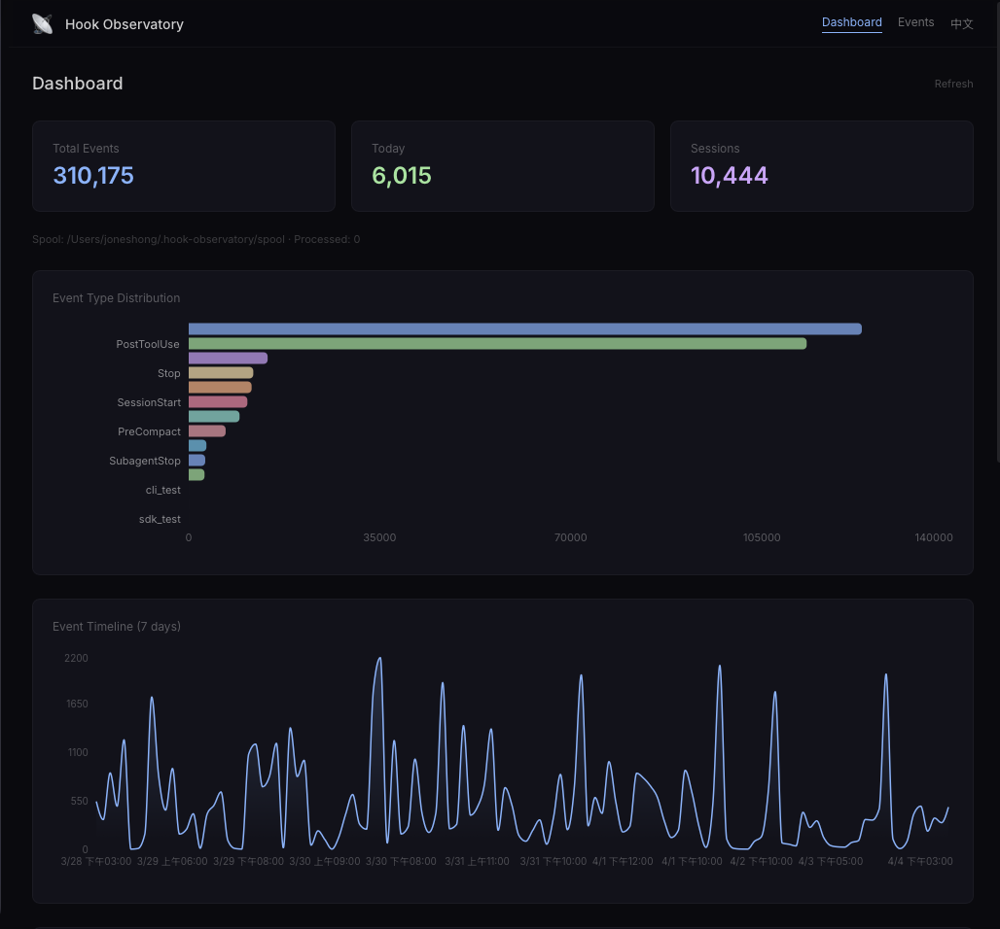
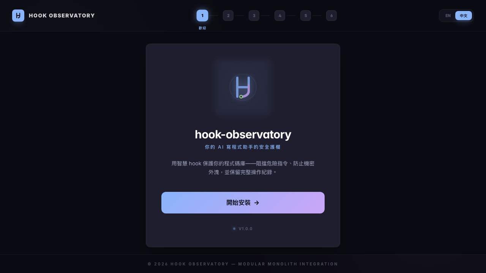
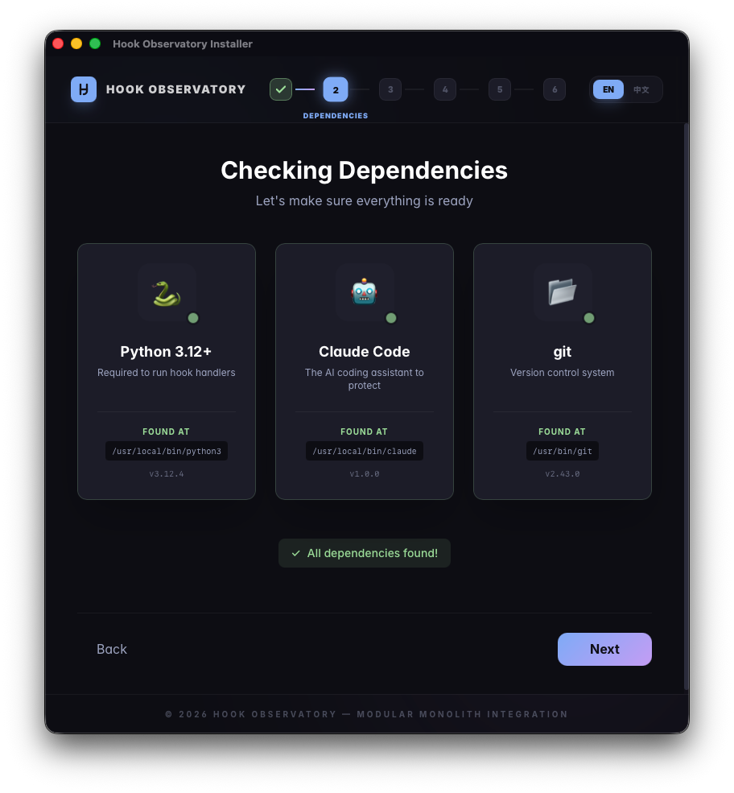
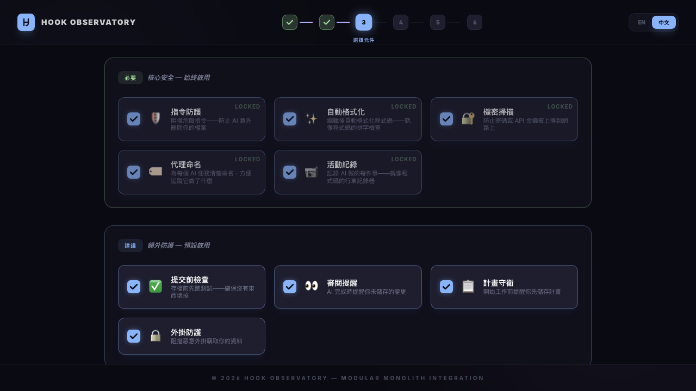

# hook-observatory

<p align="center">
  
</p>

<p align="center">
  <a href="https://github.com/operonlab/hook-observatory/blob/main/README.md">English</a>
  &nbsp;|&nbsp;
  <strong><a href="https://github.com/operonlab/hook-observatory/blob/main/README.zh.md">繁體中文</a></strong>
</p>

<p align="center">
  <a href="https://github.com/operonlab/hook-observatory/releases">
    
  </a>
  <a href="https://www.python.org/">
    
  </a>
  <a href="https://opensource.org/licenses/MIT">
    
  </a>
  <a href="https://docs.anthropic.com/en/docs/claude-code">
    
  </a>
  <a href="https://github.com/operonlab/hook-observatory/stargazers">
    
  </a>
  <a href="https://deepwiki.com/operonlab/hook-observatory">
    
  </a>
</p>

Claude Code 的集中式 hook handler 框架。

<p align="center">
  
</p>

<p align="center">
  
  
  
</p>

---

## 為什麼需要這個？

Claude Code 的 hook 系統允許你在 AI 執行每個動作前後插入自訂邏輯。問題是，當 hook 數量增加，你會得到一堆散落在 `~/.claude/hooks/` 的 shell 腳本——難以維護、無法共享狀態、錯誤不會被捕捉。

hook-observatory 用一個 Python dispatcher 接管所有事件。新增或停用一個 handler，改一行 YAML 即可。

---

## 架構

```
~/.claude/settings.json      ← 10 種事件，全部指向同一個 dispatcher
        ↓
~/.claude/hooks/dispatcher.py  ← 薄墊片，讀 argv[1] 事件名，委派給 handlers/
        ↓
handlers/__init__.py           ← registry + 雙階段分發
        ↓
handlers/bash_safety.py        ← 各個 handler 模組
handlers/auto_format.py
handlers/...
```

每次事件觸發，dispatcher 做兩件事：

1. **Critical phase**：執行安全性相關 handler（`bash_safety`、`secret_scan` 等），不受時間限制
2. **Deferrable phase**：在 5 秒預算內執行其餘 handler；預算用完則跳過非關鍵的

決策合併規則：`block > approve > passthrough`。任一 handler 要求 block，整體就 block。

---

## Handler 一覽

### 核心 handlers（預設啟用，無外部依賴）

| Handler | 事件 | 功能 |
|---------|------|------|
| `bash_safety` | PreToolUse:Bash | 攔截危險命令：`rm -rf /`、`sudo`、force push、強制 `pnpm`（防止 npm/yarn 混用） |
| `auto_format` | PostToolUse:Edit/Write | 編輯後自動執行 ruff（Python）或 biome（JS/TS） |
| `secret_scan` | PreToolUse:Bash | git push 前掃描 hardcoded secrets |
| `agent_naming` | PreToolUse:Agent | 強制 Agent 工具呼叫必須帶描述性 `name` 參數 |
| `skill_security` | PreToolUse:Write/Edit | 阻擋 skill 檔案中的 prompt injection 嘗試 |
| `verify_commit` | PreToolUse:Bash | 以測試驗證 marker 作為 commit 閘門 |
| `verify_completion` | SubagentStop | 子代理結束前強制通過測試 |
| `review_gate` | Stop | 提醒未提交的程式碼變更 |
| `plan_impl_gate` | PostToolUse/UserPromptSubmit | Plan 模式結束後提醒儲存計畫 |
| `observability` | 所有事件 | 事件日誌寫入 spool |

### Workflow handlers（預設啟用，部分需要外部工具）

| Handler | 需求 | 功能 |
|---------|------|------|
| `context_inject` | — | SubagentStart 時注入必要 context |
| `context_relay` | tmux | 跨 session 傳遞 context |
| `claudemd_suggest` | — | SessionStart 時提示相關 CLAUDE.md |
| `cleanup_versions` | — | 清理過舊的 handler 版本檔案 |
| `utility_watchdog` | — | 監控工具使用模式 |

### Integration handlers（預設停用，需外部服務）

| Handler | 需求 | 功能 |
|---------|------|------|
| `voice_notify` | TTS 服務 | 重要事件語音通知 |
| `sentinel_notify` | Sentinel station | 服務健康異常告警 |
| `anvil_telemetry` | Anvil station | 所有事件遙測 |
| `session_channel` | Session Channel station | 跨 session 廣播 |
| `memory_sync` | Memvault 服務 | 編輯後同步記憶 |
| `session_pipeline` | Session Pipeline 服務 | SessionEnd 時觸發 pipeline |
| `pm_autopilot` | `gh` CLI + GitHub repo | Issue 自動管理 |
| `session_cost` | — | 統計 response 次數（JSONL，無外部依賴） |
| `session_namer` | LLM API | 自動命名 session |

---

## 安裝

```bash
cd stations/hook-observatory

# 標準安裝（自動偵測 Python）
python3 install.py

# 指定 Python 路徑
python3 install.py --python ~/.local/bin/python3

# 預覽不實際修改
python3 install.py --dry-run

# 移除所有 hooks
python3 install.py --uninstall
```

安裝程式做四件事：

1. 偵測 Python 直譯器
2. 寫入 `~/.claude/hooks/dispatcher.py`（薄墊片）
3. 更新 `~/.claude/settings.json`（10 個事件 hook）
4. 從 `config.example.yaml` 複製 `config.yaml`（若尚未存在）

完成後重啟 Claude Code 讓 hook 生效。

---

## 配置

```bash
cp config.example.yaml config.yaml  # 安裝程式會自動做這步
```

`config.yaml` 被 gitignore，你的修改不會被提交。

### Handler 開關

```yaml
handlers:
  core:
    bash_safety: true
    auto_format: true
    secret_scan: true
    # ...

  integrations:
    voice_notify: false   # 啟用前先設好 tts_url
    pm_autopilot: false   # 啟用前先設好 github.repo
```

### 工具路徑

```yaml
tools:
  python: auto     # 自動在 PATH 尋找
  ruff: auto
  biome: auto      # 優先找 node_modules/.bin/
  gh: auto
```

`auto` 表示自動偵測 PATH；也可以填絕對路徑。

### 外部服務 URL

```yaml
services:
  tts_url: "http://127.0.0.1:10201/api/tts/speak"
  anvil_url: "http://127.0.0.1:10301"
  session_channel_url: "http://localhost:10101"
```

對應 integration handler 啟用後才會使用。

### 逃生出口

每個阻擋型 handler 都有繞過機制，讓你在緊急情況下不被卡住：

| Handler | 繞過方式 |
|---------|---------|
| bash_safety（pnpm 強制） | `PNPM_LOCK_DISABLE=1 npm install` |
| secret_scan | `SECRET_SCAN_DISABLE=1` 環境變數，或行尾加 `# nosec` |
| verify_commit | commit message 加 `[skip-verify]` |

---

## 自訂 Handler

在 `handlers/` 新增一個 Python 模組：

```python
# handlers/my_handler.py
from .base import ALLOW, HookResult, block, message

def handle(event_type: str, tool_name: str, tool_input: dict, raw_input: str) -> HookResult:
    if tool_name != "Bash":
        return ALLOW

    command = tool_input.get("command", "")
    if "dangerous-thing" in command:
        return block("已阻擋：不允許執行此命令")

    return ALLOW
```

接著在 `handlers/__init__.py` 的 `REGISTRY` 加入對應事件：

```python
"PreToolUse": [
    ("Bash", my_handler.handle),
    # ...
],
```

最後在 `config.example.yaml` 的 `handlers:` 區段加入開關即可。

---

## 設計哲學

**Fail-open**：每個 handler 都包在 `try/except` 裡，任何例外都返回 `ALLOW`。handler 本身有 bug，絕不會阻塞 Claude 的正常運作。

**Block-at-Submit > Block-at-Write**：不在 Edit/Write 時阻擋（這會讓 agent 陷入混亂）。安全閘門放在 commit 或 push 的時候。

**每個阻擋都有出口**：環境變數或行內注釋都能繞過特定 handler。強制沒有出口的工具，最終會被人繞開；有出口的，才能長期被接受。

---

## 需求

- Python 3.12+
- Claude Code CLI
- PyYAML（選配，無則使用內建簡易解析器）
- ruff（選配，`auto_format` 的 Python 格式化）
- biome（選配，`auto_format` 的 JS/TS 格式化）
- `gh` CLI（選配，`pm_autopilot` 用）

---

## 授權

MIT
