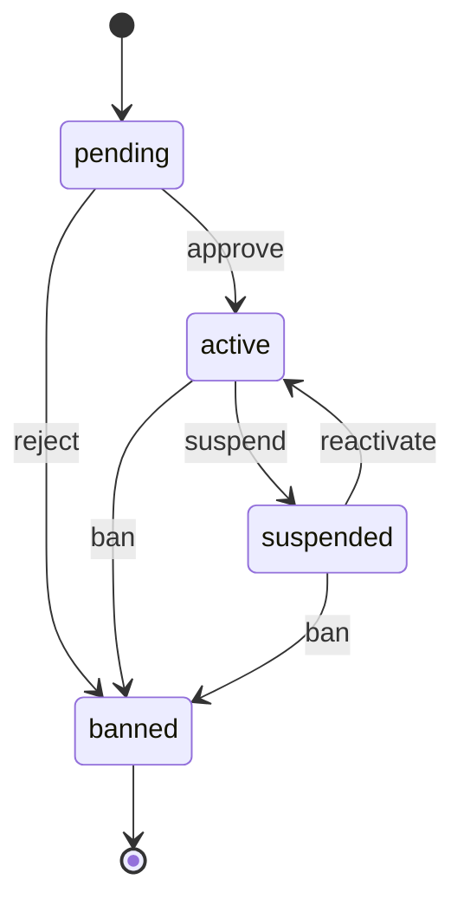

# auth.User Lifecycle

**Module**: auth | **Entity**: User | **States**: 4 | **Transitions**: 6

**Initial**: `pending` | **Final**: `banned`

**All states**: `pending`, `active`, `suspended`, `banned`

## State Diagram

## Transition Table

| Source | Target | Event |
|--------|--------|-------|
| pending | active | approve |
| pending | banned | reject |
| active | suspended | suspend |
| active | banned | ban |
| suspended | banned | ban |
| suspended | active | reactivate |
