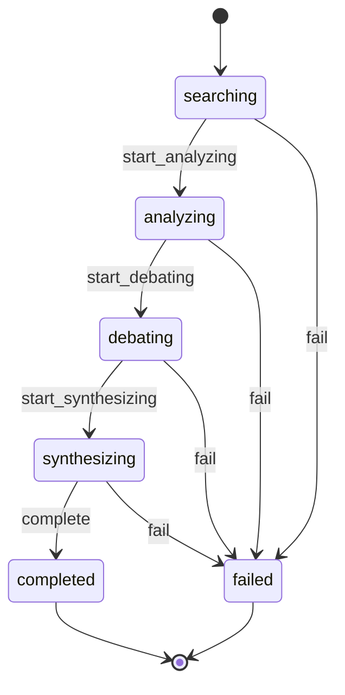

# briefing.Briefing Lifecycle

**Module**: briefing | **Entity**: Briefing | **States**: 6 | **Transitions**: 8

**Initial**: `searching` | **Final**: `completed`, `failed`

**All states**: `searching`, `analyzing`, `debating`, `synthesizing`, `completed`, `failed`

## State Diagram

## Transition Table

| Source | Target | Event |
|--------|--------|-------|
| searching | analyzing | start_analyzing |
| analyzing | debating | start_debating |
| debating | synthesizing | start_synthesizing |
| synthesizing | completed | complete |
| searching | failed | fail |
| analyzing | failed | fail |
| debating | failed | fail |
| synthesizing | failed | fail |
