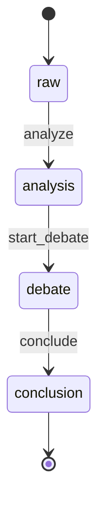

# briefing.Entry Lifecycle

**Module**: briefing | **Entity**: Entry | **States**: 4 | **Transitions**: 3

**Initial**: `raw` | **Final**: `conclusion`

**All states**: `raw`, `analysis`, `debate`, `conclusion`

## State Diagram

## Transition Table

| Source | Target | Event |
|--------|--------|-------|
| raw | analysis | analyze |
| analysis | debate | start_debate |
| debate | conclusion | conclude |
