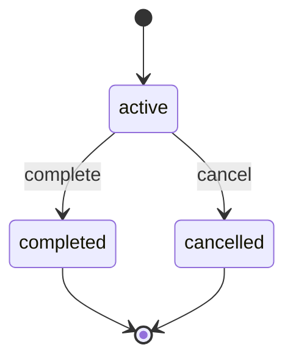

# finance.Installment Lifecycle

**Module**: finance | **Entity**: Installment | **States**: 3 | **Transitions**: 2

**Initial**: `active` | **Final**: `completed`, `cancelled`

**All states**: `active`, `completed`, `cancelled`

## State Diagram

## Transition Table

| Source | Target | Event |
|--------|--------|-------|
| active | completed | complete |
| active | cancelled | cancel |
