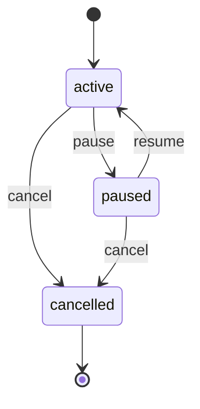

# finance.Subscription Lifecycle

**Module**: finance | **Entity**: Subscription | **States**: 3 | **Transitions**: 4

**Initial**: `active` | **Final**: `cancelled`

**All states**: `active`, `paused`, `cancelled`

## State Diagram

## Transition Table

| Source | Target | Event |
|--------|--------|-------|
| active | paused | pause |
| paused | active | resume |
| active | cancelled | cancel |
| paused | cancelled | cancel |
