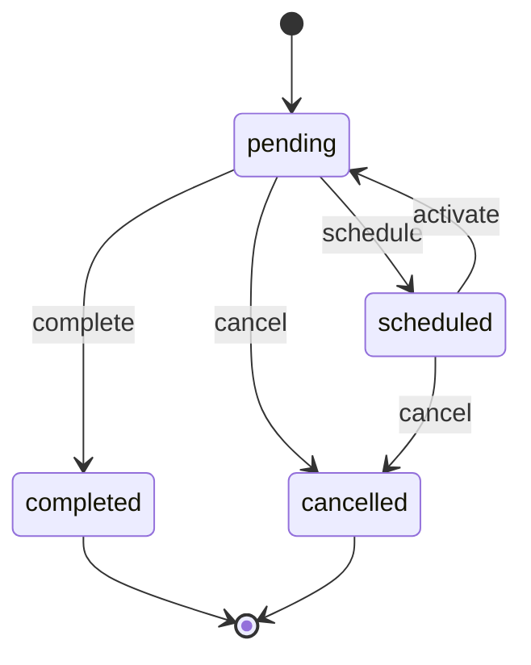

# finance.Transaction Lifecycle

**Module**: finance | **Entity**: Transaction | **States**: 4 | **Transitions**: 5

**Initial**: `pending` | **Final**: `completed`, `cancelled`

**All states**: `pending`, `scheduled`, `completed`, `cancelled`

## State Diagram

## Transition Table

| Source | Target | Event |
|--------|--------|-------|
| pending | completed | complete |
| pending | cancelled | cancel |
| scheduled | cancelled | cancel |
| pending | scheduled | schedule |
| scheduled | pending | activate |
