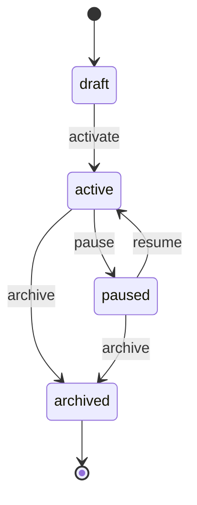

# nodeflow.Flow Lifecycle

**Module**: nodeflow | **Entity**: Flow | **States**: 4 | **Transitions**: 5

**Initial**: `draft` | **Final**: `archived`

**All states**: `draft`, `active`, `paused`, `archived`

## State Diagram

## Transition Table

| Source | Target | Event |
|--------|--------|-------|
| draft | active | activate |
| active | paused | pause |
| paused | active | resume |
| active | archived | archive |
| paused | archived | archive |
