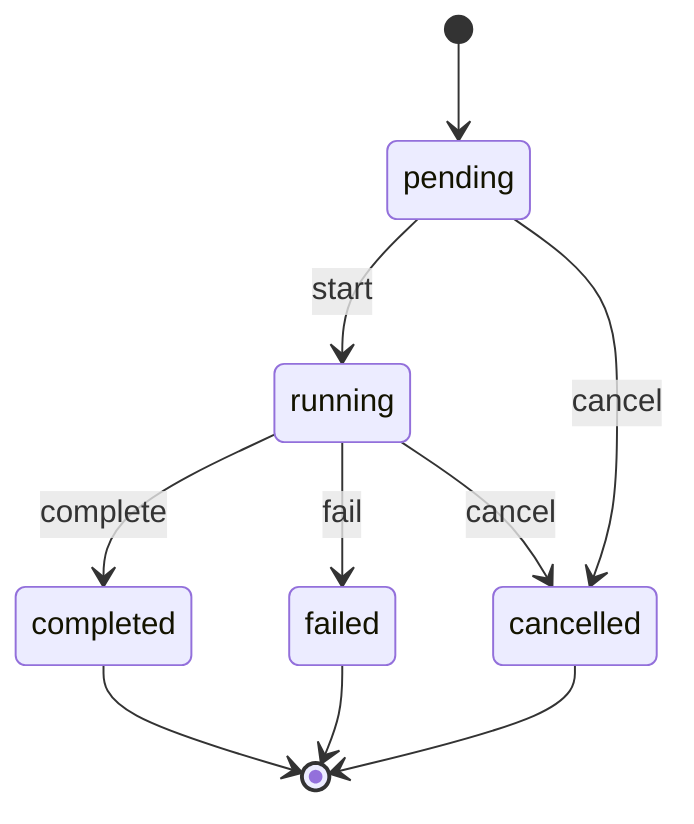

# nodeflow.FlowRun Lifecycle

**Module**: nodeflow | **Entity**: FlowRun | **States**: 5 | **Transitions**: 5

**Initial**: `pending` | **Final**: `completed`, `failed`, `cancelled`

**All states**: `pending`, `running`, `completed`, `failed`, `cancelled`

## State Diagram

## Transition Table

| Source | Target | Event |
|--------|--------|-------|
| pending | running | start |
| running | completed | complete |
| running | failed | fail |
| running | cancelled | cancel |
| pending | cancelled | cancel |
