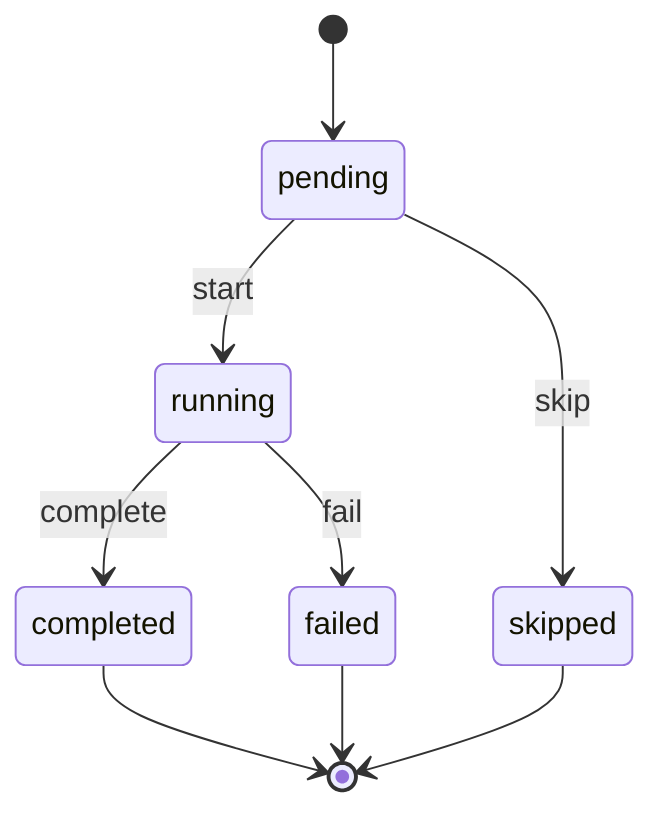

# nodeflow.NodeRun Lifecycle

**Module**: nodeflow | **Entity**: NodeRun | **States**: 5 | **Transitions**: 4

**Initial**: `pending` | **Final**: `completed`, `failed`, `skipped`

**All states**: `pending`, `running`, `completed`, `failed`, `skipped`

## State Diagram

## Transition Table

| Source | Target | Event |
|--------|--------|-------|
| pending | running | start |
| running | completed | complete |
| running | failed | fail |
| pending | skipped | skip |
